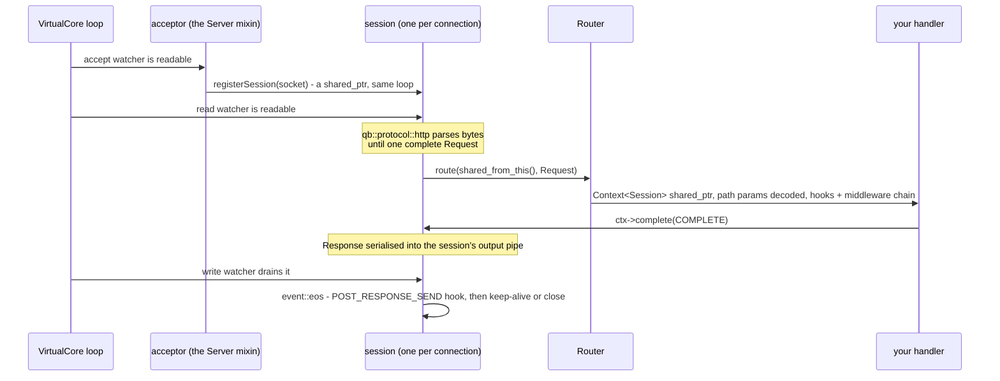

# qbm-http — HTTP/1.1, HTTP/2, HTTP/3, and WebSocket for the qb Actor Framework (QBAF)

> **Audience:** Adopter · **Status:** stable · **Verified-against:** qbm-http @ qb 3.0.0 (C++20 default, C++23 supported)

`qbm-http` is a compiled module of the qb Actor Framework (QBAF) that gives an actor asynchronous HTTP servers and clients — HTTP/1.1 always, plus HTTP/2, HTTP/3, WebSocket, JWT, and authentication on builds that enable SSL and QUIC — over qb-io's non-blocking I/O.

**Prerequisites:** a working [qb framework](https://github.com/isndev/qb) checkout (`qb-core` + `qb-io`); a C++20 toolchain (C++23 optional); CMake 3.24+. — **See also:** [readme/README.md](./readme/README.md) (full guide), [an HTTP server is an actor](./readme/00-http-in-an-actor.md), [routing](./readme/03-routing-overview.md), [async client](./readme/14-async-http-client.md), [WebSocket](./readme/20-websocket.md).

## An HTTP server is an actor

`qb::http::Server<>` is a mixin, not a runtime. It brings an acceptor and a session table; the `qb::Actor` it is mixed into brings the thread, the mailbox and the lifecycle. An HTTP/1.1 server is therefore an actor that mixes in `qb::http::Server<>`, defines routes on `router()`, compiles the router, then calls `listen` + `start`.

<!-- src: examples/06-modules/http/02-routing.cpp:32-65 -->

```cpp
#include <qb/main.h>
#include <qbm/http/http.h>

class ApiServer : public qb::Actor, public qb::http::Server<> {
public:
    qb::io::async::task<bool> onInit() override {
        registerEvent<qb::KillEvent>(*this);

        router().get("/", [](auto ctx) {
            ctx->response().body() = "Hello from qbm-http";
            ctx->complete();
        });

        router().get("/users/:id", [](auto ctx) {
            ctx->response().status() = qb::http::status::OK;
            ctx->response().body()   = "user " + ctx->path_param("id");
            ctx->complete();
        });

        router().compile();                       // required, after every route

        if (!listen({"tcp://0.0.0.0:8080"}))      // qb::io::uri; returns "is listening"
            co_return false;                      // port taken: init fails, actor never starts
        start();                                  // arm the accept watcher
        co_return true;
    }

    void on(qb::KillEvent const &) { kill(); }
};

int main() {
    qb::Main engine;
    engine.addActor<ApiServer>(0);
    engine.start();   // one worker thread per used core, then returns
    engine.join();    // blocks until every actor terminates
    return 0;
}
```

Each handler receives a `ctx` (a `std::shared_ptr<qb::http::Context<Session>>`), reads `ctx->request()`, writes `ctx->response()`, and calls `ctx->complete()` to send. Path parameters come from `ctx->path_param("id")`. Note that the HTTP `DELETE` verb is spelled `qb::http::Method::DEL` (and `router().del(...)`) because `delete` is a C++ keyword.

Four lines carry more than they look like they do:

- **`onInit()` returns a coroutine.** Routes, `compile()` and `listen()` all happen before the actor is activated, so no connection is ever accepted against a half-built router. `co_return false` fails the init and the actor is destroyed without ever handling an event — which is what you want when the port is taken.
- **`listen()` returns "is listening", not "no error", and it does not arm the watcher.** It shadows the qb-io acceptor's own `listen()`, which *does* auto-start; here `start()` is a separate, required call. Forget it and the socket is bound, the actor activates, and nothing is ever accepted.
- **`router().compile()` is mandatory**, after every route is defined and before serving. Without it, nothing matches.
- **`addActor<…>(0)` picks the core.** The accept watcher, every session it creates, the router, and every coroutine a handler spawns all live on that one `VirtualCore` thread. That is the whole concurrency model of the module: one request occupies its session until it completes, and while your handler is on the stack no other session on that core is read and no other actor on it is dispatched.

Every step below is a callback from that one core's event loop, dispatched in the same pass as the actor's ordinary messages:



HTTP/1.1 pipelining is *serialised*, not parallel: a second request arriving on a busy connection is queued — up to 128 — and the response is written when the loop says so, not when `complete()` returns. [An HTTP server is an actor](./readme/00-http-in-an-actor.md) reads the rest off that picture.

For TLS, mix in `qb::http::ssl::Server<>` instead and pass certificate and key paths to `listen` (`QB_HAS_SSL` only). For HTTP/2, use `qb::http2::Server<>` / `qb::http2::make_server()` over an `https://` listener. `make_server()` returns a `std::unique_ptr<Server<>>` for the cases where you want the server as a member rather than a base class.

## A route that has to wait

Return `qb::io::async::task<void>` from the *same* verb method and the router detects it, wraps it, and drives it:

<!-- src: examples/06-modules/http/09-coroutine-handlers.cpp:59-64 -->

```cpp
router().get("/delay/:ms", [](auto ctx) -> qb::io::async::task<void> {
    const auto ms = ctx->template path_param_or<int>("ms", 100);
    co_await qb::io::async::sleep(std::chrono::milliseconds(ms));
    ctx->json(qb::json{{"slept_ms", ms}});   // implicit complete() on co_return
    co_return;
});
```

At the `co_await` the handler *returns*: the stack unwinds to the coroutine scheduler, to the loop, to the `VirtualCore`, and every other session and actor on that core gets its turn. The wrapper captures `ctx` **by value into the coroutine frame**, so the response you are building survives every suspension; on a normal return it calls `complete()` for you; and a `std::exception` escaping your body becomes a `500` rather than reaching the session's `noexcept` boundary.

One thing it does not do: a route coroutine is spawned onto the thread's scheduler, not through `Actor::spawn`, so it does **not** join the server actor's cancellation scope. `kill()` does not signal it. [An HTTP server is an actor](./readme/00-http-in-an-actor.md) is the page for both halves of that.

## Calling another service

Inside an actor, an HTTP request is a `co_await` under `Actor::spawn` — and the ordinary actor rules apply: copy what you need by value before the first suspension, and answer through the context.

```cpp
struct RefreshCatalog : qb::Event {};
struct CatalogFetched : qb::Event {
    // An event is relocated by memcpy, so a by-value std::string is not a legal payload:
    // a short one addresses its own inline buffer on libstdc++. Box it, or use qb::string<N>.
    int                          status;
    std::shared_ptr<std::string> body;
    CatalogFetched(int s, std::string b)
        : status(s), body(std::make_shared<std::string>(std::move(b))) {}
};

// A named coroutine — not an immediately-invoked lambda, whose closure dies before the body runs.
qb::io::async::task<qb::http::async::Reply>
fetch_catalog(qb::io::uri url) {
    co_return co_await qb::http::GET(qb::http::Request{std::move(url)}, std::chrono::seconds(5));
}

void on(RefreshCatalog const &) {
    const qb::io::uri url{"http://upstream/catalog"};   // copied BEFORE spawning

    spawn([url](qb::ScopedCoroContext ctx) -> qb::io::async::task<void> {
        auto reply = co_await ctx.cancellable(fetch_catalog(url));
        ctx.push<CatalogFetched>(reply.response.status().code(),
                                 reply.response.body().as<std::string>());
    });
}
```

`ctx.cancellable(...)` is what makes the request interruptible: the module's `http_awaiter` registers no cancellation hook of its own, so an unwrapped `co_await` stays parked until the reply arrives even after `kill()`. The wrapper resumes it with `cancelled_error` instead — which `spawn` swallows unless you catch it. It does not stop the upstream; the request still completes on the far end, which is why the timeout argument matters.

The one-shot free functions (`GET`, `POST`, `REQUEST`, …) also have a callback form that heap-allocates a self-deleting session and delivers a `qb::http::async::Reply` (the original request plus the response), taking a `qb::duration` timeout:

<!-- src: qbm/http/src/qbm/http/1.1/http.h:875-889 -->

```cpp
qb::http::Request req{{"http://localhost:8080/users/42"}};
req.add_header("User-Agent", "qbm-http/1.0");

qb::http::GET(std::move(req), [](qb::http::async::Reply &&reply) {
    if (reply.response.status() == qb::http::status::OK)
        qb::io::cout() << "body: " << reply.response.body().as<std::string>() << "\n";
});
```

Capture nothing you cannot outlive: the callback runs from a later turn of the loop, and by then the actor that issued the request may be gone. Copy what it needs by value, exactly as the coroutine form does.

Both spellings share the same names: `GET`/`POST`/`REQUEST` have callback overloads and coroutine overloads that return `qb::http::async::awaiter<qb::http::async::Reply>`. Drive the latter with `co_await` inside a coroutine, or with `qb::http::run_sync(...)` from a plain function.

**Outside an actor** — a `main()`, a test, a CLI, a setup step before `qb::Main::start()` — the thread is yours to block, and `qb::http::run_sync` is the right answer:

<!-- src: qbm/http/tests/system/coro/coro-client-http1.cpp:196-200 -->

```cpp
#include <qbm/http/http.h>

int main() {
    qb::io::async::init();                       // one event loop on this thread
    auto reply = qb::http::run_sync(
        qb::http::GET(qb::http::Request{{"http://localhost:8080/"}}));
    if (reply.response.status() == qb::http::status::OK)
        std::cout << reply.response.body().as<std::string>() << "\n";
    return 0;
}
```

Inside an actor that same call stops the `VirtualCore` — silently, because nothing in the framework diagnoses it — and every other actor on the core stops with it.

For connection reuse against a single origin, use `qb::http1::Client` (request queue, batching, timeouts, auto-reconnect) — see [the async client guide](./readme/14-async-http-client.md). HTTP/2 and HTTP/3 expose analogous `qb::http2::Client` / `qb::http3::Client` types with multiplexed `push_request` / `push_requests`.

## WebSocket

WebSocket is part of `qbm-http` (namespace `qb::http::ws`); there is no separate module. A server session starts as HTTP/1.1, validates the RFC 6455 `GET` upgrade, then switches the connection from HTTP parsing to WebSocket framing with `switch_protocol` — the session is the same object throughout, only its framer changes.

<!-- src: qbm/http/tests/system/ws/ws-lifecycle.cpp:111-152 -->

```cpp
#include <qb/main.h>
#include <qbm/http/http.h>
#include <qbm/http/ws.h>

class EchoWsServer;

class WsSession : public qb::io::use<WsSession>::tcp::client<EchoWsServer> {
public:
    using Protocol    = qb::http::protocol<WsSession>;       // HTTP/1.1 first
    using WS_Protocol = qb::http::ws::protocol<WsSession>;    // then WebSocket frames

    explicit WsSession(IOServer &server) : client(server) {}

    void on(Protocol::request &&request) {          // the RFC 6455 upgrade arrives
        if (!this->switch_protocol<WS_Protocol>(*this, request))
            disconnect();
    }

    void on(WS_Protocol::message &&event) {         // a framed WS message
        *this << event.ws;                          // echo it back
    }
};

class EchoWsServer : public qb::Actor,
                     public qb::io::use<EchoWsServer>::tcp::server<WsSession> {
public:
    qb::io::async::task<bool> onInit() override {
        if (transport().listen({"tcp://0.0.0.0:8080"}) != 0)
            co_return false;
        start();
        co_return true;
    }
};
```

Clients can use the callback API (`qb::http::ws::WebSocket<T>`, `qb::http::ws::client`) or the coroutine API (`qb::http::ws::coro_client`, `co_await connect/receive/close_async`). See [WebSocket](./readme/20-websocket.md) and [WebSocket coroutines](./readme/21-websocket-coroutines.md).

## What this module is

`qbm-http` builds REST APIs, static-content servers, request clients, and WebSocket endpoints as qb actors. It is **not header-only**: the CMake build registers it as a compiled library (`qb_register_module` with a `SOURCES` list — `request.cpp`, `response.cpp`, `body.cpp`, the HTTP/1.1 protocol and client, the validation engine, and SSL-gated `auth/`, `ws/`, and HTTP/2 sources). You still consume it through a single umbrella header, `<qbm/http/http.h>`.

On top of the wire protocols it ships a fluent routing engine (path parameters, groups, controllers), a middleware pipeline, request validation and sanitization, cookie and multipart handling, JWT-based authentication, and both callback and C++20-coroutine client APIs. HTTP/1.1 parsing is done by a vendored, symbol-renamed llhttp; every byte in and out goes through qb-io.

The protocol surface is gated by the underlying qb build:

- **HTTP/1.1, routing, middleware, validation, cookies, multipart, the callback/coroutine HTTP/1.1 client** — always available.
- **HTTPS, HTTP/2, WebSocket (both `ws://` and `wss://`), JWT, and `qb::http::auth`** — require `QB_HAS_SSL` (OpenSSL). Without it, CMake prints `HTTP SSL-backed features disabled: HTTPS/WSS/JWT/HTTP3 and the HTTP/2 transport (client + server session) will not be built; the HTTP/2 wire codec under 2/protocol/ still is, so its unit tests keep running`, and those translation units are not compiled. The transport-independent HTTP/2 wire codec (`2/protocol/`) *is* still compiled, but nothing in an SSL-off build can reach it — `qb::http2` remains undeclared.
- **HTTP/3** — requires `QBM_HTTP_HAS_HTTP3`, which is set only when `QB_HAS_SSL`, `QB_HAS_QUIC`, and `libnghttp3` are all present. `libnghttp3` is located by the module's own `cmake/FindNghttp3.cmake`, which treats `pkg-config` as a hint and falls back to `find_path` / `find_library`, so an installation without a `.pc` file is still found.

These gates are real `#ifdef` boundaries in the headers, so feature availability in your code matches what was compiled. `<qbm/http/http.h>` includes `src/qbm/http/2/http2.h` and `src/qbm/http/ws/ws.h` only under `#ifdef QB_HAS_SSL`, and the HTTP/3 headers only under `#ifdef QBM_HTTP_HAS_HTTP3`.

### Feature and build matrix

<!-- src: qbm/http/CMakeLists.txt:26-103, qbm/http/src/qbm/http/http.h:43-53 -->

| Capability | Header / namespace | Compile gate | Required dependency |
|---|---|---|---|
| HTTP/1.1 server & client | `<qbm/http/http.h>` · `qb::http`, `qb::http1` | always | vendored `llhttp` |
| Routing, middleware, controllers | `<qbm/http/http.h>` · `qb::http` | always | — |
| Validation & sanitization | `<qbm/http/http.h>` · `qb::http::validation` | always | — |
| Cookies, multipart, HTTP dates | `<qbm/http/http.h>` · `qb::http` | always | — |
| HTTPS server & client | `qb::http::ssl`, `qb::http1::Client` (TLS) | `QB_HAS_SSL` | OpenSSL |
| HTTP/2 server & client | `qb::http2` | `QB_HAS_SSL` | OpenSSL (ALPN `h2`) |
| WebSocket / WSS | `<qbm/http/ws.h>` · `qb::http::ws` | `QB_HAS_SSL` (both `ws://` and `wss://`) | OpenSSL (handshake crypto + TLS) |
| JWT & authentication | `<qbm/http/auth.h>` · `qb::http::auth` | `QB_HAS_SSL` | OpenSSL |
| HTTP/3 server & client | `qb::http3`, `qb::http::dual_stack_server` | `QBM_HTTP_HAS_HTTP3` | OpenSSL + QUIC + `libnghttp3` |

The entire WebSocket surface requires `QB_HAS_SSL`, including plain `ws://` — `src/qbm/http/ws/ws.h` opens with `#error "websocket protocol requires OpenSSL crypto library"` because the RFC 6455 handshake (`qb::http::ws::generateKey`, the `base64(sha1(key + GUID))` accept, and CSPRNG frame masking) builds on qb-io's `crypto::sha1` / `crypto::base64`. The umbrella `<qbm/http/http.h>` pulls in `src/qbm/http/ws/ws.h` and `src/qbm/http/2/http2.h` only under `#ifdef QB_HAS_SSL`, so reach for `qb::http::ws` and `qb::http2` in SSL-enabled builds.

## Integration

Two supported modes, both giving the same target (`qbm::http`) and the same header spelling (`<qbm/http/...>`).

**Embedded** — add qb as a subdirectory, load the modules directory, link the target:

```cmake
# CMakeLists.txt
add_subdirectory(qb)                                  # configures qb-core + qb-io, sets QB_FOUND
qb_load_modules("${CMAKE_CURRENT_SOURCE_DIR}/qbm")    # discovers and registers qbm/http

add_executable(app main.cpp)
target_link_libraries(app PRIVATE qbm::http)          # PUBLIC-pulls qb::core, qb::io, llhttp
```

**Installed** — consume a `cmake --install`ed tree. You do **not** need a `find_package(qb)` line: the module's package config resolves qb (and, for an HTTP/3 build, nghttp3) itself.

```cmake
find_package(qbm-http CONFIG REQUIRED)                # find_dependency(qb) happens inside
add_executable(app main.cpp)
target_link_libraries(app PRIVATE qbm::http)
```

The package lands headers under `<prefix>/include/qbm/http/...` and its CMake files under `<prefix>/lib/cmake/qbm-http/`; `<prefix>/include` is a verbatim copy of this repository's `src/`, so `#include <qbm/http/http.h>` is unchanged between the two modes. `qbm-httpConfig.cmake` hard-fails at configure time if the installed qb is a different version than the one this module was compiled against, or disagrees with it about `QB_HAS_SSL` / `QB_HAS_QUIC` — the module's public headers are `#ifdef`-gated on those.

`qb_load_modules` globs and sorts the module subdirectories under the given path and `add_subdirectory`s each that has a `CMakeLists.txt`. The `http` module guards on `QB_FOUND` and returns early if qb has not been configured first, so the `add_subdirectory(qb)` line must come before `qb_load_modules`.

Because module dependencies link `PUBLIC`, the `QB_HAS_SSL` / `QB_HAS_QUIC` compile definitions and the `qb::core` / `qb::io` headers propagate to your target — that is what makes the `#ifdef QB_HAS_SSL` and `#ifdef QBM_HTTP_HAS_HTTP3` gates resolve consistently in your own code. The module also propagates the framework C++ standard as a `PUBLIC` usage requirement — `cxx_std_${QB_CXX_STANDARD}`, i.e. `cxx_std_20` by default, or `cxx_std_23` when the build is configured with `QB_CXX_STANDARD=23`.

```cpp
#include <qbm/http/http.h>            // umbrella: HTTP/1.1 always; HTTP/2 + WS under SSL; HTTP/3 under QUIC
#include <qbm/http/ws.h>              // WebSocket message/protocol/coroutine surface (SSL build)
#include <qbm/http/auth.h>            // qb::http::auth — JWT options, user, manager (SSL build)
#include <qbm/http/middleware/all.h>  // built-in middleware (CORS, compression, security headers, ...)
```

A module **cannot be configured standalone**: it calls `qb_register_module()` and `qb_add_test()`, development-time helpers an installed qb does not ship. The repository's own CI configures `.github/ci/superbuild/CMakeLists.txt`, a minimal root that adds a qb *source* tree first and this module second.

## Time and duration vocabulary

`qbm-http` follows qb's chrono model:

- Cookie `max_age` / `expires_in`, CORS preflight, and rate-limit windows are `qb::duration`.
- JWT token lifetime and clock-skew tolerance are `std::chrono::seconds` — the RFC 7519 `NumericDate` boundary, deliberately kept at seconds resolution.
- HTTP date formatting/parsing (`qb::http::date`) bridges `std::chrono::system_clock` and `qb::wall_time`.

## Pitfalls

- **Compile the router.** `router().compile()` must run after all routes are defined and before serving, or no route matches.
- **`complete()` is mandatory.** A handler that never calls `ctx->complete()` (or `ctx->cancel()`) leaves the request hanging until the inactivity timeout fires.
- **`run_sync` inside an actor stops the core.** It is correct in a `main()`, a test fixture or a CLI, where the thread it blocks is yours. Inside a handler it freezes every actor on that `VirtualCore`, silently — the I/O layer keeps running, so a "the socket still responds" check passes and the only symptom is latency.
- **An unwrapped `co_await` on this module's awaiters is not interruptible.** They register no cancellation hook, so `kill()` neither wakes nor unwinds a coroutine parked on one. Wrap it — `ctx.cancellable(...)`, `with_deadline(...)` — when it runs inside an actor.
- **Feature gates are build-time.** `qb::http2`, `qb::http::ws` (WSS), and `qb::http::auth` only exist when `QB_HAS_SSL` was on; `qb::http3` only when `QBM_HTTP_HAS_HTTP3` was set. Guard optional code paths with the same macros if your project ships in both configurations.
- **`DELETE` is `DEL`.** Use `qb::http::Method::DEL` and `router().del(...)`.
- **Not header-only.** Don't try to consume the headers without linking `qbm::http`; the message types, protocol, validation, and SSL-gated features live in compiled translation units.
- **Configure qb first.** The module's `CMakeLists` returns early unless `QB_FOUND` is true, so `add_subdirectory(qb)` precedes `qb_load_modules`.

## Documentation map

The full guide lives under [`readme/`](./readme/README.md). Read page 00 first whatever you are building; everything after it writes code that runs on one `VirtualCore` thread.

| Topic | Guide |
|---|---|
| **An HTTP server is an actor** — the shape every other page assumes | [00-http-in-an-actor.md](./readme/00-http-in-an-actor.md) |
| Request / response / message model | [01-core-concepts.md](./readme/01-core-concepts.md) |
| Body, streaming, compression | [02-body-deep-dive.md](./readme/02-body-deep-dive.md) |
| Routing overview & path matching | [03-routing-overview.md](./readme/03-routing-overview.md) |
| Defining routes & parameters | [04-defining-routes.md](./readme/04-defining-routes.md) |
| Route groups | [05-route-groups.md](./readme/05-route-groups.md) |
| Controllers | [06-controllers.md](./readme/06-controllers.md) |
| Middleware pipeline | [07-middleware.md](./readme/07-middleware.md) |
| Standard middleware | [08-standard-middleware.md](./readme/08-standard-middleware.md) |
| Custom middleware | [09-custom-middleware.md](./readme/09-custom-middleware.md) |
| Request context & lifecycle | [10-request-context.md](./readme/10-request-context.md) |
| Authentication & JWT | [11-authentication.md](./readme/11-authentication.md) |
| Validation & sanitization | [12-validation.md](./readme/12-validation.md) |
| Error handling | [13-error-handling.md](./readme/13-error-handling.md) |
| Async / coroutine HTTP client | [14-async-http-client.md](./readme/14-async-http-client.md) |
| HTTP message parsing | [15-http-parsing.md](./readme/15-http-parsing.md) |
| Advanced topics & performance | [16-advanced-topics.md](./readme/16-advanced-topics.md) |
| HTTP/2 protocol | [17-http2-protocol.md](./readme/17-http2-protocol.md) |
| HTTPS / SSL / TLS | [18-https-ssl-tls.md](./readme/18-https-ssl-tls.md) |
| HTTP/3 protocol | [19-http3-protocol.md](./readme/19-http3-protocol.md) |
| WebSocket (RFC 6455, WSS) | [20-websocket.md](./readme/20-websocket.md) |
| WebSocket coroutines | [21-websocket-coroutines.md](./readme/21-websocket-coroutines.md) |

Runnable examples are under `examples/06-modules/http/` — see the [qb-examples README](https://github.com/isndev/qb-examples/blob/main/README.md). The link points at the README rather than straight at the directory on purpose: that tree was reorganised by level for 3.0 (`qbm/http/` became `06-modules/http/`), and a deep link into it resolves only on the branches that already carry the new layout.

## For AI assistants

This repository publishes machine-readable documentation following the
[llms.txt](https://llmstxt.org/) convention, so a coding agent can read qbm-http without
guessing:

- **[`llms.txt`](./llms.txt)** — the index: a one-paragraph summary, the six rules that decide whether generated qbm-http code is correct, and a link
  list of every document in this repository.
- **[`llms-full.txt`](./llms-full.txt)** — ~30k tokens: `llm/qbm-http.llm.md` (the mental model, invariants and gotchas) and `llm/qbm-http.llm.api.md` (a deterministic public-API reference, every signature verified against the headers under `src/qbm/http/`), concatenated into one fetch.

Both files are generated by `scripts/gen-llms-txt.py` from `llm/` and checked in CI
(`scripts/doc-lint.sh` section 1d), so they cannot drift from the documentation they index.

**Use it over MCP, with nothing to host and nothing to install.**
[GitMCP](https://gitmcp.io) exposes any public GitHub repository as an MCP endpoint and reads
`llms.txt` first (its documented order is `llms.txt`, then an AI-optimised documentation
build, then `README.md`):

```json
{ "mcpServers": { "qbm-http": { "url": "https://gitmcp.io/isndev/qbm-http" } } }
```

Claude Desktop and other clients without native remote-MCP support wrap the same URL:
`"command": "npx", "args": ["mcp-remote", "https://gitmcp.io/isndev/qbm-http"]`.

**Cursor `@Docs`** — add
`https://raw.githubusercontent.com/isndev/qbm-http/main/llms-full.txt`.

## License

Apache License 2.0. See [LICENSE](./LICENSE). HTTP/1.1 parsing structures come from [llhttp](https://github.com/nodejs/llhttp) — a fork with the upstream `llhttp_*` symbols renamed to `http_*`, so it is owned rather than published: the C sources are vendored under `not-qb/llhttp` and its single public header is `src/qbm/http/vendor/llhttp.h`, reached as `<qbm/http/vendor/llhttp.h>`. I/O is handled entirely by qb-io.

---

Part of the [qb actor framework](https://github.com/isndev/qb).
