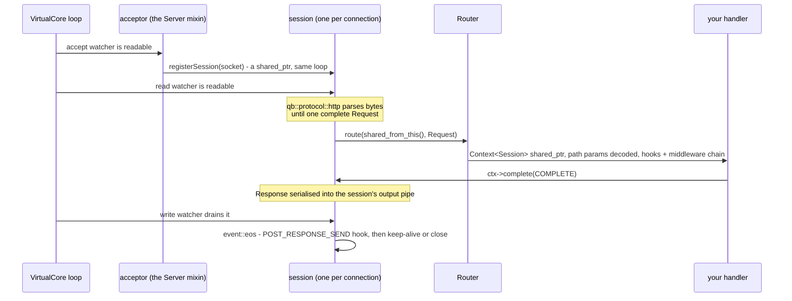

# An HTTP server is an actor

> **Audience:** Adopter · **Status:** stable · **Verified-against:** qbm-http @ qb 3.0.0 (C++20 default, C++23 supported)

The shape every other page in this book assumes: a `qb::Actor` that is also a `qb::http::Server<>`, the one thread that
carries a request from the accept watcher to the last byte of the response, and what that thread being shared means for
a handler that has to wait.

**Prerequisites:** [`qb/README.md`](https://github.com/isndev/qb/blob/main/README.md) for the shape of an actor —
**See also:** [Core HTTP concepts](./01-core-concepts.md) · [Routing overview](./03-routing-overview.md)
· [The request context](./10-request-context.md) · [Asynchronous HTTP client](./14-async-http-client.md)
· [Advanced topics](./16-advanced-topics.md), and in the framework
[Writing actors](https://github.com/isndev/qb/blob/main/readme/4_qb_core/actor.md)
· [Asynchronous work inside an actor](https://github.com/isndev/qb/blob/main/readme/5_core_io_integration/async_in_actors.md)
· [C++20 coroutines](https://github.com/isndev/qb/blob/main/readme/3_qb_io/coroutines.md)

---

## The server

`qb::http::Server<>` is a mixin, not a runtime. It brings an acceptor and a session table; the `qb::Actor` it is mixed
into brings the thread, the mailbox and the lifecycle. All fourteen shipped examples under `examples/06-modules/http/` are
actors added to a `qb::Main` — thirteen are this class, and the fourteenth is a client actor:

<!-- src: examples/06-modules/http/01-hello-server.cpp:31-134 -->

```cpp
#include <qb/main.h>
#include <qbm/http/http.h>

class HelloWorldServer
    : public qb::Actor
    , public qb::http::Server<> {
public:
    qb::io::async::task<bool> onInit() override {
        registerEvent<qb::KillEvent>(*this);

        router().get("/", [](auto ctx) {
            ctx->response().body() = "Hello, World!";
            ctx->complete(qb::http::AsyncTaskResult::COMPLETE);
        });
        router().compile();                       // once, after every route

        if (!listen({"tcp://0.0.0.0:8080"}))      // qb::io::uri; returns "is listening"
            co_return false;                      // init fails, the actor never starts
        start();                                  // arm the accept watcher
        co_return true;
    }

    void on(qb::KillEvent const &) { kill(); }
};

int main() {
    qb::Main engine;
    engine.addActor<HelloWorldServer>(0);         // pin to core 0
    engine.start();                               // async by default: returns immediately
    engine.join();                                // blocks until every actor terminates
    return 0;
}
```

Three lines carry more than they look like they do:

- **`onInit()` returns a coroutine.** Routes, `compile()` and `listen()` all happen before the actor is activated, so
  no connection is ever accepted against a half-built router. Returning `false` fails the init and the actor is
  destroyed without ever handling an event — which is what you want when the port is taken.
- **`listen()` returns "is listening", not "no error", and it does not arm the watcher.** The value is
  `!transport().listen(uri)` — the transport reports a syscall-style `0` for success, so the negation is the boolean
  you want; check it. And note that this `listen()` *shadows* the one on the qb-io acceptor it derives from, which
  **does** auto-start: here `start()` is a separate, required call. Forget it and the socket is bound, the actor
  activates, and nothing is ever accepted.
  <!-- src: qbm/http/src/qbm/http/1.1/http.h:583-602 (the module's listen: TLS context if secure, then bind — no start) -->
- **`addActor<…>(0)` picks the core.** The accept watcher, every session it creates, the router, and every coroutine a
  handler spawns all live on that one `VirtualCore` thread. That is the whole concurrency model of the module, and the
  next section is what follows from it.

`make_server()` returns a `std::unique_ptr<Server<>>` for the cases where you want the server as a member rather than a
base class — but it still has to be constructed on a thread whose event loop something turns, so inside a `qb::Main`
that means inside an actor anyway.

---

## One request, end to end

Everything below happens on **one thread** — the `VirtualCore` your server actor was placed on — and every step is a
callback from that core's event loop, dispatched in the same pass as your actor's ordinary messages.



Read off it the four facts that matter:

1. **A request occupies the session until it completes.** A second request arriving on the same connection while one is
   in flight is queued, not routed — up to 128 of them, after which the session is dropped with
   `DisconnectedReason::ByProtocolError`. HTTP/1.1 pipelining is *serialised*, not parallel.
   <!-- src: qbm/http/src/qbm/http/1.1/http.h:254-264 (queue behind the active response), :137 (_max_pipelined_requests default 128) -->
2. **The `Context` is a `shared_ptr` and it is the handle you keep.** The router builds it and hands it to your
   handler; the session holds one reference, your handler holds another. It outlives any suspension you make inside a
   handler, which is why the coroutine form below does not need the copy-everything-out discipline that the other two
   qbm modules do.
3. **Routing runs inside a `try`/`catch` that fails the connection, not the process.** `start_request` is reached
   synchronously from the protocol's `noexcept onMessage`, so an exception escaping your handler chain would cross a
   `noexcept` boundary and call `std::terminate`. It is contained: the session disconnects and the server keeps
   serving.
   <!-- src: qbm/http/src/qbm/http/1.1/http.h:210-230 (start_request contains the throw and disconnects) -->
4. **The response is written when the loop says so.** `complete()` serialises into the session's output pipe; the write
   watcher drains it over one or more turns, and `event::eos` fires when the last byte is gone. Only then does the
   `POST_RESPONSE_SEND` hook run, the context reset, and the keep-alive decision get taken.
   <!-- src: qbm/http/src/qbm/http/1.1/http.h:322-347 (eos: hook, then keep-alive or disconnect) -->

Which is the whole reason the next section exists: **while your handler is on the stack, none of that happens.** No
other request on this connection is routed, no other session on this core is read, and no other actor on this core is
dispatched.

---

## A handler that has to wait

Three forms, and the choice is not stylistic.

### The coroutine route — the default

A handler that returns `qb::io::async::task<void>` is registered through the *same* verb method. The router detects it,
wraps it, and drives it for you:

<!-- src: examples/06-modules/http/09-coroutine-handlers.cpp:59-64 -->

```cpp
router().get("/delay/:ms", [](auto ctx) -> qb::io::async::task<void> {
    const auto ms = ctx->template path_param_or<int>("ms", 100);
    co_await qb::io::async::sleep(std::chrono::milliseconds(ms));
    ctx->json(qb::json{{"slept_ms", ms}});   // implicit complete() on co_return
    co_return;
});
```

At the `co_await` the handler *returns*: the stack unwinds to the coroutine scheduler, to `listener::run()`, to the
`VirtualCore`, and every other session and actor on this core gets its turn. When the sleep expires the frame is
resumed from the next loop pass, on the same thread.

What the wrapper does around your body is worth knowing, because it changes what you have to write:

- It captures `ctx` **by value into the coroutine frame**, so the context — and the response you are building in it —
  survives every suspension without any effort from you.
- On a normal return it calls `complete(COMPLETE)` for you, *unless* you already completed or the context was
  cancelled.
- A `std::exception` escaping your body becomes a `500` with `AsyncTaskResult::ERROR`, logged with the method and path.
  It never reaches the session's `noexcept` boundary.

<!-- src: qbm/http/src/qbm/http/routing/coro_task.h:127-158 (the wrapper: capture ctx, auto-complete, translate a throw, spawn) -->

**And one thing it does not do: it is not your actor's coroutine.** The wrapper spawns onto
`qb::io::async::coro_scheduler()` — the current thread's scheduler — not through `Actor::spawn`. So a route coroutine
does **not** join the server actor's cancellation scope: `kill()` does not signal it and `has_active_coroutines()` does
not count it. It ends when its own body ends.

### `Actor::spawn` — for work that is not a route

When an actor *event* handler (not a route) needs to suspend, use `Actor::spawn`, and then the ordinary actor rules
apply: copy what you need by value before the first `co_await`, and answer through the context.
[Asynchronous work inside an actor](https://github.com/isndev/qb/blob/main/readme/5_core_io_integration/async_in_actors.md#coroutines-from-a-handler-spawn-and-spawn_detached)
owns those rules. A `std::shared_ptr<Context<Session>>` is safe to carry into such a coroutine — it is exactly what the
route wrapper does — but `this` and any server member is not.

Unlike a route coroutine, a `spawn`ed one **does** join the actor's cancellation scope, so it can be wrapped and made
interruptible. `ScopedCoroContext::cancellable` takes a `qb::io::async::task<T>` rather than an awaiter, so the client
call goes inside a named coroutine first:

```cpp
struct RefreshCatalog : qb::Event {};
struct CatalogFetched : qb::Event {
    // An event is relocated by memcpy, so a by-value std::string is not a legal payload:
    // a short one addresses its own inline buffer on libstdc++. Box it, or use qb::string<N>.
    int                          status;
    std::shared_ptr<std::string> body;
    CatalogFetched(int s, std::string b)
        : status(s), body(std::make_shared<std::string>(std::move(b))) {}
};

// A named coroutine — not an immediately-invoked lambda, whose closure dies before the body runs.
qb::io::async::task<qb::http::async::Reply>
fetch_catalog(qb::io::uri url) {
    co_return co_await qb::http::GET(qb::http::Request{std::move(url)}, std::chrono::seconds(5));
}

// In the server actor:
void on(RefreshCatalog const &) {
    const qb::io::uri url{"http://upstream/catalog"};   // copied BEFORE spawning

    spawn([url](qb::ScopedCoroContext ctx) -> qb::io::async::task<void> {
        try {
            auto reply = co_await ctx.cancellable(fetch_catalog(url));
            ctx.push<CatalogFetched>(reply.response.status().code(),
                                     reply.response.body().as<std::string>());
        } catch (qb::io::async::cancelled_error const &) {
            // The actor was killed while the request was in flight.
        }
    });
}
```

On `kill()` the wrapper's `on_cancel` hook destroys the inner frame — which destroys the `http_awaiter` and retracts
its alive flag, so the late reply is dropped — and resumes this coroutine with `cancelled_error`. `spawn`'s own wrapper
swallows that, so the `try`/`catch` is needed only when you have cleanup of your own. What it does **not** do is stop
the upstream: the request completes on the far end regardless, which is why the timeout argument still matters.

The boxed `body` above is the other rule showing through: **an event payload must be trivially *relocatable*, not
merely copyable**, because the engine moves events with `memcpy` and never runs the source destructor. A by-value
`std::string` is not — on libstdc++ a short one addresses its own inline buffer. It is **not** a cross-core-only
concern either: the source pipe `memcpy`s what it already holds when it grows, and `reply`/`forward` byte-recycle the
event, so a same-core `push` is exposed too. A response body is unbounded, so it goes behind a `std::shared_ptr`;
bounded text goes in a `qb::string<N>`. See
[Inter-actor messaging](https://github.com/isndev/qb/blob/main/readme/4_qb_core/messaging.md).

### The callback form — when you already have one

A synchronous handler may start an async operation and complete the context from its callback. The handler returns
immediately; the request stays open until `complete()` runs. The rule that comes with it is on
[The request context](./10-request-context.md): check `ctx->is_cancelled()` before doing work in a late callback,
because the connection may be gone.

---

## What cancellation means here

Two different things are called cancellation in this module, and conflating them is the mistake.

### `Context::cancel()` — the request was abandoned

`is_cancelled()` is a **sticky flag on the context**, not an interruption. Nothing unwinds; your handler keeps running.
It is set in exactly the places the session knows the response can no longer be delivered:

| Trigger | What sets it |
|:---|:---|
| Your code disconnects the session while a request is incomplete | `session::on(disconnected)`, and **only** for `DisconnectedReason::ByUser` |
| The session is handed to another handler — a WebSocket upgrade, an ownership transfer | `session::on(extracted)` calls `_context->cancel()` unless `suppress_response()` was called |
| Your own code | `ctx->cancel()` |

<!-- src: qbm/http/src/qbm/http/1.1/http.h:394-397 (disconnected: cancel only when ByUser and incomplete), :358-361 (extracted: cancel then reset) -->

Note what is **not** in that table: a peer that simply closes the socket, and a session inactivity timeout. The timeout
handler disconnects with `DisconnectedReason::ByTimeout`, which does not take the `ByUser` branch. A long-running
handler learns that the client went away when its `complete()` finds nothing to write to, not before — so
`is_cancelled()` is a useful check but not a reliable liveness signal.
<!-- src: qbm/http/src/qbm/http/1.1/http.h:279-299 (timeout disconnects with ByTimeout) -->

### `http_awaiter` — the client's awaiter is not cancellation-aware

Every coroutine client entry point — `co_await qb::http::GET(...)`, `POST`, `REQUEST`, `client->push_request(...)`, the
WebSocket coroutine API — returns an `http_awaiter`. It registers no `on_cancel` hook and consults no token, so
`cancel()` neither wakes nor unwinds a coroutine parked on one.
[C++20 coroutines](https://github.com/isndev/qb/blob/main/readme/3_qb_io/coroutines.md#every-awaitable-and-what-cancellation-does-to-it)
owns the full inventory of what is and is not cancellation-aware; this module's entry is that one line.
<!-- src: qbm/http/src/qbm/http/coro.h:119-142 (await_ready false; await_suspend stores the handle and launches the operation — no token, no hook) -->

It is a callback bridge with two guards: a `shared_ptr<bool>` alive sentinel cleared in the destructor, so a completion
arriving after the awaiter is gone is a no-op, and a `shared_ptr<std::atomic<bool>>` that makes the completion
at-most-once even if the underlying operation calls back twice. It is also **immovable** — copy and move are all
deleted — so you construct it as a prvalue from a factory and `co_await` it immediately.
<!-- src: qbm/http/src/qbm/http/coro.h:109-117 (copy and move deleted; destructor clears the alive flag), :129-136 (the completion checks alive, then compare-exchanges completed) -->

**What bounds it instead is its own timeout argument.** Every client entry point takes a `qb::duration` — and the
default is `qb::duration::zero()`, which means *no timeout at all*:

```cpp
// The second argument is a qb::duration. Zero — the default — means no deadline.
auto reply = co_await qb::http::GET(qb::http::Request{{"http://upstream/health"}},
                                    std::chrono::seconds(2));
```
<!-- src: qbm/http/src/qbm/http/1.1/http.h:999-1003 (REQUEST: qb::duration timeout = zero), :1006-1009 (GET) -->

Pass one. A route handler that `co_await`s an upstream with the default zero holds its `Context` — and the connection
behind it — open for as long as the upstream is willing to be slow.

For a bound driven by something other than the request itself, wrap the await in a named coroutine and hand *that* to
`qb::io::async::with_deadline`; both `with_deadline` and `ScopedCoroContext::cancellable` take a
`qb::io::async::task<T>`, never an awaiter.

---

## The client, from inside a server

Both directions live on the same loop, which is the point: an actor can serve HTTP and call HTTP without a second
thread, and the one-shot helpers, the persistent `qb::http1::Client`, and your routes all share the core's event loop.

```cpp
// A route that calls an upstream and relays it. Runs on the server's own core.
router().get("/proxy", [](auto ctx) -> qb::io::async::task<void> {
    auto reply = co_await qb::http::GET(qb::http::Request{{"http://localhost:8080/hello"}},
                                        std::chrono::seconds(5));
    ctx->response().status() = reply.response.status();
    ctx->response().body()   = reply.response.body();
    ctx->complete(qb::http::AsyncTaskResult::COMPLETE);
    co_return;
});
```
<!-- src: examples/06-modules/http/09-coroutine-handlers.cpp:70-76 -->

A persistent client is a member of the actor, connected in `onInit()` like any other resource. Keep it behind a
`std::shared_ptr` if a coroutine that is *not* a route handler will await on it — the factories already hand you one
(`qb::http1::make_client` returns a `std::shared_ptr<Client>`, and the type is non-copyable and non-movable, so the
shared pointer is the only handle there is). See [Asynchronous HTTP client](./14-async-http-client.md).

To move work off the core entirely — CPU-bound serialisation, a blocking third-party library — hand it to a worker
actor and complete the context from the reply, which
[Advanced topics](./16-advanced-topics.md#composing-with-qb-actors) covers with the shipped pattern.

---

## Bridging to synchronous code

`qb::http::run_sync(awaitable)` is a thin re-export of `qb::io::async::run_sync`, provided so code that already
includes `<qbm/http/coro.h>` need not reach into another namespace. It drives one awaitable to completion by pumping
the current thread's loop, and it is correct wherever **the thread it blocks is yours**: a `main()` before
`qb::Main::start()`, a test, a CLI. Every `run_sync` in the rest of this book is one of those.

```cpp
// main(), or a test. No engine is running, so this thread is ours to block.
int main() {
    qb::io::async::init();
    qb::http::Request req(qb::io::uri("http://api.example.com/data"));
    auto reply = qb::http::run_sync(qb::http::GET(std::move(req), std::chrono::seconds(5)));
    return reply.response.status() == qb::http::status::OK ? 0 : 1;
}
```

Inside a route handler or an actor handler the same call is a defect, and a quiet one. The thread it blocks is the
`VirtualCore`: until the awaitable resolves this core routes no request, reads no session and dispatches no actor
event. What makes it hard to notice is that the pump *does* keep turning the loop — the accept watcher still fires,
sockets are still serviced — so the server still looks alive and only latency moves.
[Asynchronous work inside an actor](https://github.com/isndev/qb/blob/main/readme/5_core_io_integration/async_in_actors.md#run_sync--the-stack-stays-and-step-6-never-finishes)
owns that mechanism, including why the framework's own re-entrancy guard does not fire.

---

## Shutting down

`kill()` flags the actor; the destructor runs at the core's reap later in the same pass. What that does *not* do is
wait for anything:

- **A route coroutine in flight is not cancelled and not waited for.** It was spawned on the scheduler, not on the
  actor's scope. It runs to its own end, and completing a context whose session is gone writes nowhere.
- **Sessions are destroyed with the server.** The `io_handler` base owns them; each session's destructor stops its
  watcher.
- **An in-flight upstream request is not cancelled.** The `http_awaiter` is not cancellation-aware; give it a timeout
  so it cannot outlive your shutdown by much.

If your actor owns other resources — a database connection, a Redis client, a subscription — disconnect them in the
`KillEvent` handler *before* `kill()`, so anything parked on them resumes rather than waiting for its own operation to
finish.

---

## Pitfalls

- **Calling `run_sync` from a handler.** It stops the `VirtualCore` and nothing reports it. `co_await` inside a
  coroutine route, or `Actor::spawn`, is the form that returns.
- **Ignoring `listen()`'s return value.** It reports "is listening". `start()` afterwards arms nothing.
- **Calling `compile()` before the last route.** The router is built once and is not safe to mutate while serving.
- **Assuming `kill()` cancels a route coroutine.** It does not — the route wrapper spawns outside the actor's scope.
- **Leaving a client call's timeout at the default.** `qb::duration::zero()` means no deadline, and it holds the
  request's connection open for as long as the upstream wants.
- **Treating `is_cancelled()` as liveness.** It is set on a user-initiated disconnect and on session extraction — not
  on a peer close and not on an inactivity timeout.
- **Capturing `this` into a coroutine.** The `ctx` shared pointer is the safe handle; a raw pointer to the server
  actor is not.
- **Blocking inside a handler for any other reason** — a synchronous file read, a third-party library, a lock. One
  thread serves every connection on the core.

---

## See also

- [Core HTTP concepts](./01-core-concepts.md) — `Request`, `Response`, `Headers`, `Status`, the shared message model.
- [Routing overview](./03-routing-overview.md) — the router, path matching, and the compiled handler tree.
- [The request context](./10-request-context.md) — `complete` / `cancel`, response helpers, hooks, typed data slots.
- [Asynchronous HTTP client](./14-async-http-client.md) — the callback and coroutine clients, and `run_sync`.
- [Advanced topics](./16-advanced-topics.md) — pinning servers to cores, handing work to worker actors, streaming.
- [Writing actors](https://github.com/isndev/qb/blob/main/readme/4_qb_core/actor.md) — lifecycle, `onInit`, `kill()`.
- [Asynchronous work inside an actor](https://github.com/isndev/qb/blob/main/readme/5_core_io_integration/async_in_actors.md)
  — `spawn`, `defer`, `callback`, and the two call chains.
- [C++20 coroutines](https://github.com/isndev/qb/blob/main/readme/3_qb_io/coroutines.md) — every awaitable and what
  cancellation does to it.

---

Next: [Core HTTP concepts](./01-core-concepts.md) · Up: [Documentation map](./README.md)
