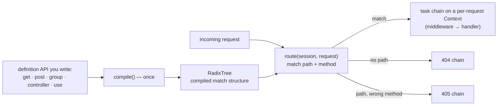
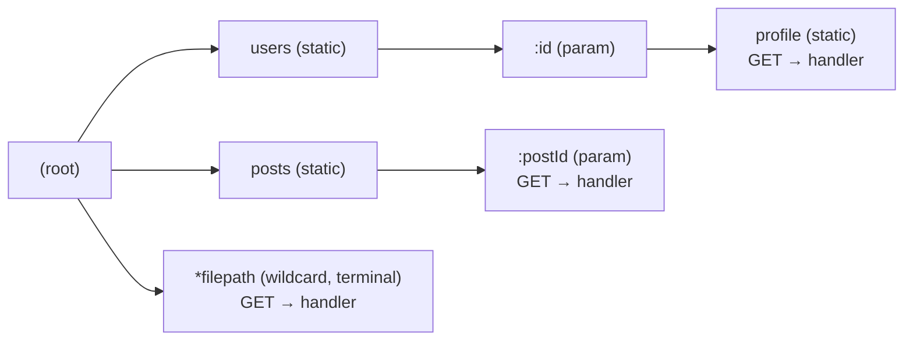

# Routing overview

> **Audience:** Adopter · **Status:** stable · **Verified-against:** qbm-http @ qb 3.0.0 (C++20 default, C++23 supported)

How `qb::http::Router` turns a tree of route, group, and controller definitions into a compiled radix tree, and how an incoming request is matched and dispatched to a chain of tasks.

**Prerequisites:** [Core HTTP concepts](./01-core-concepts.md) — **See also:** [Defining routes](./04-defining-routes.md) · [Route groups](./05-route-groups.md) · [Controllers](./06-controllers.md) · [Middleware](./07-middleware.md) · [Request context](./10-request-context.md)

## Summary

`qb::http::Router<Session>` is the public facade you use to declare routes. Internally it owns a `RouterCore<Session>` (the engine) and a `RadixTree<Session>` (the compiled match structure). You build a hierarchy of handler nodes — direct routes, `RouteGroup`s, and `Controller`s — call `compile()` once, and then every request flows through `route()`, which matches a path and method against the radix tree and runs the resulting task chain on a per-request `Context`.

The router lives behind your server: an HTTP/1.1, HTTP/2, or HTTP/3 server exposes it through `server->router()`, and the session's request handler calls `router().route(session, std::move(request))` for you. You rarely call `route()` by hand; you call the definition API (`get`, `post`, `group`, `controller`, `use`) and `compile()`.

`Router`, `RouteGroup`, `Controller`, `Context`, and the routing types are all reachable through the umbrella header `<qbm/http/http.h>`; `routing.h` is the narrower include if you only need the routing layer. `RouterCore` and `RadixTree` are internal — you never include or instantiate them directly.



## Concepts

### The router and the route table

A `Router<Session>` holds three things:

| Member | Role |
| --- | --- |
| `RouterCore<Session>` (shared) | The engine: owns the radix tree, the compiled 404/405 chains, the optional user error chain, and router-level lifecycle hooks. |
| Root `RouteGroup<Session>` (shared) | A group with an empty path prefix. Routes and middleware added directly on the `Router` attach here, which is why `router.use(...)` is effectively global middleware. |
| `_is_compiled` flag | Tracks whether `compile()` has run. Any definition mutation resets it to `false`. |

The *route table* is the set of top-level handler nodes registered with the core, plus everything nested under them. Each node is an `IHandlerNode<Session>`:

- **`Route`** — a terminal node binding one HTTP method and one path segment to a handler (a `RouteHandlerFn` lambda or an `ICustomRoute`).
- **`RouteGroup`** — a prefix container. Its middleware is inherited by every descendant route, group, and controller.
- **`Controller`** — a class-based group; you subclass `Controller<Session>`, override `initialize_routes()`, and bind member functions with the unified verb API (`this->get(path, this, &MyController::method)`).

These are described in [Defining routes](./04-defining-routes.md), [Route groups](./05-route-groups.md), and [Controllers](./06-controllers.md). This page covers the model that holds them together.

### Path pattern syntax

A path pattern is split into `/`-delimited segments. Each segment is one of three kinds:

1. **Static** — a literal that must match exactly: `users`, `list`.
2. **Parameter** — a segment beginning with `:`, capturing exactly one segment under the given name: `/users/:id` captures `id`. The name must be non-empty.
3. **Wildcard** — a segment beginning with `*`, capturing the entire remainder of the path (including embedded slashes): `/files/*path`. A wildcard **must be the last segment** in the pattern, and the name must be non-empty.

Capture names must be unique within a single pattern. A `:` or `*` with no name, an empty segment, a misplaced wildcard, or two conflicting captures at the same tree level all throw `std::invalid_argument` — raised from `add_route`, which surfaces during `compile()`.

<!-- src: qbm/http/src/qbm/http/routing/radix_tree.h:293-392 -->

### Match precedence and path handling

When more than one branch could match a segment, the radix tree applies a fixed priority: **static > parameter > wildcard**. A wildcard is the lowest priority and is terminal-only. So for a request to `/users/active`, a registered `/users/active` wins over `/users/:status`, which wins over `/users/*rest`.

<!-- src: qbm/http/src/qbm/http/routing/radix_tree.h:434-436,504-540 -->

Path segmentation handles slashes for you:

- **Leading/trailing slashes** are normalized: `/users` and `/users/` segment identically, so they reach the same node.
- **Consecutive slashes** produce no empty segments — `/foo//bar` segments to `{"foo", "bar"}`.
- The root `/` segments to the empty list, so a handler registered at `/` attaches to the tree root.

<!-- src: qbm/http/src/qbm/http/routing/radix_tree.h:279-313 -->

### The `compile()` step

`compile()` flattens the node tree into the radix tree. It delegates to `RouterCore::compile_all_routes()`, which:

1. Clears the radix tree.
2. Finds the root group and extracts its middleware as the *global prefix tasks* applied to the special 404 and 405 chains.
3. Walks every top-level node, calling `compile_tasks_and_register()` recursively. Each node combines inherited middleware with its own, and each terminal `Route` appends its handler task, producing one ordered task chain per `(path, method)` endpoint. That chain is registered into the radix tree.
4. Re-compiles the default 404 and 405 handlers with the global prefix tasks in front.

The assembled order for any endpoint is **parent middleware → this node's middleware → route handler**. Inherited tasks always run before a node's own, and a node's own before the final handler.

<!-- src: qbm/http/src/qbm/http/routing/router_core.h:177-211; qbm/http/src/qbm/http/routing/route.h:309-334; qbm/http/src/qbm/http/routing/handler_node.h:262-274 -->

`compile()` **must** be called after all routes, groups, controllers, and middleware are defined and before serving requests. Two safety nets back this up:

- Any definition mutation (`add_route`, `group`, `controller`, `use`, …) sets `_is_compiled = false`.
- `route()` auto-compiles on first use if you forgot. Relying on this is fine for tests, but compile explicitly at startup in production so a malformed pattern fails fast rather than on the first request.

Calling `compile()` again recompiles from scratch — it is idempotent and safe to re-run after adding routes.

<!-- src: qbm/http/src/qbm/http/routing/router.h:290,302,603-619 -->

### Request dispatch

`route(session, request)` hands off to `RouterCore::route_request()`, which performs the full per-request flow:

1. Builds a `std::shared_ptr<Context<Session>>` carrying the request, a response prototype (with `stream_id` copied from the request for HTTP/2 and HTTP/3), and a `weak_ptr` to the session.
2. Copies any router-level lifecycle hooks into the context, then fires the `PRE_ROUTING` hook.
3. Rejects paths longer than 4096 bytes with a `400 Bad Request` before any matching (a DoS guard).
4. Matches the path and method against the radix tree:
   - **Match found** → decodes path parameters, sets processing phase `NORMAL_CHAIN`, and selects the route's compiled task chain.
   - **Path exists, method does not** → sets phase `METHOD_NOT_ALLOWED_CHAIN`, sets the RFC `Allow` header from the registered methods, and selects the 405 chain.
   - **No match** → sets phase `NOT_FOUND_CHAIN` and selects the 404 chain.
5. Fires the `PRE_HANDLER_EXECUTION` hook and starts the selected chain on the context.

Path parameters are URI-decoded exactly once, at match time, and only when a parameterized route matches — static routes never allocate decoded strings. In path components `+` stays literal (only query/form decoding maps `+` to a space).

<!-- src: qbm/http/src/qbm/http/routing/router_core.h:309-421 -->

The `Context` returned by `route()` manages its own asynchronous lifecycle. When the chain finishes, the context invokes the router's finalization callback, which (if the session is still alive) fires `PRE_RESPONSE_SEND` and writes the response back over the session. See [Request context](./10-request-context.md) for the full lifecycle.

### Compiled chains are shared and immutable

After `compile()`, the task objects (`IAsyncTask`, middleware, route handlers) are **shared across every concurrent request** for that endpoint — HTTP/1.1 pipelining and HTTP/2/3 multiplexing reuse the same chain. Therefore:

- A task implementation **must not** store per-request state on itself. All per-request bookkeeping (the current-task cursor, cancellation, custom data) lives on the `Context`.
- The routing layer is single-threaded per listener: `execute()` and `cancel()` always run on the same I/O thread, and coroutine handlers resume on that thread via `qb::io::async::coro_scheduler()`. Tasks need no internal locking.

<!-- src: qbm/http/src/qbm/http/routing/async_task.h:37-41,66-72 -->

## Steps and examples

### Define, compile, serve

On a server the router is already wired to the session handler — you only declare routes and compile. This is the HTTP/1.1 path; the HTTP/2 and HTTP/3 servers expose the same `router()` facade (both SSL-gated, and HTTP/3 additionally `QBM_HTTP_HAS_HTTP3`-gated).

```cpp
// src: qbm/http/src/qbm/http/1.1/http.h:18-26 (server->router() pattern)
#include <qbm/http/http.h>

auto server = qb::http::make_server(); // std::unique_ptr<Server<DefaultSession>>

server->router()
    .get("/health", [](auto ctx) {
        ctx->response().status() = qb::http::status::OK;
        ctx->response().body() = "ok";
        ctx->complete(); // terminal: AsyncTaskResult::COMPLETE
    })
    .get("/users/:id", [](auto ctx) {
        const std::string id = ctx->path_param("id");
        ctx->json(qb::json{{"id", id}}); // terminal helper
    });

server->router().compile();                                 // build the radix tree once
server->listen(qb::io::uri("http://0.0.0.0:8080"));         // begin accepting connections
```

Every handler **must** eventually call a terminal: `ctx->complete(AsyncTaskResult)` (default `AsyncTaskResult::COMPLETE`) or one of the terminal response helpers (`json`, `text`, `html`, `redirect`, `no_content`, `bad_request`, …) — each of those ends in `complete(AsyncTaskResult::COMPLETE)` for you. Forget it and the request hangs. The `Context::status(code)` setter is the exception: it sets the status, returns `Context&`, and does **not** terminate, so you can chain it ahead of a terminal call.

<!-- src: qbm/http/src/qbm/http/routing/async_task.h:62-76; qbm/http/src/qbm/http/routing/context.h:913-1106 -->

### Read captured parameters

Parameter and wildcard captures are exposed through the `Context`:

```cpp
#include <qbm/http/http.h>

server->router().get("/files/:bucket/*path", [](auto ctx) {
    // :bucket captures one segment; *path captures the rest, slashes included.
    const std::string bucket = ctx->path_param("bucket");           // e.g. "images"
    const std::string& rel   = ctx->path_param("path");             // e.g. "2024/cover.png"

    // Or take the whole set:
    const qb::http::PathParameters& params = ctx->path_parameters();
    if (auto v = params.get("bucket")) { /* std::optional<std::string_view> */ }

    ctx->text("bucket=" + bucket + " path=" + rel);
});
```

Values arrive URI-decoded: a request to `/notes/My%20Note` matched by `/notes/:title` yields `title == "My Note"`. The parameter keys are `string_view`s into the route pattern held by the router, so the router must outlive the context — which it does by construction.

<!-- src: qbm/http/src/qbm/http/routing/router_core.h:385-395; qbm/http/src/qbm/http/routing/path_parameters.h:36-39,77-83 -->

### Customize the not-found and error behavior

```cpp
#include <qbm/http/http.h>

auto& router = server->router();

// Replace the default 404. Global (root-group) middleware still runs before it.
router.set_not_found_handler([](auto ctx) {
    ctx->response().status() = qb::http::status::NOT_FOUND;
    ctx->json(qb::json{{"error", "not found"}});
});

// Install an error chain, invoked when a task calls complete(AsyncTaskResult::ERROR).
router.set_error_task_chain({ /* std::shared_ptr<IAsyncTask<Session>>... */ });

router.compile();
```

Global middleware **is** prepended to the default and custom 404 and 405 chains, but it is **not** auto-prepended to the user error chain set via `set_error_task_chain` — include any cross-cutting behavior (logging, CORS) explicitly in that chain. See [Error handling](./13-error-handling.md).

<!-- src: qbm/http/src/qbm/http/routing/router_core.h:112-142,232-250,256-268 -->

### Conceptual radix tree



Matching `GET /users/alice/profile` against that tree:

1. root → static child `users` ✓
2. `users` → no static `alice` → param `:id`, capture `id="alice"`
3. `:id` → static child `profile` ✓
4. segments exhausted → GET handler present → run chain `{middleware…, handler}` with path params `{ id: "alice" }`

## Pitfalls

- **Spell the method type `qb::http::method`, and `DELETE` as `DEL`.** The canonical name `qb::http::method` is a type alias for `class Method`, so both names resolve to the same type. Values are static members: `qb::http::method::GET`, `::POST`, `::PUT`, `::PATCH`, `::OPTIONS`, `::HEAD`. `DELETE` is exposed as `qb::http::method::DEL` because `DELETE` is a reserved identifier on some platforms (`DELETE_METHOD` is a longer alias).
- **Compile after the last mutation.** Adding any route or middleware resets `_is_compiled`. If you add routes after a manual `compile()`, compile again. The auto-compile in `route()` masks the mistake only until something fails to compile.
- **Wildcards are terminal.** `/*rest/more` is rejected. Put the wildcard last, or use a parameter for an interior segment.
- **Every handler must terminate the context.** A handler or `ICustomRoute::process` that never calls `ctx->complete(...)` (or a terminal helper) leaves the request hanging. Functional middleware may instead call `next()`. A `cancel()` implementation must **not** call `complete()` — the context owns cancellation.
- **Never store per-request state on a task.** Compiled tasks are shared across concurrent requests. Keep state on the `Context` (string-keyed `set/get` or typed `Slot<T>`), never on the task object.
- **Don't include or instantiate `RouterCore`/`RadixTree`.** They are internal and intentionally excluded from `routing.h` and `<qbm/http/http.h>`. Use `Router` and, only if you must reach the engine, `Router::get_router_core_weak_ptr()`.
- **`session()` may be null.** The context holds the session by `weak_ptr`; a client can disconnect mid-flight. Code reachable in lifecycle hooks or late callbacks must null-check before sending.

## See also

- [Defining routes](./04-defining-routes.md) — the `get`/`post`/`add_route`/custom-route API.
- [Route groups](./05-route-groups.md) — prefixes and inherited middleware.
- [Controllers](./06-controllers.md) — class-based route organization.
- [Middleware](./07-middleware.md) — how chains are built and ordered.
- [Request context](./10-request-context.md) — the per-request lifecycle, hooks, and response helpers.
- [Error handling](./13-error-handling.md) — 404/405 customization and the error chain.

---

Previous: [HTTP message body: deep dive](./02-body-deep-dive.md) · Next: [Defining routes](./04-defining-routes.md) · Return to [Index](./README.md)
