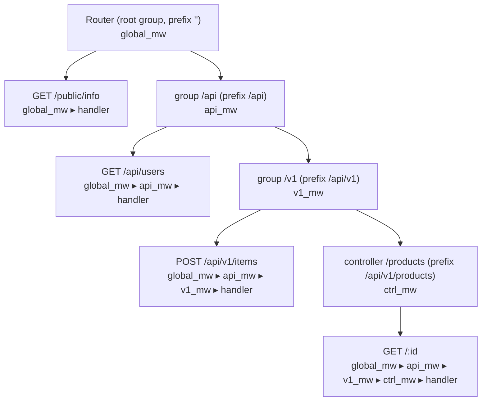

# Route groups

> **Audience:** Adopter · **Status:** stable · **Verified-against:** qbm-http @ qb 3.0.0 (C++20 default, C++23 supported)

Mount a set of related routes under a shared path prefix, nest groups to any depth, and attach middleware that every route inside the group inherits.

**Prerequisites:** [Defining routes](./04-defining-routes.md), [Routing overview](./03-routing-overview.md) — **See also:** [Controllers](./06-controllers.md), [Middleware overview](./07-middleware.md), [The request context](./10-request-context.md)

## What a route group is

A `qb::http::RouteGroup<SessionType>` is a non-terminal node in the routing tree. It owns two things: a **path prefix** that is prepended to every route declared inside it, and a **middleware stack** that runs before any route declared inside it. Groups exist to keep large APIs organized — version namespaces (`/api/v1`), feature areas (`/admin`), and authentication boundaries are the typical reasons to reach for one.

`RouteGroup` shares the same fluent route-definition API as the [`Router`](./03-routing-overview.md) and [`Controller`](./06-controllers.md): `get`, `post`, `put`, `del`, `patch`, `options`, `head`, `add_route`, the typed `ICustomRoute` overloads, and three `use()` overloads for middleware. Everything you can do at the router root, you can do on a group — relative to the group's prefix.

Groups are part of the routing tree, so they obey the same compile rule as routes: declare every group, route, controller, and middleware first, then call `router.compile()` once. Any definition mutation resets the compiled flag (`_is_compiled = false`); `route()` auto-compiles on first use if you forgot, but call `compile()` explicitly so the cost is paid at startup, not on the first request.

<!-- src: qbm/http/src/qbm/http/routing/route_group.h:49-95 -->

## Creating a group

You create a top-level group from the router with `group(path_prefix)`, and a nested group from another group with the same method. Both return a `std::shared_ptr<RouteGroup<SessionType>>` — the result is `[[nodiscard]]`, so capture it and define routes against the pointer.

<!-- src: qbm/http/src/qbm/http/routing/router.h:208, route_group.h:213-218 -->
```cpp
#include <qbm/http/http.h>   // Router, RouteGroup, Context, method

// In a server actor (class Srv : public qb::Actor, public qb::http::Server<>),
// router() is inherited from Server<> and called inside the actor's onInit().
// SessionType defaults to qb::http::DefaultSession.

auto api = router().group("/api/v1");        // std::shared_ptr<RouteGroup<...>>

api->get("/users", [](auto ctx) {            // effective path: /api/v1/users
    ctx->response().status() = qb::http::status::OK;
    ctx->complete();
});
api->post("/users", [](auto ctx) {           // effective path: /api/v1/users (POST)
    ctx->response().status() = qb::http::status::CREATED;
    ctx->complete();
});
```

The handler signature, the `Context` API, and path parameters are identical to top-level routes — see [Defining routes](./04-defining-routes.md). The only difference a group introduces is the prefix.

> DELETE is `del()`, not `delete()` — `delete` is a C++ keyword, so the verb API spells the method `qb::http::method::DEL` throughout (router, group, and controller).

## How prefixes compose

When `compile()` runs, the router walks the tree from the root. Each node calls `build_full_path(parent_path)`, which joins the parent's accumulated path with its own segment through `qb::http::detail::join_paths`. That joiner normalizes slashes, so the prefix you write is forgiving:

- Leading and trailing slashes are stripped before joining: `"/users"`, `"users"`, and `"users/"` all contribute the same segment.
- The result always starts with `"/"` and never contains a double slash.
- An empty segment contributes nothing; the root group's prefix is `""`, which is why a route declared directly on the router keeps its own path.

<!-- src: qbm/http/src/qbm/http/routing/handler_node.h:84-114, 262-264 -->
```cpp
#include <qbm/http/http.h>

router().get("/health", h_health);            // -> /health   (root group prefix is "")

auto users = router().group("/users");
users->get("/:id", h_user_by_id);             // -> /users/:id
users->post("/", h_user_create);              // -> /users     (trailing "/" normalized away)

auto profiles = users->group("/profiles");    // nested: prefix accumulates to /users/profiles
profiles->get("/:userId/view", h_view);       // -> /users/profiles/:userId/view
```

Because both arguments are normalized, `router().group("/api/")->group("/v1")` and `router().group("api")->group("v1/")` resolve to the same `/api/v1` base. Write whichever reads best; the joiner makes them equivalent.

## Group-scoped middleware

The reason groups matter beyond tidiness is shared middleware. Call `use()` on a group and every route, nested group, and controller mounted under it inherits that middleware. This is the natural place to put authentication, logging, or rate limiting for a whole section of the API instead of repeating it on each route.

`RouteGroup::use()` has the same three overloads as the router:

<!-- src: qbm/http/src/qbm/http/routing/route_group.h:251-303 -->
```cpp
// 1. Lambda middleware (ctx, next) -> void; second arg names it for logs.
group->use([](auto ctx, auto next) { /* ... */ next(); }, "trace");

// 2. A pre-built IMiddleware instance; name is taken from mw->name() if omitted.
group->use(std::make_shared<MyMiddleware>(/* ctor args */));

// 3. Construct the middleware in place from its type and constructor args.
group->use<MyMiddleware>(/* ctor args */);
```

The lambda form takes `(ctx, next)` — invoke `next()` to pass control down the chain, or set a response and call `ctx->complete(qb::http::AsyncTaskResult::COMPLETE)` to short-circuit. See [Middleware overview](./07-middleware.md) for the full contract and [Standard middleware](./08-standard-middleware.md) for the built-in handlers (auth, CORS, rate limiting) you typically mount on a group.

### Inheritance and execution order

Middleware composes top-down. At compile time each node runs `combine_tasks(inherited)`: it copies the tasks inherited from its parent, then appends its own. The resulting chain for any route is **parent middleware first, then this node's middleware, then the route handler** — in declaration order at each level.

<!-- src: qbm/http/src/qbm/http/routing/handler_node.h:272-279, route_group.h:65-77 -->
```cpp
#include <qbm/http/http.h>

router().use(global_mw);                       // runs for every request

auto api = router().group("/api");
api->use(api_auth_mw);                          // runs for every /api/* request

auto v1 = api->group("/v1");
v1->use(v1_logging_mw);                         // runs for every /api/v1/* request
v1->get("/status", h_status);

// A request to GET /api/v1/status executes, in order:
//   global_mw  ->  api_auth_mw  ->  v1_logging_mw  ->  h_status
```

This ordering is enforced by the framework, not by chance — a router-middleware test asserts the exact trace `"router_mw;g1_mw;g2_mw;g2_handler"` for a route nested two groups deep. Middleware applies to descendants only: a sibling group does **not** inherit another sibling's middleware.

<!-- src: qbm/http/tests/unit/routing/router-middleware-chain.cpp:418-447 -->
```cpp
auto api = router().group("/api");
api->use(api_auth_mw);                          // shared by v1 and v2 below

auto v1 = api->group("/v1");
v1->use(v1_logging_mw);                          // v1 only
v1->get("/status", h_status);
// GET /api/v1/status:  global_mw -> api_auth_mw -> v1_logging_mw -> h_status

auto v2 = api->group("/v2");
v2->get("/info", h_info);                        // no v1_logging_mw here
// GET /api/v2/info:    global_mw -> api_auth_mw -> h_info
```

## Mounting controllers in a group

A group can host a [`Controller`](./06-controllers.md) the same way the router can, with `controller<C>(path_prefix, ctor_args...)`. The controller's own routes are prefixed by the group's full path, and requests into them pass through the group's middleware stack in addition to the controller's own middleware.

<!-- src: qbm/http/src/qbm/http/routing/route_group.h:232-240 -->
```cpp
#include <qbm/http/http.h>

auto api = router().group("/api/users");
api->use(user_group_auth_mw);

// Mount UserController at /api/users/manage; a GET "/:id" in the
// controller resolves to /api/users/manage/:id and runs user_group_auth_mw first.
auto users = api->controller<UserController>("/manage");
```

## How prefixes and middleware accumulate



Path prefixes accumulate as you descend; middleware chains build up the same way, each level appending after the levels above it.

## Pitfalls

- **Forgetting `compile()`.** A group's prefix and middleware are flattened into the radix tree only at compile time. Declaring a group after `compile()` has run leaves it unrouted until you recompile; declaring one before invalidates the compiled flag, which `compile()` (or the first `route()`) then rebuilds.
- **Dropping the returned pointer.** `group()` and `controller()` are `[[nodiscard]]`. The group lives in the tree regardless, but if you discard the `shared_ptr` you have no handle to add routes or middleware to it. Capture it.
- **Expecting sibling inheritance.** Middleware flows down to descendants only. Two sibling groups under the same parent inherit the parent's stack but never each other's. Put shared middleware on the common ancestor.
- **Assuming middleware order is alphabetical or registration-global.** Order is structural: parent-before-child, and within a node, declaration order. The 404 and 405 chains additionally inherit root-group (global) middleware, but a user-defined error chain set via `set_error_task_chain` does **not** — include those behaviors explicitly there. See [Error handling](./13-error-handling.md).
- **Treating the prefix as literal.** `join_paths` normalizes slashes, so a stray leading or trailing `/` is harmless — but it will not collapse path *parameters* or wildcards for you. The prefix is matched as written once normalized; see [Routing overview](./03-routing-overview.md) for the match semantics.

## See also

- [Defining routes](./04-defining-routes.md) — the per-route API that groups reuse, and path parameters.
- [Controllers](./06-controllers.md) — class-based grouping, mountable inside a group.
- [Middleware overview](./07-middleware.md) — the `(ctx, next)` contract and lifecycle, and [Standard middleware](./08-standard-middleware.md) for built-ins.
- [Routing overview](./03-routing-overview.md) — the compile step, the radix match algorithm, and dispatch.

---

Previous: [Defining routes](./04-defining-routes.md) · Next: [Controllers](./06-controllers.md) · Up: [Index](./README.md)
