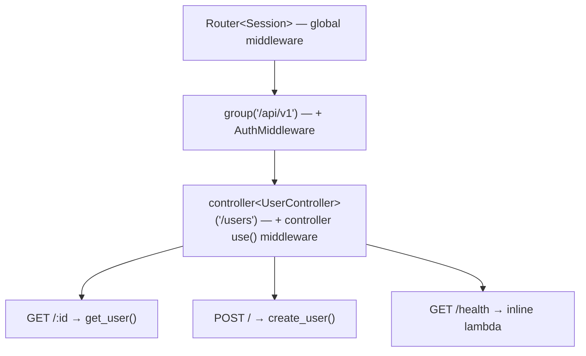

# Controllers

> **Audience:** Adopter · **Status:** stable · **Verified-against:** qbm-http @ qb 3.0.0 (C++20 default, C++23 supported)

Group related route handlers, their shared state, and their middleware into a single class that mounts onto the router under a base path.

**Prerequisites:** [Defining routes](./04-defining-routes.md), [Route groups](./05-route-groups.md) — **See also:** [Middleware overview](./07-middleware.md), [The request context](./10-request-context.md), [Custom middleware](./09-custom-middleware.md)

## What a controller is

A [`RouteGroup`](./05-route-groups.md) bundles routes under a path prefix, but its routes are still anonymous lambdas declared inline. A `qb::http::Controller<SessionType>` is the class-based equivalent: you subclass it, declare the group's routes once in an overridden method, and back each route with a member function. Because the controller is an object, those member functions share the controller's member variables — a database handle, a service client, a cache, a counter — without capturing anything into a lambda.

A controller is itself an `IHandlerNode<SessionType>`, the same tree-node abstraction as `Route` and `RouteGroup`. It owns a path segment, a stack of per-node middleware inherited by all of its routes, and the `compile_tasks_and_register` step that flattens it into the router's radix tree. Mounting a controller is therefore indistinguishable, at the routing level, from mounting a group: the controller's routes appear at `parent_path + base_path_segment + route_path`, and parent middleware flows down into them.

Reach for a controller when:

- A set of routes shares state or an injected dependency (a service, a connection pool).
- You want the route definitions and their handlers to live together in one testable unit.
- You want to mount the same set of routes more than once, under different prefixes or with different constructor arguments.

For a handful of stateless endpoints, an inline `RouteGroup` is lighter. Controllers earn their weight as the surface grows.

## Anatomy of a controller

<!-- src: qbm/http/src/qbm/http/routing/controller.h:53-168, tests/unit/routing/router-controller.cpp:94-145 -->

```cpp
#include <qbm/http/http.h>   // qb::http::Controller, Context, Router, status
#include <memory>
#include <string>

// Your application's session type — see 01-core-concepts.md.
struct MySession;

// An injected dependency the controller's handlers will share.
struct UserService {
    std::string fetch(const std::string &id) { return "user:" + id; }
    void        create(std::string_view body) { /* ... */ }
};

class UserController : public qb::http::Controller<MySession> {
public:
    // Constructor receives dependencies. Anything the router's controller<>()
    // call forwards lands here.
    explicit UserController(std::shared_ptr<UserService> svc)
        : _svc(std::move(svc)) {}

    // Required override: declare the controller's routes and middleware here.
    void initialize_routes() override {
        // Bind a member function directly: pass `this` and the method pointer.
        // (The method may be synchronous or return qb::io::async::task<void>.)
        this->get("/:id", this, &UserController::get_user);
        this->post("/",   this, &UserController::create_user);

        // A plain lambda works too, when no member state is needed.
        this->get("/health", [](std::shared_ptr<Context> ctx) {
            ctx->response().body() = "ok";
            ctx->complete();
        });
    }

private:
    void get_user(std::shared_ptr<Context> ctx) {
        const std::string id = ctx->path_param("id");
        ctx->response().body() = _svc->fetch(id);
        ctx->complete();
    }

    void create_user(std::shared_ptr<Context> ctx) {
        _svc->create(ctx->request().body().template as<std::string_view>());
        ctx->response().status() = qb::http::status::CREATED;
        ctx->complete();
    }

    std::shared_ptr<UserService> _svc;
};
```

The pieces:

- **Subclass `Controller<MySession>`.** The base injects two convenience aliases inside the class body: `SessionType` (= `MySession`) and `Context` (= `qb::http::Context<MySession>`). Use the short `Context` spelling for handler signatures.
- **Override `initialize_routes()`.** This is the one pure-virtual method. Declare routes with `this->get(...)`, `this->post(...)`, etc., and per-controller middleware with `this->use(...)`. The router calls this method for you during compilation — never call it yourself in normal use.
- **Write handlers as member functions** taking `std::shared_ptr<Context>` and returning `void`. They drive the request through the same `Context` object documented in [The request context](./10-request-context.md): set `response()`, read `path_param(...)`, then call `complete()`.
- **Hold state in members.** Each handler sees the controller's members directly, so a `UserService`, a request counter, or a config struct is shared across every route the controller defines.

### The route-definition API

Inside `initialize_routes()`, a controller exposes the same verb methods as a router or group, all relative to the controller's base path:

| Method | Maps to |
| --- | --- |
| `get`, `post`, `put`, `del`, `patch`, `options`, `head` | `qb::http::method::GET … HEAD` |

`del` (not `delete`) is the spelling for `DELETE` throughout the verb API — `delete` is a C++ keyword and cannot be a method name. Each verb has these overloads, mirroring [Defining routes](./04-defining-routes.md):

- `get(path, handler)` — any handler satisfying `RouteHandlerLike`: a **synchronous** lambda (`void(ctx)`) **or** a **coroutine** lambda (`qb::io::async::task<void>(ctx)`). One concept-gated overload accepts both; the coroutine form is detected automatically.
- `get(path, this, &Class::method)` — binds a member function (sync **or** coroutine) without writing a lambda.
- `get<MyCustomRoute>(path, ctor_args...)` — constructs an [`ICustomRoute`](./09-custom-middleware.md) in place.
- `get(path, std::shared_ptr<ICustomRoute<MySession>>)` — a pre-built custom route.

Every verb method returns `Controller<MySession>&`, so calls chain. Paths are relative to the controller's mount point — a leading `/` is normalized, so `"/users"` and `"users"` behave identically.

### Member-function handlers

<!-- src: qbm/http/src/qbm/http/routing/controller.h (QB_HTTP_CTRL_VERB) -->

Pass the controller instance and a pointer-to-member to bind a method as the handler — no lambda, no wrapper:

```cpp
this->get("/:id", this, &UserController::get_user);   // void get_user(std::shared_ptr<Context>)
this->post("/",   this, &UserController::create);     // task<void> create(std::shared_ptr<Context>)  ← coroutine also OK
```

The bound member takes `std::shared_ptr<Context>` and returns either `void` (synchronous) or `qb::io::async::task<void>` (coroutine); the framework picks the right path automatically. The captured `this` must outlive every request — it does, since the router owns the controller for its lifetime. An explicit `[this](std::shared_ptr<Context> ctx){ return this->method(ctx); }` is exactly equivalent if you prefer a lambda.

## Mounting a controller

<!-- src: qbm/http/src/qbm/http/routing/router.h:219-220, qbm/http/src/qbm/http/routing/route_group.h:230-232, tests/unit/routing/router-controller.cpp:572-583 -->

Mount a controller on a `Router` or a `RouteGroup` with `controller<C>(path_prefix, ctor_args...)`:

```cpp
#include <qbm/http/http.h>
#include <memory>

qb::http::Router<MySession> router;
auto svc = std::make_shared<UserService>();

// Construct UserController(svc) and mount it under "/users".
std::shared_ptr<UserController> users =
    router.controller<UserController>("/users", svc);

router.compile();   // flatten the tree — required before serving
```

- `C` is your controller type. The signature is constrained — on both `Router` and `RouteGroup` by `requires DerivedFrom<C, Controller<SessionType>>` — so a non-controller type fails to compile.
- `path_prefix` is the controller's base path segment. It combines with the parent's path: a controller mounted at `"/users"` on the router answers at `/users/...`; the same controller mounted at `"/users"` inside a group created with `group("/api/v1")` answers at `/api/v1/users/...`.
- `ctor_args...` are forwarded to `C`'s constructor. The `controller<>()` call constructs the instance immediately, so a throwing constructor throws out of `controller<>()`, before `compile()`.

The call returns `std::shared_ptr<C>` — the concrete type, not the base — so you can keep configuring the instance after mounting (for example, `users->use(...)` to add middleware, as shown below). The router co-owns the controller; the returned handle is a shared reference, not the sole owner.

With the mount above and the `UserController` from earlier, the routing table resolves:

| Request | Handler |
| --- | --- |
| `GET /users/42` | `UserController::get_user`, `path_param("id") == "42"` |
| `POST /users/` | `UserController::create_user` |
| `GET /users/health` | the inline `/health` lambda |

### Mounting inside a group

A controller composes with [route groups](./05-route-groups.md). Mount it on a group to inherit the group's prefix and middleware:

```cpp
auto api = router.group("/api/v1");
api->use<AuthMiddleware>();                       // applies to everything under /api/v1
api->controller<UserController>("/users", svc);   // -> /api/v1/users/...
router.compile();
```

`AuthMiddleware` here runs ahead of any controller-level middleware and ahead of the route handlers, because parent middleware is always inherited first. See [Middleware overview](./07-middleware.md) for the full ordering rules.

A controller is an `IHandlerNode` in the same tree as the router and its groups, so mounting composes paths and inherits middleware top-down:



Effective path = `/api/v1/users/…`; middleware runs outermost-first: global → group → controller → handler.

## Controller-scoped middleware

<!-- src: qbm/http/src/qbm/http/routing/controller.h:327-372, tests/unit/routing/router-controller.cpp:549-568, 763-786 -->

Middleware declared on a controller applies to **all** routes the controller defines, and only those routes. Declare it from inside `initialize_routes()` with `this->use(...)`, or add it after mounting through the returned handle. **Four** overloads, matching the router and group APIs: a coroutine `(ctx, next) -> task<void>` handler, a sync functional `(ctx, next)` lambda, a `shared_ptr<IMiddleware>`, and in-place construction from the middleware type and its ctor args. The coroutine and sync forms are *separate* overloads selected by concept, not one unified overload. The example below shows three of the four:

<!-- src: qbm/http/src/qbm/http/routing/controller.h:218 (coro), :327 (sync functional), :342 (shared_ptr), :370 (in-place) -->

```cpp
class AdminController : public qb::http::Controller<MySession> {
public:
    void initialize_routes() override {
        // 1) Functional middleware: (ctx, next) — call next() to continue.
        this->use(
            [](std::shared_ptr<Context> ctx, std::function<void()> next) {
                if (ctx->request().has_header("X-Admin-Token")) {
                    next();                                  // continue the chain
                } else {
                    ctx->response().status() = qb::http::status::UNAUTHORIZED;
                    ctx->complete();                         // short-circuit
                }
            },
            "AdminGate");                                    // optional name for tracing

        // 2) An IMiddleware instance, constructed in place from ctor args.
        this->use<RateLimitMiddleware>(/* ctor args */);

        this->get("/stats", this, &AdminController::stats);
    }
private:
    void stats(std::shared_ptr<Context> ctx) { /* ... */ }
};
```

You can also add middleware to the live instance after mounting — useful when the middleware needs runtime configuration the controller's constructor did not receive:

```cpp
auto admin = router.controller<AdminController>("/admin");
admin->use(std::make_shared<AuditMiddleware>("admin-audit"));   // 3) shared_ptr form
router.compile();
```

All four `use` overloads return `Controller<MySession>&` for chaining. Within a single controller, middleware runs in declaration order, after any inherited parent middleware, and before the matched route's handler. The `(ctx, next)` functional form and the `IMiddleware`/`ICustomRoute` interfaces are documented in [Custom middleware](./09-custom-middleware.md); the bundled middleware (CORS, auth, rate limiting, compression, and so on) in [Standard middleware](./08-standard-middleware.md).

## State and reuse

Because a controller is a plain object, it holds state across requests and can be mounted more than once. The router owns one instance per mount, and that instance lives for the router's lifetime — so a member counter accumulates across every request the mount serves:

<!-- src: tests/unit/routing/router-controller.cpp:509-547, 667-713 -->

```cpp
class CounterController : public qb::http::Controller<MySession> {
public:
    explicit CounterController(std::string label) : _label(std::move(label)) {}

    void initialize_routes() override {
        this->get("/hit", this, &CounterController::hit);
    }
private:
    void hit(std::shared_ptr<Context> ctx) {
        ctx->response().body() = _label + ": " + std::to_string(++_count);
        ctx->complete();
    }
    std::string _label;
    int         _count = 0;   // survives across requests to this mount
};

// Two independent instances, two independent counters.
router.controller<CounterController>("/a", std::string{"A"});
router.controller<CounterController>("/b", std::string{"B"});
router.compile();
```

That shared mutable state is exactly why controllers carry a concurrency contract. The session type parameter and the actor that owns the router decide the threading model. If the controller is reachable from one actor only — the common qb pattern, where an HTTP server actor owns its router — the member state is single-threaded and needs no locking. If you deliberately share a controller across cores, its members become shared mutable state and you are responsible for synchronizing them. Prefer the single-owner model; it is what the framework is built around.

## How a controller compiles

<!-- src: qbm/http/src/qbm/http/routing/controller.h:372-401 -->

You rarely touch this, but the mechanics explain a few behaviors worth knowing. During `router.compile()`, each controller's `compile_tasks_and_register` runs once:

1. If the controller has not been initialized yet, it calls `initialize_routes()` exactly once and sets the internal `_routes_initialized` flag. The guard is keyed solely on that flag — **not** on whether the route list is empty — so `initialize_routes()` always runs once, even for a controller that declares only middleware and no routes. (The earlier `_controller_routes.empty()` guard was removed: it silently *dropped* the routes declared in `initialize_routes()` whenever the constructor had already pushed any, so declaring routes in both the constructor and the override now combines them unpredictably rather than skipping the override.)
2. It computes the controller's full base path from the parent path plus its own segment.
3. It combines inherited middleware with the controller's own middleware into one task list.
4. It compiles each declared route against that base path and task list, registering the flattened chains in the radix tree.

`compile()` is idempotent and safe to call repeatedly; `initialize_routes()` still fires only once. Any mutation of the routing tree after compilation resets the compiled flag, and `route()` auto-compiles on first use if you forgot — but call `compile()` explicitly once during setup so the cost is paid at startup, not on the first request. See [Routing overview](./03-routing-overview.md) for the compile model.

## Pitfalls

- **Define routes in `initialize_routes()`, not in the constructor.** The compile step always calls `initialize_routes()` exactly once (it is gated on the `_routes_initialized` flag, not on whether the route list is empty). If your constructor *also* declared routes, both sets are kept and combine unpredictably — there is no longer a guard that skips the override. Pick one location, and prefer `initialize_routes()`; it is the contract the framework is built around.
- **`del`, not `delete`.** The DELETE verb method is `del()`. `delete` is a C++ keyword and cannot be a method name.
- **Handlers must call `complete()` (or `cancel()`).** Each handler must signal terminal status on its `Context`, exactly as standalone route handlers do. A handler that returns without completing leaves the request hanging. For deferred work, capture the `std::shared_ptr<Context>` into the async task and call `complete()` from the continuation — the controller test suite drives precisely this pattern.
- **Member-function binding is controller-scoped.** `get(path, this, &Class::method)` captures `this`, so it is written inside `initialize_routes()` (or another controller method). The pointed-to method may be synchronous or a coroutine.
- **Compile after every controller is mounted.** Mount all controllers, groups, and global middleware first, then call `compile()` once. Mounting a controller after `compile()` invalidates the compiled tree; you must compile again before those routes resolve.
- **A throwing controller constructor throws from `controller<>()`.** The instance is built eagerly at mount time. Wrap the `controller<>()` call, not `compile()`, if construction can fail.

## See also

- [Route groups](./05-route-groups.md) — the lambda-based equivalent and the shared path/middleware model.
- [Defining routes](./04-defining-routes.md) — the verb overloads, path patterns, and parameter extraction controllers reuse.
- [Middleware overview](./07-middleware.md) — inheritance and execution order across router, group, and controller layers.
- [Custom middleware](./09-custom-middleware.md) — writing `IMiddleware` and `ICustomRoute` implementations used by `use<>` and `get<>`.
- [The request context](./10-request-context.md) — the `Context` every controller handler receives.

---

Previous: [Route groups](./05-route-groups.md) · Next: [Middleware overview](./07-middleware.md) · Up: [Index](./README.md)
