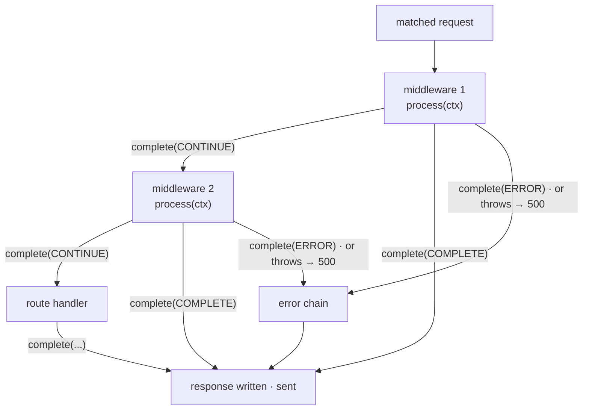

# The middleware model

> **Audience:** Adopter · **Status:** stable · **Verified-against:** qbm-http @ qb 3.0.0 (C++20 default, C++23 supported)

Middleware is the cross-cutting layer of the router: a chain of tasks that run before (and, for synchronous functional middleware, around) a route handler, each free to inspect the request, mutate the response, short-circuit the request, or pass control onward.

**Prerequisites:** [Routing overview](./03-routing-overview.md), [Route groups](./05-route-groups.md), [The request context](./10-request-context.md) — **See also:** [Standard middleware](./08-standard-middleware.md), [Custom middleware](./09-custom-middleware.md), [Error handling](./13-error-handling.md)

## Summary

A request that matches a route does not call your handler directly. The router executes a **compiled chain of tasks** — every applicable middleware, in order, followed by the route handler. Each task drives the chain forward by calling `ctx->complete(AsyncTaskResult)` (or, for `(ctx, next)`-style functional middleware, by calling `next()`). A task can let the request continue, finalize a response and stop the chain, or divert to the error chain. This page covers the interface, how chains are built and ordered, how short-circuiting works, and the synchronous-versus-asynchronous contract.



Middleware comes in three forms that resolve to the same runtime type:

- **Object middleware** — a class implementing `qb::http::IMiddleware<Session>` (this is what every standard middleware in `middleware/` is).
- **Functional middleware** — a synchronous `(ctx, next)` lambda, wrapped automatically by `qb::http::FunctionalMiddleware<Session>` when you pass it to `use()`.
- **Coroutine middleware** — a `qb::io::async::task<void>(ctx)` lambda (no `next` parameter), auto-detected and wrapped when you pass it to `use()`. The chain advances on normal coroutine completion unless the body called `ctx->complete(...)` itself.

All are adapted to the router's unit-of-work interface, `qb::http::IAsyncTask<Session>`, via `qb::http::MiddlewareTask<Session>`.

## Concepts

### The middleware interface

`qb::http::IMiddleware<Session>` is the contract every object middleware implements.

```cpp
// src: qbm/http/src/qbm/http/routing/middleware.h:37-59
template <typename SessionType>
class IMiddleware {
public:
    virtual ~IMiddleware() = default;

    // Main processing entry point. Must eventually call ctx->complete(...).
    virtual void process(std::shared_ptr<Context<SessionType>> ctx) = 0;

    // Descriptive name, for logging and debugging.
    virtual std::string name() const = 0;

    // Called if the chain is cancelled while this middleware is in flight.
    virtual void cancel() = 0;
};
```

- `process(ctx)` holds the logic. It receives a `std::shared_ptr<Context<Session>>` — the per-request object that exposes `request()`, `response()`, `session()`, path parameters, and the typed per-request store (see [The request context](./10-request-context.md)). `process` **must** lead to exactly one `ctx->complete(...)` call, either synchronously before it returns or later from an async callback.
- `name()` is used in log lines (`MiddlewareTask [<name>]: ...`).
- `cancel()` is invoked by the `Context` when the request is cancelled while this middleware is the in-flight task. Release any pending I/O here. **Never call `ctx->complete()` from `cancel()`** — the `Context` already owns the cancellation and finalization path; calling `complete()` would double-drive the chain. <!-- src: qbm/http/src/qbm/http/routing/async_task.h:73-75 -->

### How a middleware becomes a task

The router does not execute `IMiddleware` directly. It executes `IAsyncTask<Session>`, the generic unit of work in a request chain (a middleware *or* a handler). `qb::http::MiddlewareTask<Session>` is the adapter that bridges the two: its `execute()` calls your `process()` and, critically, **wraps it in a try/catch**. If `process()` throws, the adapter logs the method, path, and error, and — only if the context has not already completed or cancelled — sets the response status to `500` and calls `ctx->complete(AsyncTaskResult::ERROR)` for you. <!-- src: qbm/http/src/qbm/http/routing/middleware.h:79-113 -->

You rarely construct `MiddlewareTask` yourself — `use()` does it. But the wrapping is why an exception escaping your `process()` becomes a clean 500 + error chain rather than a hung request.

> A task instance is shared, immutable, and reused across many concurrent requests on the same single-threaded listener (HTTP/1 pipelining, HTTP/2 multiplexing). **Do not store per-request state on the middleware object itself** — all per-request bookkeeping lives on the `Context`. <!-- src: qbm/http/src/qbm/http/routing/async_task.h:36-39 -->

### Registering middleware: `use()`

You attach middleware with `use()`, available at three levels with the same four overloads. All return a reference for chaining. Each form is concept-gated, so the right overload resolves automatically with no disambiguation tags.

```cpp
// src: qbm/http/src/qbm/http/routing/router.h:143-149,224-252; route_group.h:147-153,252-302; controller.h:208-211,317-364
// Functional form — a synchronous (ctx, next) lambda (SyncMiddleware concept):
router.use(mw_fn, "OptionalName");

// Coroutine form — a task<void>(ctx) lambda, no next (CoroMiddlewareHandler concept):
router.use(
    [](std::shared_ptr<qb::http::Context<Session>> ctx) -> qb::io::async::task<void> {
        // co_await ...; falls through to the next task on return
        co_return;
    },
    "OptionalName");

// Object form — a shared_ptr to an IMiddleware:
router.use(std::make_shared<MyMiddleware<Session>>(...));

// In-place construction — forwards args to MyMiddleware's constructor:
router.use<MyMiddleware<Session>>(arg1, arg2);
```

| Level | Where you call it | Scope |
| --- | --- | --- |
| Global | `router.use(...)` on the root | Every route |
| Group | `group->use(...)` on a `RouteGroup` | Every route nested under that group |
| Controller | `use(...)` inside a controller's `initialize_routes()` | Every route on that controller |

`RouteGroup::use` and `Controller::use` carry the same four overloads (all ultimately feed `IHandlerNode::add_middleware`); group middleware is inherited by *all* descendant routes, groups, and controllers. <!-- src: qbm/http/src/qbm/http/routing/route_group.h:147-302, controller.h:208-364 -->

### Chaining and order

Middleware declared at different levels is flattened into one ordered chain per route when you call `router.compile()`. Each node combines the middleware inherited from its parents with its own, **parent first, then this node's, in declaration order** — `combine_tasks()` appends a node's own middleware after the inherited list. <!-- src: qbm/http/src/qbm/http/routing/handler_node.h:262-274 -->

The resulting per-route chain is:

```
Request
  -> global MW (in registration order)
  -> outer group MW -> inner group MW   (parent before child)
  -> controller MW
  -> route handler
```

Compilation happens in `router.compile()` (or lazily on the first `route()` call). Any change to routes or middleware resets the compiled flag, so re-registering after serving requires a recompile. <!-- src: qbm/http/src/qbm/http/routing/router.h:613-615, 238 -->

### Short-circuiting: `AsyncTaskResult`

Every task signals an outcome with `ctx->complete(AsyncTaskResult)`. The enum drives the chain:

```cpp
// src: qbm/http/src/qbm/http/routing/types.h:53-62
enum class AsyncTaskResult {
    CONTINUE,                     // Proceed to the next task in this chain.
    COMPLETE,                     // This task produced the final response; stop the chain, send it.
    CANCELLED,                    // Processing was cancelled; finalize (typically a 503/error response).
    ERROR,                        // An error occurred; invoke the configured error chain.
    FATAL_SPECIAL_HANDLER_ERROR   // A 404/error-chain handler itself failed; respond with a generic 500.
};
```

- **`CONTINUE`** — pre-processing is done; hand off to the next task. This is the default path for middleware that only inspects or annotates.
- **`COMPLETE`** — this middleware fully handled the request (an auth gate denying access, a cache hit, a CORS preflight answer). Populate `ctx->response()`, then `complete(COMPLETE)`. **No later middleware and no route handler in this chain run.**
- **`ERROR`** — an unrecoverable failure. The router abandons the normal chain and runs the configured error task chain (see [Error handling](./13-error-handling.md)). You generally do not throw and call this yourself unless you want a specific status; an uncaught exception is converted to `ERROR` for you by `MiddlewareTask`.
- **`CANCELLED`** — propagates a cancellation. Prefer `ctx->cancel(reason)`, which sets the cancellation flag and finalizes; do not call `complete(CANCELLED)` from a `cancel()` override.

The `Context` enforces single-completion: once finalized or cancelled, further `complete()` calls (other than `CANCELLED`) are ignored, so a stray second call cannot corrupt the chain. <!-- src: qbm/http/src/qbm/http/routing/context.h:1067-1111 (complete(): is_finalised_internal / is_cancelled early-out) -->

This is what "short-circuit" means in practice — a middleware that calls `complete(COMPLETE)` ends the chain:

```cpp
// Illustrative: stamp a header, then either short-circuit or continue.
void process(std::shared_ptr<qb::http::Context<MySession>> ctx) override {
    ctx->response().set_header(_header_name, _header_value);
    if (_short_circuit) {
        ctx->complete(qb::http::AsyncTaskResult::COMPLETE);  // stop here
    } else {
        ctx->complete(qb::http::AsyncTaskResult::CONTINUE);  // next task
    }
}
```

### Functional middleware and the `next` callback

When you pass a `(ctx, next)` lambda to `use()`, it is wrapped in `qb::http::FunctionalMiddleware<Session>`. The signature is `MiddlewareHandlerFn<Session>`:

```cpp
// src: qbm/http/src/qbm/http/routing/types.h:108
template <typename SessionType>
using MiddlewareHandlerFn =
    std::function<void(std::shared_ptr<Context<SessionType>> ctx,
                       std::function<void()> next)>;
```

This `(ctx, next)` form is the **synchronous** functional middleware. A **coroutine** functional middleware has no `next`: it is a `qb::io::async::task<void>(ctx)` lambda, and the chain advances automatically when the coroutine returns (unless the body called `ctx->complete(...)` first). See [Custom middleware](./09-custom-middleware.md) for the coroutine form end to end.

Inside the lambda:

- Call **`next()`** to continue the chain. The wrapper translates this into `complete(CONTINUE)` for you. To short-circuit instead, set `ctx->response()` and call `ctx->complete(AsyncTaskResult::COMPLETE)` — do not call `next()`.
- Calling `next()` **more than once** is detected (atomic exchange) and the duplicate is ignored with a warning, so accidental double-advance cannot happen. <!-- src: qbm/http/src/qbm/http/routing/middleware.h:218-225 -->
- Like object middleware, exceptions out of the lambda are caught and turned into a `500` + `ERROR`. <!-- src: qbm/http/src/qbm/http/routing/middleware.h:230-259 -->

```cpp
#include <qbm/http/http.h>

router.use(
    [](std::shared_ptr<qb::http::Context<MySession>> ctx,
       std::function<void()> next) {
        ctx->set("request_start", qb::wall_now());  // typed per-request store
        next();                                           // -> next task
    },
    "RequestTimer");
```

#### Post-`next()` mutation: synchronous only

For a **synchronous** downstream chain, code *after* `next()` still runs before the response is sent, so you can post-process `ctx->response()`. `FunctionalMiddleware::process` opens a `ScopedFinalizationDeferral` (via `ctx->defer_finalization_scope()`) so terminal completion is held back until the lambda returns. <!-- src: qbm/http/src/qbm/http/routing/middleware.h:214-215, context.h:337-385 -->

```cpp
router.use(
    [](std::shared_ptr<qb::http::Context<MySession>> ctx,
       std::function<void()> next) {
        next();  // run the rest of the chain (synchronously)
        // The downstream chain finished; the response is not sent yet.
        ctx->response().set_header("X-Powered-By", "qbm-http");
    },
    "ResponseStamper");
```

This deferral only spans **synchronous** downstream work. If anything downstream is asynchronous (a `qb::io::async::callback`, an actor round-trip, a DB query), the lambda returns before that work finishes and the deferral has already closed — code after `next()` would run too early. For mutations that must happen at final send time regardless of downstream timing, register a **`HookPoint::PRE_RESPONSE_SEND`** lifecycle hook instead. <!-- src: qbm/http/src/qbm/http/routing/types.h:38-46 -->

### Synchronous versus asynchronous middleware

The interface does not distinguish the two — the difference is *when* `complete()` (or `next()`) is called.

**Synchronous** middleware does its work and completes before `process()` returns:

```cpp
// src: qbm/http/src/qbm/http/routing/middleware.h (IMiddleware contract)
class HeaderGuard : public qb::http::IMiddleware<MySession> {
public:
    std::string name() const override { return "HeaderGuard"; }
    void cancel() override {}

    void process(std::shared_ptr<qb::http::Context<MySession>> ctx) override {
        if (!ctx->request().has_header("X-Api-Key")) {
            ctx->response().status() = qb::http::status::UNAUTHORIZED;
            ctx->complete(qb::http::AsyncTaskResult::COMPLETE);  // short-circuit
            return;
        }
        ctx->complete(qb::http::AsyncTaskResult::CONTINUE);
    }
};
```

**Asynchronous** middleware starts an operation, captures the `ctx` shared pointer, and completes from the callback. `process()` returns immediately; the chain pauses on the in-flight task until `complete()` fires:

```cpp
#include <qbm/http/http.h>
#include <qb/io/async.h>

class AsyncGate : public qb::http::IMiddleware<MySession> {
public:
    std::string name() const override { return "AsyncGate"; }
    void cancel() override { /* abort pending work if possible */ }

    void process(std::shared_ptr<qb::http::Context<MySession>> ctx) override {
        // defer() runs on the NEXT loop turn — a bare callback(fn) would run inline,
        // right here (not deferred). For a real timed wait use callback(fn, delay).
        qb::io::async::defer([ctx]() {
            if (ctx->is_cancelled())
                return;  // cancelled while we were parked; Context already finalized
            ctx->response().set_header("X-Async-Checked", "true");
            ctx->complete(qb::http::AsyncTaskResult::CONTINUE);
        });
    }
};
```

Two rules make async middleware correct: capture `ctx` as a `std::shared_ptr` so the context outlives the suspension, and call `complete()` **exactly once**. Guard against the cancelled case (`ctx->is_cancelled()`) — when a request is cancelled while parked, the `Context` finalizes itself, and a late `complete()` with anything but `CANCELLED` is ignored, but checking keeps your callback from doing pointless work on a dead request. For a fully worked coroutine-style middleware, see [Custom middleware](./09-custom-middleware.md).

### Global middleware and the special chains

Global (root-group) middleware is treated specially for the router's built-in chains:

- It **is** prepended to the default and custom **404** and **405** handlers, so cross-cutting concerns (logging, security headers) still apply to not-found and method-not-allowed responses. <!-- src: qbm/http/src/qbm/http/routing/router_core.h:104-142, 194-210 -->
- It is **not** automatically prepended to the **user-defined error chain** set via `Router::set_error_task_chain`. If you want global behaviors (error logging, CORS headers) on error responses, include them explicitly in the error chain. <!-- src: qbm/http/src/qbm/http/routing/router_core.h:256-268 -->

There is one more asymmetry worth knowing: a router-level lifecycle hook is the only way to observe `HookPoint::PRE_ROUTING`, because router hooks are copied into each new `Context` before routing runs — a hook added *inside* a middleware is registered too late for that point.

### Conditional middleware

You do not need a hand-rolled `if` inside a middleware to run one branch per request. `qb::http::conditional_middleware<Session>(predicate, if_mw[, else_mw])` wraps a predicate over the context and dispatches to one of two child middlewares; when the predicate is false and there is no else branch, the chain simply continues. The predicate is `std::function<bool(const std::shared_ptr<Context<Session>>&)>`. <!-- src: qbm/http/src/qbm/http/middleware/conditional.h:51, 146-153 -->

```cpp
#include <qbm/http/http.h>

// Pattern: qbm/http/tests/system/middleware/middleware-pipeline-system.cpp:643-649 (ConditionalMiddleware tests)
auto predicate = [](const std::shared_ptr<qb::http::Context<MySession>> &ctx) -> bool {
    return ctx->request().uri().path().starts_with("/admin");
};
auto guard = std::make_shared<MyAuthMiddleware<MySession>>();
router.use(qb::http::conditional_middleware<MySession>(predicate, guard));
```

## Worked example: a global logging gate plus a per-group guard

```cpp
#include <qbm/http/http.h>

void configure(qb::http::Router<MySession> &router) {
    // Global: runs for every route, and is prepended to 404/405 too.
    router.use(
        [](std::shared_ptr<qb::http::Context<MySession>> ctx,
           std::function<void()> next) {
            std::cout << std::to_string(ctx->request().method())
                      << ' ' << ctx->request().uri().path() << '\n';
            next();
        },
        "AccessLog");

    router.get("/health", [](auto ctx) {
        ctx->response().status() = qb::http::status::OK;
        ctx->complete(qb::http::AsyncTaskResult::COMPLETE);
    });

    // Group: an /api prefix whose middleware is inherited by every nested route.
    auto api = router.group("/api");
    api->use<RequireApiKey<MySession>>();   // in-place IMiddleware, short-circuits on 401

    api->get("/users", [](auto ctx) {
        ctx->response().body() = "[]";
        ctx->complete(qb::http::AsyncTaskResult::COMPLETE);
    });

    router.compile();  // flatten the node tree into per-route chains
}
```

Effective chain for `GET /api/users`: `AccessLog -> RequireApiKey -> users handler`. For `GET /health`: `AccessLog -> health handler`. For an unmatched path: `AccessLog -> default 404`.

## Pitfalls

- **Forgetting to complete hangs the request.** Every `IMiddleware::process` (and every async callback it spawns) must reach exactly one `ctx->complete(...)`. Functional middleware may call `next()` instead, which completes `CONTINUE` for you. A path that returns without completing leaves the chain parked forever. <!-- src: qbm/http/src/qbm/http/routing/async_task.h:50-62 -->
- **Calling `complete()` from `cancel()`.** The `Context` drives cancellation itself; a `complete()` in your `cancel()` override double-drives the chain. Use `cancel()` only to release resources. <!-- src: qbm/http/src/qbm/http/routing/async_task.h:73-75 -->
- **Per-request state on the middleware object.** Instances are shared across concurrent requests on a listener. Store request-scoped data in `ctx->set(...)`/`Slot<T>`, never in member fields. <!-- src: qbm/http/src/qbm/http/routing/async_task.h:36-39 -->
- **Post-`next()` code with async downstream work.** The synchronous deferral has already closed by the time an async downstream task finishes. Use a `PRE_RESPONSE_SEND` lifecycle hook for send-time mutations.
- **Expecting global middleware on the error chain.** It is not prepended there. Add error logging / shared headers explicitly to the chain you pass to `set_error_task_chain`.
- **Recompiling after serving.** Mutating routes or middleware resets the compiled flag; `route()` auto-compiles on next use, but call `router.compile()` deliberately when you finish setup.

## See also

- [Standard middleware](./08-standard-middleware.md) — the shipped `IMiddleware` implementations (CORS, auth, rate limit, compression, security headers, static files) and their factory helpers.
- [Custom middleware](./09-custom-middleware.md) — writing your own object and coroutine middleware end to end.
- [The request context](./10-request-context.md) — `Context` API, the typed per-request store, lifecycle hooks.
- [Error handling](./13-error-handling.md) — the error task chain, `set_error_task_chain`, and `FATAL_SPECIAL_HANDLER_ERROR`.
- [Route groups](./05-route-groups.md) and [Controllers](./06-controllers.md) — the group/controller levels that inherit middleware.

---

Previous: [Controllers](./06-controllers.md) · Next: [Standard middleware](./08-standard-middleware.md) · [Index](./README.md)
