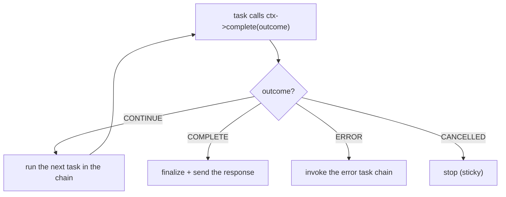

# Writing custom middleware

> **Audience:** Adopter · **Status:** stable · **Verified-against:** qbm-http @ qb 2.6.0 (C++20 default, C++23 supported)

How to write your own middleware: the `IMiddleware` interface, the functional `(ctx, next)` form, the coroutine form, how each one drives the task chain, how to share state through the context, and where ordering is decided.

**Prerequisites:** [Middleware overview](./07-middleware.md), [The request context](./10-request-context.md) — **See also:** [Standard middleware](./08-standard-middleware.md), [Route groups](./05-route-groups.md), [Controllers](./06-controllers.md), [Error handling strategies](./13-error-handling.md), [WebSocket coroutines](./21-websocket-coroutines.md)

## Summary

The standard middleware set covers logging, CORS, compression, rate limiting, auth, and more (see [page 08](./08-standard-middleware.md)). When none of them fits, you write your own. A middleware is any object or callable inserted into the per-request task chain ahead of the route handler. It inspects or mutates the request, optionally short-circuits with a response, and signals an outcome that tells the router whether to continue, finish, or fail the request.

There are three ways to write one, in increasing order of ceremony:

- **Functional** — a `(ctx, next)` lambda. Call `next()` to continue; don't call it to short-circuit. Best for stateless, single-purpose logic.
- **Coroutine** — a `task<void>(ctx)` lambda passed **directly** to `router.use(...)`. Use `co_await` for asynchronous work; the framework auto-continues on normal return.
- **Class-based** — a type deriving from `qb::http::IMiddleware<SessionType>`. Best for stateful, configurable, or dependency-injected middleware that you register by value or by `shared_ptr`.

All three reduce to the same contract: every middleware **must eventually call `ctx->complete(AsyncTaskResult)` exactly once** (the functional form may instead call `next()`, which completes with `CONTINUE` on your behalf). Miss that call and the request hangs until the connection times out.

This page is grounded in `qbm/http/routing/middleware.h`, `qbm/http/routing/types.h`, `qbm/http/routing/coro_task.h`, and `qbm/http/routing/context.h`. The standard middleware under `qbm/http/middleware/` are themselves `IMiddleware` implementations and serve as worked references.

## The outcome enum

Every task in the chain — middleware, route handler, error handler — reports its result through `ctx->complete(AsyncTaskResult)`. The enum lives in `routing/types.h`:

<!-- src: qbm/http/routing/types.h:53-62 -->

| Outcome | Meaning |
| --- | --- |
| `AsyncTaskResult::CONTINUE` | Done; run the next task in the chain. |
| `AsyncTaskResult::COMPLETE` | The request is fully handled and the response is ready; finalize and send. |
| `AsyncTaskResult::CANCELLED` | Processing was cancelled (client disconnect, timeout, explicit `cancel()`). |
| `AsyncTaskResult::ERROR` | This task failed; invoke the configured [error task chain](./13-error-handling.md). |
| `AsyncTaskResult::FATAL_SPECIAL_HANDLER_ERROR` | A special handler (404, error chain) itself failed; bypass the error chain and emit a generic 500. You rarely return this from custom middleware. |

`complete()` is **idempotent after finalization**: once the context reaches `State::Finalised` (or is cancelled), further `complete()` calls are ignored, except `CANCELLED`, which is sticky. State only moves forward — `Ready -> Running -> Finalised`. This is what makes the "call it exactly once" rule forgiving: a redundant second call is dropped rather than corrupting the chain.

> **`AsyncTaskResult::ERROR` and Windows.** `types.h` does `#undef ERROR` at the top of the `AsyncTaskResult` enum body (before any enumerator, four lines ahead of the `ERROR` enumerator) so the enum survives inclusion alongside `<windows.h>`. After the enum, the Win32 `ERROR` macro is gone. This is a deliberate, documented boundary; you do not need to do anything about it.

Each task ends by reporting one outcome, and the router acts on it:



## Form 1 — Functional middleware

The least-ceremony middleware is a lambda matching `MiddlewareHandlerFn<SessionType>`:

<!-- src: qbm/http/routing/types.h:107-108 -->

```cpp
namespace qb::http {
    template <typename SessionType>
    using MiddlewareHandlerFn = std::function<void(
        std::shared_ptr<Context<SessionType>> ctx,
        std::function<void()>                  next)>;
}
```

You receive the request context and a `next` callback. The rules:

- **Continue the chain:** call `next()`. The chain runs the next task; when control unwinds back, the code *after* `next()` runs (see "Pre and post processing" below).
- **Short-circuit with a response:** do **not** call `next()`. Populate `ctx->response()`, then call `ctx->complete(AsyncTaskResult::COMPLETE)`.
- **Fail:** do **not** call `next()`. Call `ctx->complete(AsyncTaskResult::ERROR)` to hand off to the error chain.

```cpp
#include <http/http.h>   // Router, Context, AsyncTaskResult, status

using Session = qb::http::DefaultSession;  // your session type
qb::http::Router<Session> router;

// Reject requests while a maintenance flag is set; otherwise continue.
router.use([](std::shared_ptr<qb::http::Context<Session>> ctx,
              std::function<void()> next) {
    if (ctx->request().header("X-Maintenance-Mode") == "true") {
        ctx->response().status() = qb::http::status::SERVICE_UNAVAILABLE;
        ctx->response().set_header("Retry-After", "3600");
        ctx->response().body() = "Server is in maintenance mode.";
        ctx->complete(qb::http::AsyncTaskResult::COMPLETE);   // short-circuit
        return;
    }
    next();   // continue down the chain
}, "MaintenanceModeCheck");
```

The string second argument to `use()` names the task for logs and diagnostics. It is optional but recommended.

### What `next()` actually does

When you register a `(ctx, next)` lambda, the router wraps it in a `FunctionalMiddleware<SessionType>` adapter (an `IMiddleware` itself). The adapter, not you, owns the completion call:

<!-- src: qbm/http/routing/middleware.h:153-203 -->

1. The adapter opens a `defer_finalization_scope()` for the duration of your lambda. While that scope is open, the response is **not** published even if a downstream task completes.
2. Your lambda runs. If you call `next()`, the adapter checks an atomic `next_called` flag, then — if the context is neither completed nor cancelled — calls `ctx->complete(AsyncTaskResult::CONTINUE)` to advance the chain.
3. Calling `next()` **more than once** is detected (atomic exchange) and the duplicate is ignored with a warning. You cannot double-advance the chain.
4. If your lambda throws, the adapter catches it, sets `500 Internal Server Error` with a `text/plain` body, and completes with `AsyncTaskResult::ERROR`. You do not need a top-level try/catch in the lambda for safety — only for cleanup.

### Pre and post processing

For a **synchronous** downstream chain, the deferral scope lets you post-process the response after `next()` returns:

```cpp
#include <chrono>   // std::chrono::duration_cast

router.use([](std::shared_ptr<qb::http::Context<Session>> ctx,
              std::function<void()> next) {
    const auto start = qb::mono_now();   // qb-io monotonic clock (qb::mono_time)

    next();   // run the rest of the chain synchronously

    // Runs before the response is published, because the adapter holds
    // a finalization deferral open across this lambda.
    const auto elapsed = qb::mono_now() - start;   // a qb::duration
    ctx->response().set_header(
        "X-Elapsed-Us",
        std::to_string(
            std::chrono::duration_cast<std::chrono::microseconds>(elapsed).count()));
}, "ElapsedTimer");
```

This works only when everything downstream completes inline before your lambda returns. **If any downstream task suspends on real asynchronous work** (a database round-trip, an outbound HTTP call, a coroutine `co_await`), control returns from `next()` *before* the response exists, and your post-`next()` code runs too early. For that case, register a `PRE_RESPONSE_SEND` lifecycle hook instead — it fires at final send time regardless of how the chain unwound:

<!-- src: qbm/http/routing/types.h:38-47 -->

```cpp
router.use([](std::shared_ptr<qb::http::Context<Session>> ctx,
              std::function<void()> next) {
    ctx->add_lifecycle_hook(
        [](qb::http::Context<Session>& c, qb::http::HookPoint pt) {
            if (pt == qb::http::HookPoint::PRE_RESPONSE_SEND) {
                c.response().set_header("X-Frame-Options", "DENY");
            }
        });
    next();   // safe even if the downstream chain is asynchronous
}, "LateHeaderStamp");
```

Lifecycle hooks are covered in [The request context](./10-request-context.md); `HookPoint` is defined in `routing/types.h`.

## Form 2 — Coroutine middleware

If your middleware does asynchronous work, the coroutine form expresses it directly. Pass a `task<void>(ctx)` lambda **directly** to `router.use(...)` — the router auto-detects the coroutine return type via the `CoroMiddlewareHandler` concept and wraps it automatically. No separate wrapper call is needed:

<!-- src: qbm/http/routing/coro_task.h:75-82, qbm/http/routing/router.h:143-149 -->

```cpp
#include <http/http.h>

router.use([this](std::shared_ptr<qb::http::Context<Session>> ctx)
    -> qb::io::async::task<void> {
    // co_await any qb-io awaitable: outbound request, DB lookup, timer.
    auto user = co_await auth_lookup(ctx->request().header("Authorization"));
    if (!user) {
        ctx->response().status() = qb::http::status::UNAUTHORIZED;
        ctx->complete(qb::http::AsyncTaskResult::COMPLETE);   // short-circuit
        co_return;
    }
    ctx->set("user", std::move(*user));   // share with downstream tasks
    co_return;                            // default outcome: CONTINUE
});
```

The coroutine signature is `task<void>(ctx)` — there is **no `next` parameter**. The framework drives chaining itself when the coroutine finishes:

<!-- src: qbm/http/routing/coro_task.h:113-185 -->

- On **normal return** (`co_return` without having called `complete()`/`cancel()`), the wrapper completes the context with `AsyncTaskResult::CONTINUE`. To short-circuit, set the response and call `ctx->complete(AsyncTaskResult::COMPLETE)` before `co_return`.
- If your body **already called** `ctx->complete(...)` or `ctx->cancel()`, the wrapper does **not** override it — the outcome you chose wins. (The wrapper compares `completion_count()` before and after to detect this.)
- Exceptions escaping the body are caught, logged with method/path context, and translated into `500 Internal Server Error` with `AsyncTaskResult::ERROR`.

Two safety properties matter:

- The body receives a `std::shared_ptr<Context<Session>>`, which **outlives every suspension point** the body hits. Capturing `ctx` across `co_await` is safe.
- The coroutine is spawned on `qb::io::async::coro_scheduler()` — the thread-local scheduler the rest of qb-io uses — so the mono-thread-per-listener contract holds.

Coroutine route handlers follow the same pattern — pass a `task<void>(ctx)` lambda directly to the verb method (e.g. `router.get(path, lambda)`) and the router auto-detects it via `CoroRouteHandler`; its default outcome on normal return is `AsyncTaskResult::COMPLETE`, because a handler is the leaf of the chain. See [WebSocket coroutines](./21-websocket-coroutines.md) for the same model applied to message handlers.

## Form 3 — Class-based middleware (`IMiddleware`)

For stateful, configurable, or reusable middleware, derive from `qb::http::IMiddleware<SessionType>` and implement three pure-virtual methods:

<!-- src: qbm/http/routing/middleware.h:36-59 -->

```cpp
namespace qb::http {
    template <typename SessionType>
    class IMiddleware {
    public:
        virtual ~IMiddleware() = default;

        // Core logic. MUST call ctx->complete(...) on every path.
        virtual void process(std::shared_ptr<Context<SessionType>> ctx) = 0;

        // Name for logs/diagnostics.
        virtual std::string name() const = 0;

        // Invoked if the chain is cancelled while this middleware is in flight.
        // MUST NOT call ctx->complete() — the Context owns cancellation.
        virtual void cancel() = 0;
    };
}
```

A complete, minimal example — add a header to every request:

```cpp
#include <http/http.h>
#include <string>
#include <utility>

template <typename Session>
class StampHeaderMiddleware final : public qb::http::IMiddleware<Session> {
public:
    StampHeaderMiddleware(std::string name, std::string value)
        : _header(std::move(name)), _value(std::move(value)) {}

    void process(std::shared_ptr<qb::http::Context<Session>> ctx) override {
        ctx->request().set_header(_header, _value);
        ctx->complete(qb::http::AsyncTaskResult::CONTINUE);   // hand off to next task
    }

    std::string name() const override {
        return "StampHeaderMiddleware(" + _header + ")";
    }

    void cancel() override {
        // Nothing async in flight here, so nothing to unwind.
        // NEVER call ctx->complete() from cancel().
    }

private:
    std::string _header;
    std::string _value;
};
```

The router adapts your `IMiddleware` into the task chain through `MiddlewareTask<SessionType>`, which catches any exception from `process()`, logs it with method/path context, sets `500`, and completes with `AsyncTaskResult::ERROR` — the same safety net the functional adapter provides.

`TransformMiddleware` in `qbm/http/middleware/transform.h` is a compact production example of this shape: it holds a user-supplied `std::function<void(Request&)>`, applies it inside a try/catch, and completes `CONTINUE` on success or `ERROR` on a thrown transformer.

### Asynchronous class-based middleware

If `process()` starts non-blocking work, capture the `shared_ptr<Context>` and complete from the completion handler. The context keeps itself alive as long as you hold the pointer:

```cpp
void process(std::shared_ptr<qb::http::Context<Session>> ctx) override {
    _service->fetch(std::string(ctx->request().query("id")),
        [ctx](std::optional<std::string> data, bool ok) {
            if (ctx->is_cancelled())   // client gone / timed out
                return;                // do nothing; the Context handled it
            if (ok && data) {
                ctx->set("fetched", std::move(*data));
                ctx->complete(qb::http::AsyncTaskResult::CONTINUE);
            } else {
                ctx->response().status() = qb::http::status::SERVICE_UNAVAILABLE;
                ctx->complete(qb::http::AsyncTaskResult::ERROR);
            }
        });
    // process() returns now; completion happens later from the callback.
}
```

Always check `is_cancelled()` at the top of an async callback before touching the context. For new code, prefer the coroutine form (Form 2) over manual callbacks — it is the same control flow without the captured-pointer bookkeeping. If your callback uses `qb::io::async::callback`, mind the [fire-and-forget timer lifetime rules](./14-async-http-client.md) — the `cancel()` hook exists precisely so the framework can notify you when the request is abandoned mid-flight.

## Sharing state across the chain

Middleware communicates with downstream middleware and the route handler through the context's key-value store. It accepts arbitrary types (stored as `std::any`).

**String-keyed** access — quick, untyped:

<!-- src: qbm/http/routing/context.h:659-747 -->

```cpp
ctx->set("request_id", std::string("abc-123"));        // store
ctx->set<qb::json>("payload", parsed);                 // explicit any tag

if (auto id = ctx->get<std::string>("request_id"))     // std::optional<T>
    log(*id);

const std::string* p = ctx->get_if<std::string>("request_id");  // T* or nullptr
bool present = ctx->has("payload");                    // contains() is an alias
```

`get<T>` returns `std::nullopt` on a missing key *or* a type mismatch — it catches `std::bad_any_cast` internally, so it never throws on a wrong type.

**Typed slots** — compile-time keys, the safer choice for state that crosses module boundaries:

<!-- src: qbm/http/routing/slot.h:79-95, qbm/http/routing/context.h:782-894 -->

```cpp
// Declare once, in a shared header.
inline constexpr qb::http::Slot<User> kUser{"auth.user"};

// Producer middleware:
ctx->set(kUser, std::move(authenticated_user));
ctx->emplace(kUser, id, name);                 // construct in place

// Consumer handler:
if (const User* u = ctx->get_if(kUser)) { /* use *u */ }
User u = ctx->get_or(kUser, User::anonymous());
bool ok = ctx->contains(kUser);
```

A `Slot<T>` binds a string name to a static type, so producers and consumers agree on the value type at compile time. Use slots for anything an authentication, validation, or business-logic middleware passes to a handler. See [The request context](./10-request-context.md) for the full data API.

## Registering middleware and ordering

You register middleware with `use()` on a `Router`, `RouteGroup`, or `Controller`. Three overloads exist:

<!-- src: qbm/http/routing/router.h:224-252 -->

```cpp
// 1. Functional (ctx, next) lambda, with an optional task name.
router.use(my_functional_mw, "RequestLogger");

// 2. A shared_ptr<IMiddleware<Session>> (e.g. from a factory), optional name override.
router.use(std::make_shared<StampHeaderMiddleware<Session>>("X-App", "qbm-http"));
router.use(qb::http::transform_middleware<Session>(my_transformer));

// 3. Construct an IMiddleware in place. Constrained to types deriving from
//    IMiddleware<Session> via the DerivedFrom concept.
router.use<StampHeaderMiddleware<Session>>("X-App", "qbm-http");
```

`use()` returns a reference to the router (or group/controller) for chaining. Overload 3 is constrained by the `DerivedFrom<MiddlewareType, IMiddleware<SessionType>>` concept, so a mistyped middleware fails at compile time with a clear constraint error rather than a deep template diagnostic.

**Ordering is positional and scoped.** Middleware runs in the order you register it, and scope determines breadth:

- **Router-level** (`router.use(...)`) middleware runs for every matched route.
- **Group-level** (`group->use(...)`) middleware runs only for routes inside that [route group](./05-route-groups.md), after the router-level middleware.
- **Controller-level** middleware runs only for that [controller's](./06-controllers.md) routes.

So for a request matching a route inside `/api/v1`, the chain is: router middleware (in registration order) → group middleware for `/api/v1` (in registration order) → the route handler. Order matters for correctness: register authentication before authorization, CORS before handlers that depend on its preflight handling, and a request-ID stamper before anything that logs the ID.

```cpp
// Global: applies to all routes.
router.use(qb::http::logging_middleware<Session>(), "AccessLog");

// Scoped: applies only under /api/v1, and only after the global middleware.
auto api = router.group("/api/v1");
api->use<MyAuthMiddleware<Session>>();              // runs first within the group
api->use<MyRateLimitMiddleware<Session>>();         // then this
api->get("/users/:id", my_handler);
```

After registering routes and middleware, the router must be compiled (`router.compile()`) before it serves traffic; see [Routing overview](./03-routing-overview.md).

## Pitfalls

- **Forgetting to complete the request.** Every `process()` path and every async callback must call `ctx->complete(...)` (or `next()` in the functional form) exactly once. A path that returns without completing leaves the request parked until the connection times out. The framework's adapters only rescue you on a *thrown exception*, not on a silent early return.
- **Calling `complete()` from `cancel()`.** `cancel()` must clean up your own async work and return. The `Context` owns cancellation and finalization; calling `complete()` there fights the framework. (Per `async_task.h` / `custom_route.h`, `cancel()` implementations must not complete the context.)
- **Post-`next()` code with async downstream tasks.** Code after `next()` runs synchronously when `next()` returns, which for an asynchronous downstream chain is *before* the response exists. Use a `PRE_RESPONSE_SEND` lifecycle hook for mutations that must land at send time.
- **Using a terminal response helper and then continuing.** `ctx->json(...)`, `text`, `html`, `redirect`, `no_content`, `bad_request`, `unauthorized`, `forbidden`, `not_found`, and `internal_server_error` each call `complete(AsyncTaskResult::COMPLETE)` internally — they are terminal. Set any custom headers and body *before* calling them, and do not call `next()` afterward. Only `status()` is non-terminal and chainable.
- **Capturing a raw `Context*` across async boundaries.** Capture the `std::shared_ptr<Context>` by value so the context stays alive; a raw pointer or reference becomes a use-after-free if the request finalizes first.
- **Treating `use()` order as cosmetic.** It is the execution order. An auth check registered after the handler it protects does nothing.
- **Throwing from a coroutine and expecting your own `complete()` to still fire.** Once an exception escapes the coroutine body, the wrapper has already emitted `500` + `ERROR`. Catch and translate inside the body if you want a different status.

## See also

- [Middleware overview](./07-middleware.md) — the task chain and how a request flows through it.
- [Standard middleware](./08-standard-middleware.md) — the shipped set; read these headers as `IMiddleware` references.
- [The request context](./10-request-context.md) — `Context` data slots, response helpers, lifecycle hooks, `complete`/`cancel`.
- [Route groups](./05-route-groups.md) and [Controllers](./06-controllers.md) — the other scopes that accept `use()`.
- [Error handling strategies](./13-error-handling.md) — what `AsyncTaskResult::ERROR` triggers.
- [WebSocket coroutines](./21-websocket-coroutines.md) — the coroutine adapter model applied to message handlers.
