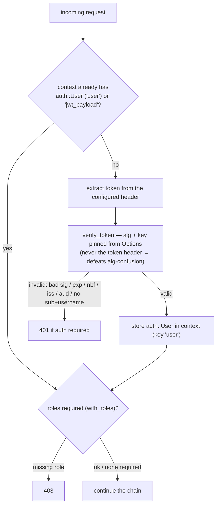

# Authentication system

> **Audience:** Adopter · **Status:** stable · **Verified-against:** qbm-http @ qb 2.6.0 (C++20 default, C++23 supported)

The `qb::http::auth` triad — `Options`, `User`, and `Manager` — issues and verifies JSON Web Tokens, turns a valid token into a typed principal, and feeds the two authentication middleware that gate your routes.

**Prerequisites:** [the request context](./10-request-context.md) for `ctx->set`/`ctx->get`, and [the middleware model](./07-middleware.md) for chain order. **See also:** [standard middleware](./08-standard-middleware.md) for the full `JwtOptions`/auth-middleware configuration tables, [HTTPS](./18-https-ssl-tls.md) for the SSL build, and the doc map [`README.md`](./README.md).

## What this page covers

This page is the reference for the authentication *system*: the three value types under `qb::http::auth` and the security contract of the `Manager`. The two middleware that drive it — `JwtMiddleware` and `AuthMiddleware` — are configured in detail on [the standard-middleware page](./08-standard-middleware.md); here you will see how they connect to the system and how to issue tokens yourself.

Two facts to keep in mind throughout:

- **The whole auth path is SSL-gated.** `auth/manager.cpp` is one of the SSL-only sources, and `<http/middleware/all.h>` and `make.h` guard the JWT and auth includes behind `#ifdef QB_HAS_SSL`. In a build without `QB_HAS_SSL`, `qb::jwt` and the auth middleware are not compiled in. See [feature gates](./08-standard-middleware.md#feature-gates-and-includes).
- **The module is a compiled library, not header-only.** You link `qbm::http`; the umbrella `<http/auth.h>` brings the declarations in. The JWT machinery lives in `qb-io`'s crypto library (`qb::jwt`), which `auth.h` pulls in via `<qb/io/crypto_jwt.h>`.

## The three types

| Type | Alias | Role |
| --- | --- | --- |
| `qb::http::auth::Options` | `auth::AuthOptions` | Keys, algorithm, expiration, expected claims, header/scheme, and verification-policy flags. |
| `qb::http::auth::User` | `auth::AuthUser` | The authenticated principal: `id`, `username`, `roles`, `metadata`, plus role predicates. |
| `qb::http::auth::Manager` | `auth::AuthManager` | Token lifecycle — `generate_token`, `extract_token_from_header`, `verify_token`. |

Include them all through the convenience header:

```cpp
#include <http/auth.h>   // qb::http::auth::Options, User, Manager
```

<!-- src: qbm/http/auth.h:14-23 -->

## auth::Options

`Options` is a fluent configuration object. Every setter returns `Options&`, so you build it in a chain. Defaults are production-safe: HMAC-SHA256, a one-hour expiry, signature verification on, and `Bearer` extraction from the `Authorization` header.

```cpp
#include <http/auth.h>
#include <chrono>

qb::http::auth::Options opts;
opts.secret_key("a-strong-32-byte-minimum-hmac-secret")
    .algorithm(qb::http::auth::Options::Algorithm::HMAC_SHA256)
    .token_expiration(std::chrono::hours(1))     // std::chrono::seconds field
    .token_issuer("my-api")                      // also enables issuer verification
    .clock_skew_tolerance(std::chrono::seconds(30));
```

<!-- src: qbm/http/auth/options.h:92-246 -->

### Supported algorithms

`Options::Algorithm` enumerates the families `qb::jwt` can sign and verify. `Options::algorithm_from_string` maps the case-insensitive JWT header strings onto them, and returns `std::nullopt` for an unknown string so you can reject bad config before constructing `Options`.

| `Algorithm` enum | JWT `alg` string | Key material |
| --- | --- | --- |
| `HMAC_SHA256` / `HMAC_SHA384` / `HMAC_SHA512` | `HS256` / `HS384` / `HS512` | `secret_key` (symmetric) |
| `RSA_SHA256` / `RSA_SHA384` / `RSA_SHA512` | `RS256` / `RS384` / `RS512` | `private_key` to sign, `public_key` to verify (PEM) |
| `ECDSA_SHA256` / `ECDSA_SHA384` / `ECDSA_SHA512` | `ES256` / `ES384` / `ES512` | `private_key` / `public_key` (PEM) |
| `ED25519` | `EdDSA` | `private_key` / `public_key` (PEM) |

<!-- src: qbm/http/auth/options.h:41-52,358 ; qbm/http/auth/options.cpp:21-44 -->

For HMAC, set `secret_key` (a `std::string` is reinterpreted as raw bytes, or pass a `std::vector<unsigned char>`). For the asymmetric families, set `private_key` (PEM) for signing and `public_key` (PEM) for verification — a verify-only service needs only the public key.

### Time fields

Two of the `Options` durations are `std::chrono::seconds`, not `qb::duration`. This is deliberate: JWT `exp`, `nbf`, and `iat` are RFC 7519 NumericDate values — integer seconds since the Unix epoch from the system (wall) clock — and seconds is the unit the library reads and writes. Do not convert these to `qb::duration`.

- `token_expiration(std::chrono::seconds)` — validity of an issued token; default `3600` s. Only emitted as an `exp` claim when expiration verification is on.
- `clock_skew_tolerance(std::chrono::seconds)` — widens both the `exp` and `nbf` windows during verification; default `0`.

<!-- src: qbm/http/auth/options.h:62-64,154-157,257-261 -->

### Verification-policy flags

| Setter | Default | Effect |
| --- | --- | --- |
| `require_signature_verification(bool)` | `true` | When `false`, the token is decoded **without** checking the signature. Unsafe — see [Pitfalls](#pitfalls). |
| `verify_expiration(bool)` | `true` | Check the `exp` claim. When `false`, issued tokens carry no `exp` and never expire. |
| `verify_not_before(bool)` | `true` | Check the `nbf` claim. |
| `token_issuer(std::string)` | — | A non-empty value auto-enables issuer verification; an empty string disables it. |
| `token_audience(std::string)` | — | A non-empty value auto-enables audience verification; an empty string disables it. |
| `auth_header_name(std::string)` | `"Authorization"` | Header the manager reads the token from. |
| `auth_scheme(std::string)` | `"Bearer"` | Scheme prefix expected before the token. |

There is no separate boolean to enable issuer or audience checks independently of the expected value: setting `token_issuer("my-api")` both records the expected `iss` and turns the check on; `token_issuer("")` turns it off.

<!-- src: qbm/http/auth/options.h:75-79,165-205 -->

## auth::User

`User` is the principal the system carries through the request. It is a plain struct with three role predicates.

```cpp
struct User {
    std::string id;        // from the JWT "sub" claim
    std::string username;  // from the "username" claim
    std::vector<std::string> roles;
    qb::unordered_map<std::string, std::string> metadata;

    bool has_role(const std::string &role) const noexcept;            // case-sensitive
    bool has_any_role(const std::vector<std::string> &roles) const noexcept;  // empty list -> false
    bool has_all_roles(const std::vector<std::string> &roles) const noexcept; // empty list -> true
};
```

<!-- src: qbm/http/auth/user.h:33-68 -->

Role comparison is case-sensitive. The empty-list semantics matter for authorization gates: `has_any_role({})` is `false` (no role can satisfy an empty allow-list), while `has_all_roles({})` is `true` (no requirement to violate).

## auth::Manager

`Manager` owns an `Options` by value and is the workhorse for token operations. All three operations are `const`.

```cpp
explicit Manager(const auth::Options &options = auth::Options()) noexcept;

std::string                generate_token(const User &user) const;             // sign
std::string                extract_token_from_header(const std::string &) const; // parse scheme
std::optional<User>        verify_token(const std::string &token) const;        // verify + build User

const Options &get_options() const noexcept;
void           set_options(const Options &) noexcept;
```

<!-- src: qbm/http/auth/manager.h:60-111 -->

### Issuing a token

`generate_token` builds a JWT payload from the `User` and the current `Options`, then signs it. The claims it writes:

| Claim | Source | Emitted when |
| --- | --- | --- |
| `sub` | `user.id` | always |
| `iat` | current epoch seconds | always |
| `exp` | `iat + token_expiration` | `verify_expiration` is on |
| `iss` | `token_issuer` | issuer verification is on |
| `aud` | `token_audience` | audience verification is on |
| `username` | `user.username` | always |
| `roles` | `user.roles` (JSON array) | always |
| `metadata` | `user.metadata` (JSON object) | when non-empty |

<!-- src: qbm/http/auth/manager.cpp:99-135 -->

### Verifying a token

`verify_token` returns `std::optional<User>`. It **never throws** on a bad token — it returns `std::nullopt` for any failure (bad signature, expired, not-yet-valid, issuer/audience mismatch, malformed, or a token carrying neither `sub` nor `username`). Callers treat `std::nullopt` as "unauthenticated".

Two security properties are worth stating explicitly:

- **The algorithm and key come from `Options`, never from the token header.** `verify_token` selects HMAC-secret or asymmetric-public-key based on the configured algorithm family, pinning verification and defeating `alg`-confusion attacks driven by an attacker-controlled JWT header.
- **A verified `User` must have a usable identity.** If a signature-valid token resolves to an empty `id` *and* empty `username`, verification still fails (logged and `nullopt`). Malformed `roles`/`metadata` JSON is tolerated — those fields are left empty and a warning is logged — because only a missing subject/username is fatal.

<!-- src: qbm/http/auth/manager.cpp:259-457 -->

### Extracting from a header

`extract_token_from_header` strips the configured scheme and returns the bare token, or an empty string on a format mismatch. The scheme match is case-insensitive and requires whitespace after it: `"bearer <token>"` is accepted, but `"Bearertoken"` (no separator) is rejected.

<!-- src: qbm/http/auth/manager.cpp:235-255 -->

### End-to-end with the Manager

```cpp
#include <http/auth.h>
#include <chrono>

qb::http::auth::Options opts;
opts.secret_key("a-strong-hmac-secret").token_issuer("my-api");
const qb::http::auth::Manager manager(opts);   // const: safe to share on the request path

// Issue
qb::http::auth::User alice;
alice.id       = "u-101";
alice.username = "alice";
alice.roles    = {"editor"};
const std::string token = manager.generate_token(alice);

// Verify (e.g. on an incoming request)
const std::string raw = manager.extract_token_from_header("Bearer " + token);
if (!raw.empty()) {
    if (auto user = manager.verify_token(raw)) {
        // user->id == "u-101", user->has_role("editor") == true
    }
    // else: token present but invalid -> reject
}
```

<!-- src: qbm/http/tests/unit/middleware/middleware-auth.cpp:223-232 -->

`Manager` is a lightweight value type with no shared mutable state, and its three operations are `const`, so a `const Manager` may be shared across the synchronous request path. There is no thread-safety contract beyond const-correctness: do not call `set_options` concurrently with verifications.

## Integration with the middleware

You rarely call the `Manager` from a handler. Two middleware drive it; both are SSL-gated and detailed on [the standard-middleware page](./08-standard-middleware.md).

### AuthMiddleware — full authentication and roles

`qb::http::AuthMiddleware<Session>` (`<http/middleware/auth.h>`) wraps an `auth::Manager`. On each request it:

1. Looks in the context (default key `"user"`) for a pre-authenticated `auth::User`, then for a `"jwt_payload"` left by a preceding `JwtMiddleware`.
2. Otherwise extracts a token from the configured header and calls `verify_token`.
3. On success, stores the `auth::User` in the context under the configured key.
4. If roles were required via `with_roles`, checks them and answers `403` on failure.
5. Answers `401` when authentication is required and no valid user could be established.



Four factories cover the common shapes — all `<Session>`-templated:

| Factory | Behavior |
| --- | --- |
| `auth_middleware<S>(options, name)` | Required auth from `options`. |
| `jwt_auth_middleware<S>(secret, algo = "HS256", name)` | Required auth; `secret` is an HMAC secret for `HS*` or a public key otherwise. |
| `role_auth_middleware<S>(roles, require_all = false, name)` | Pure role gate; assumes an upstream middleware already populated the user. |
| `optional_auth_middleware<S>(options, name)` | Auth optional — proceeds when no credentials are sent, but still rejects an *invalid* token. |

<!-- src: qbm/http/middleware/auth.h:371-462 -->

```cpp
#include <http/http.h>
#include <http/auth.h>
#include <http/middleware/auth.h>

using MySession = qb::http::DefaultSession;  // the shipped server session
qb::http::Router<MySession> router;

qb::http::auth::Options opts;
opts.secret_key("a-strong-hmac-secret").token_issuer("my-api");

auto admin_gate = qb::http::auth_middleware<MySession>(opts);
admin_gate->with_auth_required(true)
          .with_user_context_key("user")
          .with_roles({"administrator"});   // any-of by default; pass true for all-of

router.use(admin_gate);                     // gate every route declared after this

router.get("/admin", [](auto ctx) {
    auto user = ctx->template get<qb::http::auth::User>("user");  // std::optional<User>
    ctx->json(qb::json{{"hello", user->username}});               // terminal helper
});
```

<!-- src: qbm/http/tests/unit/middleware/middleware-auth.cpp:324-341,438-456 -->

Reach for the equivalent tag dispatch when you prefer the unified entry point. With `namespace mw = qb::http::middleware;`, `mw::make<mw::tags::auth, MySession>(opts)` forwards to the same factory; the other tags are `mw::tags::jwt_auth`, `mw::tags::role_auth`, and `mw::tags::optional_auth`.

<!-- src: qbm/http/middleware/make.h:64-68,116-134 -->

### JwtMiddleware — raw payload, no User

`qb::http::JwtMiddleware<Session>` (`<http/middleware/jwt.h>`) verifies a JWT and stores the decoded payload as a `qb::json` under `"jwt_payload"` — it does not build an `auth::User`. Use it when you want the raw claims, when the token can sit in a cookie or query parameter (`from_header`/`from_cookie`/`from_query`), or as the verification stage in front of a `role_auth_middleware` gate.

```cpp
#include <http/http.h>
#include <http/middleware/jwt.h>

qb::http::JwtOptions jwt_opts;
jwt_opts.secret    = "a-strong-hmac-secret";
jwt_opts.algorithm = "HS256";
jwt_opts.verify_iss = true;
jwt_opts.issuer     = "my-api";

auto jwt = qb::http::jwt_middleware_with_options<MySession>(jwt_opts);
jwt->require_claims({"sub", "roles"});
router.use(jwt);

router.get("/data", [](auto ctx) {
    if (auto payload = ctx->template get<qb::json>("jwt_payload")) {
        ctx->json(*payload);
    } else {
        ctx->internal_server_error();   // jwt_payload missing after auth
    }
});
```

<!-- src: qbm/http/middleware/jwt.h:48-64,156-160,234,541-545 -->

`JwtOptions::leeway` is `std::chrono::seconds` for the same NumericDate reason as `auth::Options`. The full `JwtOptions` table and the fluent setters (`from_cookie`, `with_validator`, `with_error_handler`, `with_success_handler`) are on [the standard-middleware page](./08-standard-middleware.md#jwt).

### Choosing between the two

- Want a typed `auth::User` and role helpers in your handlers? Use `AuthMiddleware`.
- Want the raw JWT payload, a non-header token location, or a custom validator over arbitrary claims? Use `JwtMiddleware`.
- Want both — verify once, then gate by role? Run `JwtMiddleware` first (it writes `"jwt_payload"`), then `role_auth_middleware`, which builds an `auth::User` from that payload before checking roles.

## Pitfalls

- **Never ship `require_signature_verification(false)`.** With it off, `verify_token` decodes the payload *without* a signature check and validates only `exp`/`nbf`/`iss`/`aud` against forgeable claims — any token with the right claims is accepted. The default is `true`; keep it `true` in production. (`qbm/http/auth/manager.cpp:261,336-398`)
- **`verify_expiration(false)` mints non-expiring tokens.** `generate_token` only writes an `exp` claim when expiration verification is on, so disabling it produces tokens that never expire and are never rejected for age.
- **The key must match the algorithm family.** An HMAC secret under an `RS*`/`ES*`/`EdDSA` algorithm (or vice versa) does not throw — `verify_token` simply returns `std::nullopt`. A verify-only service still needs the `public_key` set for asymmetric algorithms.
- **`"Bearertoken"` is not a token.** `extract_token_from_header` always requires a scheme prefix followed by whitespace, so a missing separator yields an empty string. It cannot extract a bare/scheme-less token: `auth_scheme("")` does not enable that — it makes the whitespace check fall on the token's first character and reject every header.
- **An empty principal fails even with a valid signature.** A token whose `sub` and `username` both resolve empty is rejected. When you issue tokens, set `user.id` (it becomes `sub`).
- **Context-helper responses are terminal.** `ctx->json(...)`, `ctx->unauthorized()`, `ctx->forbidden()` and friends call `complete` internally — set any custom headers or body *before* calling them. See [the request context](./10-request-context.md).
- **Don't mutate options under load.** `set_options` is not synchronized against in-flight verifications; configure the `Manager`/middleware at startup and treat it as read-only on the request path.

## See also

- [Standard middleware](./08-standard-middleware.md) — full `JwtOptions` and auth-middleware configuration tables.
- [The middleware model](./07-middleware.md) — chain order and how `Router::use` composes gates.
- [The request context](./10-request-context.md) — `ctx->set`/`ctx->get` typed slots and the terminal response helpers.
- [Custom middleware](./09-custom-middleware.md) — building your own authentication stage.
- [Enabling HTTPS (SSL/TLS)](./18-https-ssl-tls.md) — the `QB_HAS_SSL` build these features require.

---

Previous: [The request context](./10-request-context.md) · Next: [Validation system](./12-validation.md) · Return to [Index](./README.md)
