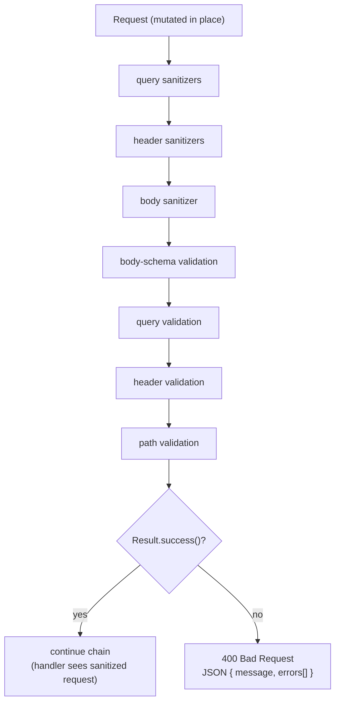

# Request validation

> **Audience:** Adopter · **Status:** stable · **Verified-against:** qbm-http @ qb 3.0.0 (C++20 default, C++23 supported)

A composable pipeline for sanitizing and validating the body, query parameters, headers, and path parameters of an incoming request — JSON-Schema-subset rules for bodies, typed-and-coerced rule sets for parameters, in-place string sanitizers, and a middleware that turns a failed validation into a `400 Bad Request` with a structured JSON error list.

**Prerequisites:** [the request context](./10-request-context.md) for `ctx->request()` and `ctx->path_parameters()`, and [the middleware model](./07-middleware.md) for where validation runs in the chain. **See also:** [standard middleware](./08-standard-middleware.md), [the body deep-dive](./02-body-deep-dive.md) for how the JSON body is parsed, and the doc map [`README.md`](./README.md).

## What this page covers

Everything in this page lives in the `qb::http::validation` namespace (declared across `<qbm/http/validation.h>` and the headers under `http/validation/`). The umbrella header `<qbm/http/http.h>` already pulls it in transitively; `<qbm/http/validation.h>` is the focused include if you want only the validation surface.

The system has six layers, smallest to largest:

| Component | Header | Role |
| --- | --- | --- |
| `Error`, `Result` | `src/qbm/http/validation/error.h` | One failure record; a collection of them with an offending-value policy. |
| `IRule` + concrete rules | `src/qbm/http/validation/rule.h` | A single JSON-Schema-style constraint over one `qb::json` value. |
| `SchemaValidator` | `src/qbm/http/validation/schema_validator.h` | Validates a `qb::json` document against a JSON-Schema-subset definition. |
| `ParameterRuleSet`, `ParameterValidator` | `src/qbm/http/validation/parameter_validator.h` | Parses-then-validates a string-keyed parameter map (query/header/path). |
| `Sanitizer`, `PredefinedSanitizers` | `src/qbm/http/validation/sanitizer.h` | Path-addressed, in-place string transforms over a `qb::json`. |
| `RequestValidator` | `src/qbm/http/validation/request_validator.h` | The pipeline: sanitize, then validate every part of a `Request`. |

You normally configure one `RequestValidator` per route (or route group) and hand it to `ValidationMiddleware`. The rules and validators underneath are also usable standalone — for example to validate a configuration document at startup.

> **This module is a compiled library, not header-only.** The rule, schema, parameter, sanitizer, and request-validator implementations live in `.cpp` translation units that are built into `qbm::http`. Link the module (`target_link_libraries(app PRIVATE qbm::http)`); including the headers alone will not resolve the symbols.

## The error model

A single failure is an `Error` (`src/qbm/http/validation/error.h`):

```cpp
// <!-- src: qbm/http/src/qbm/http/validation/error.h -->
struct Error {
    std::string             field_path;       // e.g. "body.user.email" or "query.page"
    std::string             rule_violated;    // e.g. "minLength", "type", "required"
    std::string             message;          // human-readable detail
    std::optional<qb::json> offending_value;  // the value that failed, subject to policy
};
```

Failures accumulate in a `Result`. It is a flat list — `success()` is true only when the list is empty — plus an `ErrorValuePolicy` that governs how much of each offending value is captured:

```cpp
// <!-- src: qbm/http/src/qbm/http/validation/error.h -->
#include <qbm/http/validation.h>

qb::http::validation::Result result;
result.set_error_value_policy(
    qb::http::validation::Result::ErrorValuePolicy::Preview, 256);

// ... run a validator against `result` ...

if (!result.success()) {
    for (const auto &err : result.errors()) {
        std::cerr << err.field_path << ": " << err.rule_violated
                  << " — " << err.message << '\n';
    }
}
```

`ErrorValuePolicy` has three values:

- `Full` (default) — deep-copy the offending value verbatim.
- `Preview` — serialize and truncate to `preview_bytes` (clamped to the range 16 B – 64 KiB). Cheap scalars pass through untouched; strings are cut to the budget; compound values become a `{"_truncated": true, "preview": ..., "original_kind": ...}` marker.
- `None` — omit the value; `field_path` is the only locator that remains.

Use `Preview` or `None` in production where error bodies and logs forward to systems with payload budgets, or where the offending value may contain data you do not want echoed back.

Two structural helpers matter when composing validators: `Result::make_child()` returns an empty `Result` that *inherits this result's policy* (used for sub-validations), and `Result::merge(other)` appends another result's already-shaped errors. The whole pipeline is built on these two.

> **Policy is set at the top, not on the leaf.** The `offending_value` shaping runs only on the `add_error(field, rule, message, value)` overload. The `add_error(Error)` overload and `merge()` copy the payload verbatim — deliberately, so a caller can opt out for a synthetic error. Both `SchemaValidator::validate` and `RequestValidator::validate` call `set_error_value_policy` on the supplied `Result` *at entry*, so any policy you set on a `Result` before calling them is overwritten. Configure the policy on the validator (`RequestValidator::set_error_value_policy`, `SchemaValidator::set_error_value_policy`) rather than on the `Result` you pass in.

## Rules

`IRule` is the leaf interface (`src/qbm/http/validation/rule.h`): one rule validates one `qb::json` value and appends any failure to a `Result`.

```cpp
// <!-- src: qbm/http/src/qbm/http/validation/rule.h -->
class IRule {
public:
    virtual ~IRule() = default;
    virtual bool validate(const qb::json &value,
                          const std::string &field_path,
                          Result &result) const = 0;
    virtual std::string rule_name() const = 0;
};
```

The concrete rules below map one-to-one onto JSON-Schema keywords. You rarely instantiate them by hand for body validation — `SchemaValidator` builds them from a schema definition — but you *do* construct them directly when attaching rules to a `ParameterRuleSet`.

| Rule (constructor) | `rule_name()` | Applies to |
| --- | --- | --- |
| `TypeRule(DataType)` | `"type"` | any — checks the JSON kind |
| `MinLengthRule(size_t)` / `MaxLengthRule(size_t)` | `"minLength"` / `"maxLength"` | strings (char count) and arrays (element count) |
| `PatternRule(std::string regex)` | `"pattern"` | strings — full `std::regex_match` |
| `MinimumRule(double, bool exclusive=false)` | `"minimum"` / `"exclusiveMinimum"` | numbers |
| `MaximumRule(double, bool exclusive=false)` | `"maximum"` / `"exclusiveMaximum"` | numbers |
| `EnumRule(qb::json allowed_values)` | `"enum"` | any — membership in a set |
| `MinItemsRule(size_t)` / `MaxItemsRule(size_t)` | `"minItems"` / `"maxItems"` | arrays |
| `UniqueItemsRule()` | `"uniqueItems"` | arrays |
| `MinPropertiesRule(size_t)` / `MaxPropertiesRule(size_t)` | `"minProperties"` / `"maxProperties"` | objects |
| `PropertyNamesRule(const qb::json& name_schema_definition)` | `"propertyNames"` | objects — validates keys against a sub-schema |
| `CustomRule(CustomValidateFn, std::string name)` | your name | any — arbitrary lambda |

`DataType` is the kind enum used by both rules and parameter coercion: `STRING`, `INTEGER`, `NUMBER`, `BOOLEAN`, `OBJECT`, `ARRAY`, `NUL`, `ANY`.

`CustomRule` expresses logic no built-in rule covers:

```cpp
// <!-- src: qbm/http/src/qbm/http/validation/rule.h -->
#include <qbm/http/validation.h>
using namespace qb::http::validation;

auto even_only = std::make_shared<CustomRule>(
    [](const qb::json &value, const std::string &path, Result &result) {
        if (value.is_number_integer() && value.get<long long>() % 2 != 0) {
            result.add_error(path, "evenOnly", "Value must be even.", value);
            return false;
        }
        return true;
    },
    "evenOnly");
```

> **Most primitive rules are type-gated and pass silently for the wrong kind.** Numeric rules pass for non-numbers, item/array rules pass for non-arrays, property-count rules pass for non-objects, and `PatternRule` passes for non-strings. Absence of an error therefore does **not** mean the constraint was checked — it may mean the value was the wrong kind. Always pair a constraint with a `type` keyword (in a schema) or `set_type(...)` (in a parameter rule set) so the kind is asserted first.

> **Some constructors throw at build time, not at `validate()` time.** `PatternRule` throws `std::invalid_argument` if the pattern exceeds 1024 characters or fails to compile as an ECMAScript regex. `EnumRule` throws `std::invalid_argument` if its argument is not a JSON array. `SchemaValidator`'s constructor (and therefore `RequestValidator::for_body`) throws `std::invalid_argument` if the schema is not a JSON object. Wrap construction in `try/catch` when the schema or pattern comes from untrusted input.

> **`PatternRule` is a ReDoS surface.** It uses `std::regex_match` (full match, not search) and has no execution timeout. To bound cost it rejects inputs longer than 2 KiB (`MAX_REGEX_INPUT_LENGTH`) and caps pattern length at 1024 characters, but a pathological pattern can still be super-linear. Prefer linear-time patterns. The 2 KiB input cap is deliberately small: libstdc++'s `std::regex` executor recurses one stack frame per matched character, so a longer input against even a benign `.*` pattern overflows the stack (measured to crash above ~4 KiB on Linux) — the cap keeps matching below that limit. Validate larger payloads by other means.

> **`RequiredRule` and `ItemsRule` are placeholders.** Their `validate()` returns `true` unconditionally; the real `required` / `items` logic lives inside `SchemaValidator` (and, for presence, inside `ParameterValidator`). Do not attach them to a `ParameterRuleSet` expecting them to fire.

## Schema validation

`SchemaValidator` (`src/qbm/http/validation/schema_validator.h`) validates a `qb::json` document against a JSON-Schema-subset definition supplied as `qb::json`. It supports:

- **Type:** `type` (a single string or an array of allowed type names).
- **Strings:** `minLength`, `maxLength`, `pattern`.
- **Numbers:** `minimum`, `exclusiveMinimum`, `maximum`, `exclusiveMaximum`.
- **Any value:** `enum`.
- **Arrays:** `items` (one schema for all, or an array of schemas for tuple positions), `additionalItems`, `minItems`, `maxItems`, `uniqueItems`.
- **Objects:** `properties`, `required`, `additionalProperties` (bool or schema), `minProperties`, `maxProperties`, `propertyNames`.
- **Combinators:** `allOf`, `anyOf`, `oneOf`, `not`.

```cpp
// <!-- src: qbm/http/tests/unit/validation/validation-schema.cpp (schema shape) -->
#include <qbm/http/validation.h>
#include <qb/json.h>

using namespace qb::http::validation;

const qb::json user_schema = {
    {"type", "object"},
    {"properties", {
        {"username", {{"type", "string"}, {"minLength", 3}, {"maxLength", 32}}},
        {"email",    {{"type", "string"}, {"pattern", "^[^@\\s]+@[^@\\s]+\\.[^@\\s]+$"}}},
        {"age",      {{"type", "integer"}, {"minimum", 0}, {"maximum", 120}}},
        {"roles",    {{"type", "array"}, {"items", {{"type", "string"}}},
                      {"minItems", 1}, {"uniqueItems", true}}}
    }},
    {"required", {"username", "email"}}
};

SchemaValidator validator(user_schema);          // throws if user_schema is not an object
validator.set_error_value_policy(SchemaValidator::ErrorValuePolicy::Preview, 256);

Result result;
const qb::json data = {
    {"username", "tester"}, {"email", "test@example.com"},
    {"age", 30}, {"roles", {"user", "editor"}}
};

if (validator.validate(data, result)) {
    // data conforms to user_schema
} else {
    for (const auto &err : result.errors()) {
        // err.field_path is a "user.roles[0]"-style path
    }
}
```

> **A constructed `SchemaValidator` is effectively `const`-shared, but not concurrently first-touched.** Internally it caches the compiled `IRule` list for each schema node, keyed by the node's address in the by-value schema copy. That cache is a plain `std::unordered_map` populated lazily and is **not** thread-safe to first-populate. If you share one validator across cores, validate once on the owning thread first (warming the cache), or give each core its own validator. Once warmed it is safe to read concurrently because the schema is never mutated.

> **Combinators short-circuit and aggregate.** `anyOf`/`oneOf`/`not` are evaluated only if earlier combinators passed. They validate sub-schemas against throwaway `Result`s, so a failure surfaces a single aggregate error (`"anyOf"`, `"oneOf"`, `"not"`) rather than the per-branch detail. Expect one error per failed combinator, not a tree.

## Parameter validation

Query parameters, headers, and path parameters arrive as strings. `ParameterValidator` (`src/qbm/http/validation/parameter_validator.h`) parses each value into a `qb::json` of the declared `DataType`, then applies the attached rules. Each parameter is described by a fluent `ParameterRuleSet`:

```cpp
// <!-- src: qbm/http/src/qbm/http/validation/parameter_validator.h -->
struct ParameterRuleSet {
    std::string name;
    DataType    expected_type = DataType::STRING;   // target type after parsing
    bool        required = false;
    std::optional<std::string> default_value;       // substituted (as a string) if absent
    std::vector<std::shared_ptr<IRule>> rules;       // applied AFTER coercion
    std::function<qb::json(const std::string &, bool &success)> custom_parser;

    // Fluent setters: set_type, set_required, set_default, add_rule, set_custom_parser
};
```

```cpp
// <!-- src: qbm/http/tests/unit/validation/validation-parameter.cpp -->
#include <qbm/http/validation.h>
using namespace qb::http::validation;

ParameterValidator query;                 // non-strict by default
query.add_param(
    ParameterRuleSet("page")
        .set_type(DataType::INTEGER)
        .set_default("1")
        .add_rule(std::make_shared<MinimumRule>(1)));
query.add_param(
    ParameterRuleSet("limit")
        .set_type(DataType::INTEGER)
        .set_default("20")
        .add_rule(std::make_shared<MinimumRule>(1))
        .add_rule(std::make_shared<MaximumRule>(100)));
query.add_param(
    ParameterRuleSet("sort_by")
        .set_required()
        .add_rule(std::make_shared<EnumRule>(qb::json::array({"name", "date"}))));

qb::icase_unordered_map<std::string> params = {{"sort_by", "name"}, {"limit", "50"}};
Result result;
if (query.validate(params, result, "query")) {
    // "page" filled from its default; "limit" coerced to 50; "sort_by" in enum
}
```

Constructing the validator with `ParameterValidator(true)` (or calling `set_strict_mode(true)`) makes any parameter not described by a rule set a validation failure.

A few behaviors worth pinning down, all confirmed against `parameter_validator.cpp`:

- **Maps and definitions are case-insensitive.** Both the parameter map and the rule-set store are `qb::icase_unordered_map`, matching HTTP header semantics.
- **Coercion covers four types only.** `parse_value` handles `STRING`, `INTEGER`, `NUMBER`, and `BOOLEAN`. `ARRAY` is a pass-through that returns the raw string; `OBJECT`, `NUL`, and `ANY` produce a `"type"` error. To accept anything else, supply a `custom_parser`.
- **Number parsing is strict.** `NUMBER` rejects `NaN`/`Infinity`, and a parsed double that is an exact integer in `long long` range is returned as a JSON integer. `INTEGER`/`NUMBER` accept only a full-string parse — trailing characters fail.
- **`required` plus `default_value` never errors on absence.** The default is substituted and treated as present, so the `required` check passes. A required parameter with no default *does* error when missing.
- **Parser and rule exceptions are caught, not propagated.** A throwing `custom_parser` becomes a `"customParseException"` error; a throwing rule becomes a `"ruleExecutionException"` error. Validation reports the failure instead of unwinding.

## Sanitization

A `Sanitizer` (`src/qbm/http/validation/sanitizer.h`) applies `SanitizerFunction`s — `std::function<std::string(const std::string&)>` — to string nodes inside a `qb::json`, addressed by a JSON-pointer-like path. Sanitizers *transform*; they do not validate.

```cpp
// <!-- src: qbm/http/src/qbm/http/validation/sanitizer.h -->
#include <qbm/http/validation.h>
using namespace qb::http::validation;

Sanitizer sanitizer;
sanitizer.add_rule("comment_text", PredefinedSanitizers::trim());
sanitizer.add_rule("comment_text", PredefinedSanitizers::escape_html());
sanitizer.add_rule("tags[*]",      PredefinedSanitizers::to_lower_case());

qb::json data = {
    {"comment_text", "  <b>hi</b>  "},
    {"tags", {"TagA", "TagB"}}
};
sanitizer.sanitize(data);   // mutates `data` in place
// data["comment_text"] -> "&lt;b&gt;hi&lt;/b&gt;"
// data["tags"]         -> ["taga", "tagb"]
```

Path segments use dot notation for object keys, `[N]` for a specific array index, and `[*]` for every element of an array (`"user.address.street"`, `"comments[0].text"`, `"tags[*]"`).

`PredefinedSanitizers` ships eight transforms. Read the security notes — two of them are explicitly *not* safe as a security boundary:

| Function | Effect |
| --- | --- |
| `trim()` | Removes leading/trailing whitespace. |
| `to_lower_case()` / `to_upper_case()` | ASCII case conversion. |
| `normalize_whitespace()` | Trims ends, collapses runs of internal spaces to one. |
| `alphanumeric_only()` | Drops every non-alphanumeric character. |
| `escape_html()` | Escapes `&`, `<`, `>`, `"`, `'`. |
| `strip_html_tags()` | Crude tag removal — **not** an XSS defense. |
| `escape_sql_like()` | Escapes `%`, `_`, and `'` — **not** general SQL-injection protection. |

> **Sanitizers touch string nodes only, and silently skip what they cannot reach.** Applying a sanitizer to a non-string target is a no-op; a path that does not resolve to an existing node is skipped; and an array index segment that fails to parse or is out of range is ignored. A sanitizer that "did nothing" usually means the path did not match — verify the path against your actual document shape.

## The request validator: the full pipeline

`RequestValidator` (`src/qbm/http/validation/request_validator.h`) ties the four parts together with a fluent builder. Each `for_*` method registers a validator; each `add_*_sanitizer` registers a transform:

```cpp
// <!-- src: qbm/http/tests/unit/validation/validation-request.cpp -->
#include <qbm/http/validation.h>
using namespace qb::http::validation;

auto rv = std::make_shared<RequestValidator>();

rv->for_body({
    {"type", "object"},
    {"properties", {{"message", {{"type", "string"}, {"minLength", 1}}}}},
    {"required", {"message"}}
});

rv->for_query_param("id",
    ParameterRuleSet("id").set_type(DataType::INTEGER).set_required());

rv->add_header_sanitizer("X-Custom-Input", PredefinedSanitizers::trim());

rv->set_error_value_policy(Result::ErrorValuePolicy::Preview, 256);
```

`validate(Request&, Result&, const PathParameters* = nullptr)` runs the pipeline. **Sanitizers run first, then validators**, and the precise order inside `validate` (confirmed against `request_validator.cpp`) is: query sanitizers → header sanitizers → body sanitizer → body-schema validation → query validation → header validation → path validation, with every stage merged into the one `Result`.



> **`validate()` mutates the request.** Sanitizers rewrite query and header values *in place*, and a sanitized body is re-serialized via `dump()` back into `request.body()`. Do not assume the request is unchanged after `validate()` returns — even after a *failed* validation. The handler downstream sees the sanitized request.

A few more pipeline facts to design around:

- **The body is parsed as JSON independently for sanitizing and for schema validation.** A non-JSON body yields an `"invalidFormat.*"` error (it does not throw). An empty body against a body schema is validated as JSON `null` — which typically produces a `type` error — or a synthetic `"contentRequired"` error.
- **Path validation needs a non-null `PathParameters`.** The path-parameter validator is always strict. If you defined path-param rules but pass `path_params == nullptr`, `validate()` emits a `"required"` error per defined path parameter and returns `false`. The middleware wires this for you from `ctx->path_parameters()`.
- **Multi-valued query parameters and headers are validated per value.** Each occurrence of a repeated parameter is sanitized and validated individually; the strict-mode "unexpected parameter" check, however, inspects only the first value.
- **Sanitizer exceptions are caught**, surfacing as `"sanitizeException.*"` errors rather than unwinding through `validate()`.

## Wiring it into the chain

`ValidationMiddleware<SessionType>` (`http/middleware/validation.h`) runs a `RequestValidator` as a chain task. On success it continues; on failure it sets `400 Bad Request`, a `application/json; charset=utf-8` content type, and a body of the shape below, then completes the request:

```json
{
  "message": "Validation failed.",
  "errors": [
    { "field": "body.message", "rule": "minLength", "message": "...", "value": "" }
  ]
}
```

Attach it like any other middleware (see [the middleware model](./07-middleware.md)). The free-function factory is `validation_middleware<SessionType>(...)`:

```cpp
// <!-- src: qbm/http/tests/unit/middleware/middleware-validator.cpp -->
#include <qbm/http/http.h>

auto rv = std::make_shared<qb::http::validation::RequestValidator>();
rv->for_body({
    {"type", "object"},
    {"properties", {{"message", {{"type", "string"}, {"minLength", 1}}}}},
    {"required", {"message"}}
});

auto val_mw = qb::http::validation_middleware<MySession>(rv);
router.use(val_mw);

router.post("/messages", [](auto ctx) {
    // Reached only when validation passed.
    // ctx->request() already reflects any sanitizers that ran.
    ctx->response().status() = qb::http::status::CREATED;
    ctx->complete();
});
```

The factory and constructor throw `std::invalid_argument` if the `RequestValidator` pointer is null. Construct and configure the validator once (it is reusable and, after warm-up, read-safe across cores) and share it.

## Pitfalls

- **Do not read absence of an error as proof a constraint ran.** Type-gated rules pass for the wrong kind. Always assert `type` first — in a schema with a `type` keyword, in a parameter rule set with `set_type(...)`.
- **Schema and pattern construction can throw.** `for_body` / `SchemaValidator` throw on a non-object schema; `PatternRule` and `EnumRule` throw on a bad pattern or non-array enum. Guard with `try/catch` for untrusted definitions; these are construction-time, not `validate()`-time, throws.
- **Set the error-value policy on the validator, not the `Result`.** Both validators reset the `Result`'s policy at entry. A policy you set on the `Result` first is discarded.
- **`validate()` mutates the request.** Sanitized values are written back; the body is re-serialized. Code that needs the raw input must capture it before validation.
- **Warm a shared `SchemaValidator` before concurrent use.** Its rule cache is populated lazily and is not thread-safe to first-touch. Validate once on the owning thread, or use one validator per core.
- **`strip_html_tags()` and `escape_sql_like()` are not security boundaries.** Use a real HTML sanitizer and parameterized queries for those concerns; these are convenience transforms.
- **Path-param validation requires the routing context.** Outside the middleware, you must pass a `PathParameters*` to `validate()` or every defined path-param rule reports `"required"`.

## See also

- [Standard middleware](./08-standard-middleware.md) — the other shipped middleware and their configuration surfaces.
- [The middleware model](./07-middleware.md) — where validation sits in the chain and how `Router::use` ordering works.
- [The request context](./10-request-context.md) — `ctx->request()` and `ctx->path_parameters()`, the inputs to validation.
- [Body deep-dive](./02-body-deep-dive.md) — how the request body becomes the `qb::json` a schema validates.
- [Authentication](./11-authentication.md) — the companion subsystem for identity and JWT.
- [Doc map](./README.md) — the full chapter index.
