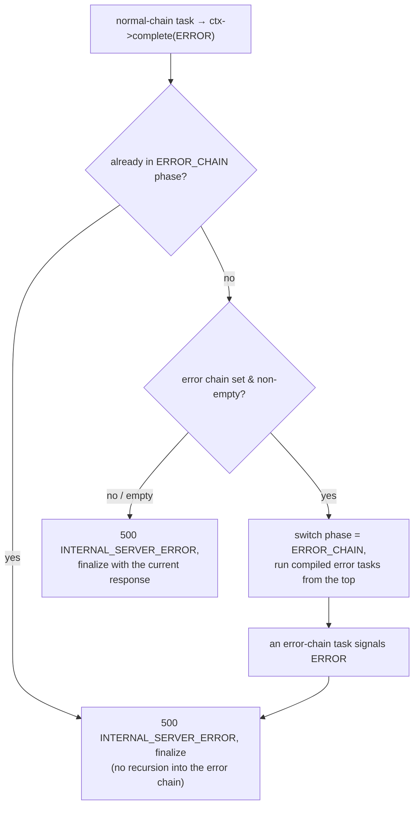

# Error handling strategies

> **Audience:** Adopter · **Status:** stable · **Verified-against:** qbm-http @ qb 3.0.0 (C++20 default, C++23 supported)

How an HTTP request fails, what the client sees, and where you intervene: status codes on the response, the `AsyncTaskResult::ERROR` task outcome and the router error chain, contained handler exceptions, and the protocol-level `not_ok()` framing-error path that closes a malformed connection before routing ever runs.

**Prerequisites:** [The middleware model](./07-middleware.md), [The request context](./10-request-context.md) — **See also:** [Standard middleware](./08-standard-middleware.md), [Custom middleware](./09-custom-middleware.md), [Validation](./12-validation.md)

## Summary

There are two distinct failure surfaces in qbm-http, and they are handled by entirely separate machinery:

- **Application-level errors** happen *after* a request has been parsed and matched to a route. A task in the chain (middleware or handler) sets a status on `ctx->response()` and signals an outcome through `ctx->complete(AsyncTaskResult)`. The `Context` either finalizes the response as-is or diverts to a user-supplied **error chain**. This is the layer you customize.
- **Protocol-level framing errors** happen *before* routing. The llhttp-based parser (or the WebSocket/HTTP/2/HTTP/3 framer) rejects a malformed or oversized message by calling `not_ok()` on the protocol object, which tears down the connection. There is no `Context`, no route, and no error chain — the connection simply closes.

This page covers status codes, the four ways to produce an error response, the `AsyncTaskResult::ERROR` flow and `ErrorHandlingMiddleware`, how unhandled exceptions are contained, and the `not_ok()` boundary. The single most important rule, established in [the middleware model](./07-middleware.md): **every task must eventually call `ctx->complete(...)`** (or, for `(ctx, next)` functional middleware, `next()`), including on the error path — a task that returns without completing hangs the request.

## Status codes

`qb::http::status` is an alias for the `qb::http::Status` wrapper class (`types.h`), which carries a nested `enum class Value` backed by llhttp's `HTTP_STATUS_*` constants and re-exposes each code as a `static constexpr Value` member — so `qb::http::status::NOT_FOUND` names a value directly. The response status is plain mutable state: `ctx->response().status()` is an lvalue you assign.

```cpp
// <!-- src: qbm/http/src/qbm/http/types.h:281-679 (class Status), src/qbm/http/routing/context.h:455-463 (response()), 989-993 (status()) -->
ctx->response().status() = qb::http::status::NOT_FOUND;    // 404
ctx->status(qb::http::status::FORBIDDEN);                  // 403, chainable, non-terminal
```

`status()` is the one response helper that is **non-terminal** — it returns `Context&` for chaining and does not finalize. Every other helper (`json`, `text`, `html`, `redirect`, `no_content`, and the named `bad_request` / `unauthorized` / `forbidden` / `not_found` / `internal_server_error` shortcuts) is **terminal**: each ends in `complete(AsyncTaskResult::COMPLETE)` and sends the response. Set any custom headers or body *before* calling a terminal helper; mutations after it are ignored.

Common codes you will set explicitly (full list in `qbm/http/src/qbm/http/types.h`):

| Code | `qb::http::status` | Typical cause |
|------|--------------------|---------------|
| 400  | `BAD_REQUEST`      | malformed input, validation failure |
| 401  | `UNAUTHORIZED`     | missing/invalid credentials |
| 403  | `FORBIDDEN`        | authenticated but not permitted |
| 404  | `NOT_FOUND`        | no resource / no route match |
| 405  | `METHOD_NOT_ALLOWED` | path exists, method does not (router-set) |
| 422  | `UNPROCESSABLE_ENTITY` | semantically invalid payload |
| 429  | `TOO_MANY_REQUESTS` | rate limit exceeded |
| 500  | `INTERNAL_SERVER_ERROR` | unhandled server fault |

## Four ways to produce an error response

The right tool depends on whether you want to send a final response immediately or route the error through a centralized formatter.

### 1. A terminal response helper (send now, skip the error chain)

The simplest path. The named helpers set the status, a plain-text body, and finalize in one call. The chain stops; the response goes out as written. The error chain is **not** involved.

```cpp
// <!-- src: qbm/http/src/qbm/http/routing/context.h:1001-1041 (named helpers), 930-968 (json/text/html) -->
#include <qbm/http/http.h>

router.get("/items/:id", [](auto ctx) {
    auto item = find_item(ctx->path_param("id"));
    if (!item) {
        ctx->not_found("No such item");   // 404 + body, complete(COMPLETE)
        return;                            // chain stops here
    }
    ctx->json(item->to_json());            // 200, complete(COMPLETE)
});
```

Use this when the handler already knows the exact response it wants. It is terminal, so no later task — including the error chain — runs.

### 2. Signal `AsyncTaskResult::ERROR` (divert to the error chain)

Set a status that gives downstream context, then call `complete(AsyncTaskResult::ERROR)`. The normal chain halts and the `Context` attempts to switch to the router's error chain. Use this when you want one place to format all error responses consistently.

```cpp
// <!-- src: qbm/http/src/qbm/http/routing/types.h:53-62 (AsyncTaskResult), src/qbm/http/routing/context.h:1068-1140 (complete()) -->
router.get("/items/:id", [](auto ctx) {
    auto item = find_item(ctx->path_param("id"));
    if (!item) {
        ctx->response().status() = qb::http::status::NOT_FOUND;
        // Optionally hand the error chain a message:
        ctx->set("__error_message", std::string{"item not found"});
        ctx->complete(qb::http::AsyncTaskResult::ERROR);   // divert
        return;
    }
    ctx->response().body() = item->to_json().dump();
    ctx->complete(qb::http::AsyncTaskResult::COMPLETE);
});
```

`AsyncTaskResult` is the outcome enum a task passes to `complete()` (`qbm/http/src/qbm/http/routing/types.h`):

- `CONTINUE` — task succeeded; advance to the next task in the chain.
- `COMPLETE` — request fully handled; finalize and send the current response.
- `CANCELLED` — processing was cancelled (client disconnect, timeout, explicit `ctx->cancel()`).
- `ERROR` — divert to the error chain (or, if none, finalize as 500).
- `FATAL_SPECIAL_HANDLER_ERROR` — a critical fault inside a special handler (404/405 chain or the error chain itself); forces a generic 500 and bypasses the error chain to prevent loops.

### 3. The router error chain

`Router::set_error_task_chain(...)` installs a `std::vector` of `IAsyncTask` shared pointers run when any task signals `AsyncTaskResult::ERROR`. The chain runs in full, in order; the last task is responsible for finalizing (`COMPLETE`).

```cpp
// <!-- src: qbm/http/src/qbm/http/routing/router.h:272 (decl), qbm/http/src/qbm/http/routing/router_core.h:265 (set_error_task_chain), 290 (get_compiled_error_tasks), 303 (is_error_chain_set) -->
std::vector<std::shared_ptr<qb::http::IAsyncTask<MySession>>> error_chain;
error_chain.push_back(
    std::make_shared<qb::http::MiddlewareTask<MySession>>(my_error_formatter));
router.set_error_task_chain(std::move(error_chain));
```

Note the parameter type is `std::vector`, not `std::list`. There is no auto-prepended global middleware on this chain: global (root-group) middleware **is** prepended to the default 404 and 405 chains, but is **not** prepended to the error chain. If you want error logging or another cross-cutting behavior on the error path, add it to the error chain explicitly.

### 4. `ErrorHandlingMiddleware` (the standard formatter)

`qb::http::ErrorHandlingMiddleware` is the off-the-shelf task you put in the error chain. It dispatches on `ctx->response().status()` and always finalizes with `complete(AsyncTaskResult::COMPLETE)` afterward. Dispatch is a **single lookup** in one `status -> handler` map, then the generic fallback: `on_status_range` does not create a second tier, it *expands the range at registration time* into one entry per code in that same map (via `try_emplace`, so it never overwrites an entry already bound by `on_status` or by an earlier overlapping range — while a later `on_status` assigns and therefore *does* replace a range-installed entry). The generic handler runs when the lookup misses **or** when the matched status handler throws.

```cpp
// <!-- src: qbm/http/src/qbm/http/middleware/error_handling.h:92-98, 112-124, 134-141, 152-188 -->
#include <qbm/http/http.h>
#include <qbm/http/middleware/all.h>   // required: http.h declares no middleware factory

auto error_mw = qb::http::error_handling_middleware<MySession>();

error_mw->on_status(qb::http::status::NOT_FOUND, [](auto ctx) {
    ctx->response().set_content_type("application/json; charset=utf-8");
    ctx->response().body() = R"({"error":"Resource not found","code":404})";
});

// 4xx range. on_status_range uses try_emplace, so a code already bound by
// on_status (or an earlier overlapping range) keeps its more specific handler.
error_mw->on_status_range(qb::http::status::BAD_REQUEST,
                          qb::http::status::UNPROCESSABLE_ENTITY,
    [](auto ctx) {
        ctx->response().body() =
            "Client error: " + std::to_string(static_cast<int>(ctx->response().status()));
    });

// Fallback. The message arrives from ctx->get<std::string>("__error_message")
// if a prior task set it, otherwise a generic "Error encountered: status N".
error_mw->on_any_error([](auto ctx, const std::string& message) {
    ctx->response().status() = qb::http::status::INTERNAL_SERVER_ERROR;
    ctx->response().body() = "Server error: " + message;
});

std::vector<std::shared_ptr<qb::http::IAsyncTask<MySession>>> error_chain;
error_chain.push_back(
    std::make_shared<qb::http::MiddlewareTask<MySession>>(error_mw));
router.set_error_task_chain(std::move(error_chain));
```

`ErrorHandlingMiddleware` is defensive: each user handler runs inside a `try/catch`, so a throwing status handler falls through to the generic handler, and a throwing generic handler leaves the pre-existing response in place. In every case the middleware still calls `complete(AsyncTaskResult::COMPLETE)` — it will not strand the request.

## What `AsyncTaskResult::ERROR` actually does

The dispatch lives in `Context::complete()`. When a task signals `ERROR` (and the context is neither cancelled nor finalized):

1. **If the context is already in the error chain** (`ProcessingPhase::ERROR_CHAIN`), the framework refuses to recurse: it sets `500 INTERNAL_SERVER_ERROR` and finalizes. An error handler cannot re-enter the error chain.
2. **Otherwise**, it locks the router core. If an error chain *is set* (`is_error_chain_set()`) and *non-empty*, the context switches its phase to `ERROR_CHAIN`, replaces the running chain with the compiled error tasks, and starts from the top.
3. **If no error chain is set, or the set chain is empty**, it sets `500 INTERNAL_SERVER_ERROR` and finalizes with whatever response is present.

So `AsyncTaskResult::ERROR` with no configured chain is not lost — it produces a 500 using any status and body the erroring task already wrote. Setting a meaningful status before signaling `ERROR` is therefore worthwhile even without an error chain.



`complete()` is **idempotent after finalization**: once the context reaches `State::Finalised` (or is cancelled), further `complete()` calls are ignored except `AsyncTaskResult::CANCELLED`. State only moves forward (`Ready → Running → Finalised`), and `is_cancelled` is sticky. This is what makes a double-`complete()` a no-op rather than a crash.

## Unhandled exceptions are contained

You do not have to wrap handler bodies in `try/catch` to keep the server alive. The chain driver in `Context` runs each task inside a `try/catch`; an exception that escapes a middleware or handler is caught, and — provided the context is not already finalized or cancelled — converted into `complete(AsyncTaskResult::ERROR)`. That routes through the error chain exactly as an explicit `ERROR` would, defaulting the status to 500.

```cpp
// <!-- src: qbm/http/src/qbm/http/routing/context.h:240-264 (task try/catch), 1068-1140 (complete() backstop) -->
router.get("/risky", [](auto ctx) {
    auto data = parse_or_throw(ctx->request().body().as<std::string_view>());
    // If parse_or_throw throws, the chain driver catches it,
    // signals ERROR, and your error chain (or a default 500) takes over.
    ctx->json(data);
});
```

Two consequences worth internalizing:

- **Prefer explicit status + `ERROR` over throwing** when you can. Throwing works, but it always yields a 500 unless your error chain reclassifies the status; an explicit `ctx->response().status() = ...; ctx->complete(ERROR);` gives the error chain the right code to dispatch on.
- **If the context is already finalized or cancelled, an escaping exception is swallowed** (the response was already sent or is being torn down). Code after a terminal helper that throws will not surface to the client.

The outermost `complete()` switch is itself wrapped: if finalization or a downstream task throws during the switch, the context sets 500 and finalizes. This is the backstop that guarantees a malfunctioning chain still produces a response rather than hanging the connection.

## Built-in error responses you get for free

Several behaviors produce error responses without any error chain:

- **404 Not Found** — no route matches. A default handler writes `404 Not Found (Default)` unless you install your own via `Router::set_not_found_handler(...)`. Global middleware *is* prepended to this chain.
- **405 Method Not Allowed** — the path exists but not for this method. The router sets the status, adds the RFC-required `Allow` header listing permitted methods, and runs the 405 chain.
- **400 Bad Request (path too long)** — a request path over 4096 bytes short-circuits to 400 *before* any route matching, as a DoS guard. (`qbm/http/src/qbm/http/routing/router_core.h`.)
- **Validation failures** — `RequestValidator` / the validation middleware build a JSON error body and finalize with `complete(AsyncTaskResult::COMPLETE)` (default `400 BAD_REQUEST`, `422 UNPROCESSABLE_ENTITY` available). These do **not** divert to the error chain; they send their own response. See [Validation](./12-validation.md).
- **Rate limiting** — `RateLimitMiddleware` finalizes a `429 TOO_MANY_REQUESTS` itself. See [Standard middleware](./08-standard-middleware.md).

## The framing-error path: `not_ok()`

Everything above assumes a parsed request and a `Context`. When the bytes on the wire are not a valid HTTP message, there is no context to fail — the protocol layer rejects the connection itself.

For HTTP/1.1, the parser enforces compile-time security limits and structural rules. Any violation makes a parser callback return `HPE_USER` (via `fail_with_reason`), which surfaces in `getMessageSize()` as a call to `this->not_ok()` (`qbm/http/src/qbm/http/1.1/protocol/base.h`). `not_ok()` is the qb-io `AProtocol` signal that the byte stream is unrecoverable; the connection is closed. Enforced limits include:

| Limit | Value |
|-------|-------|
| URL length | 8 KB |
| header name | 1 KB |
| header value | 8 KB |
| header count | 100 |
| chunk size | 16 MB |
| total body | 100 MB |

Structural rejections in the same path include `Transfer-Encoding` together with `Content-Length` (request smuggling guard) and any unsupported transfer coding other than `chunked`. None of these produce a 4xx response body by default at the HTTP/1.1 layer — a framing failure is a closed connection, not a status code, because the parser cannot trust enough of the message to reply.

The other protocols follow the same `not_ok()` discipline at their own framers:

- **WebSocket** — `onMessage` is a `noexcept` `AProtocol` boundary; any throw from frame allocation or a user frame handler is caught and turned into `not_ok()` rather than escaping to `std::terminate`. A protocol violation calls `fail_connection`, which queues a Close frame (appended after in-flight data, so queued frames still flush), notifies the error handler if the IO type defines `on(error)`, sets `not_ok()`, and resets reassembly state. A failed server handshake is rejected with `400` and the protocol goes `not_ok()`. (`qbm/http/src/qbm/http/ws/ws.h`.)
- **HTTP/2** — application handler exceptions are contained in `dispatch_complete_request`, which wraps the synchronous dispatch in `try/catch` (it is reached from `noexcept` frame handlers) and, on catch, sends `RST_STREAM(INTERNAL_ERROR)` with `close_context=false` and keeps the connection alive. (`qbm/http/src/qbm/http/2/protocol/server.h`.)
- **HTTP/3** — request callbacks always fire exactly once: with the server `Response` on success, or a synthesized error `Response` (`SERVICE_UNAVAILABLE` on shutdown, `REQUEST_TIMEOUT` on timeout, `BAD_GATEWAY` on stream close, `CLIENT_CLOSED_REQUEST` on cancel). (`qbm/http/src/qbm/http/3/client.cpp`.)

You do not write `not_ok()` handling — it is the framework's. What you should know is that **framing errors never reach your router**, so do not look for them in your error chain; they manifest as a closed connection (and, where wired, an `on(error)` event). HTTP/2, secure WebSocket (WSS), and HTTP/3 are feature-gated (`QB_HAS_SSL`, and `QBM_HTTP_HAS_HTTP3` for HTTP/3); their framers only exist in builds with those gates enabled.

## Pitfalls

- **Forgetting to complete on the error branch.** A handler that early-returns on failure without calling a terminal helper or `complete(...)` hangs the request until the connection times out. Every branch must complete.
- **Mutating the response after a terminal helper.** `json` / `text` / `not_found` / `bad_request` and friends finalize immediately. Set headers and body *before* them; only `status()` is non-terminal.
- **Expecting `set_error_task_chain` to take a `std::list`.** It takes a `std::vector<std::shared_ptr<IAsyncTask<Session>>>`. (Older docs showed `std::list`.)
- **Expecting global middleware on the error chain.** It is prepended to 404/405 but not to the error chain. Add logging or other cross-cutting tasks to the error chain explicitly.
- **Signaling `ERROR` from inside the error chain.** It will not re-enter the chain; the context forces a 500 to avoid an error loop (`FATAL_SPECIAL_HANDLER_ERROR` covers the equivalent case for special handlers). Keep error handlers simple and unlikely to fail.
- **Throwing when you mean a specific status.** An escaping exception always defaults to 500. If you want a 403 or 422, set the status and call `complete(AsyncTaskResult::ERROR)` instead of throwing.
- **Looking for framing errors in your error chain.** Oversized headers, smuggling attempts, and malformed frames close the connection via `not_ok()` before any `Context` exists. They are invisible to application-level error handling by design.

## See also

- [The middleware model](./07-middleware.md) — the `complete()`/`next()` contract every error path obeys.
- [Standard middleware](./08-standard-middleware.md) — `ErrorHandlingMiddleware`, rate limiting, and other built-ins that produce error responses.
- [Custom middleware](./09-custom-middleware.md) — writing `IAsyncTask`/`IMiddleware` tasks for the error chain.
- [The request context](./10-request-context.md) — `complete`, `cancel`, response helpers, and `__error_message`.
- [Validation](./12-validation.md) — how `RequestValidator` builds and finalizes its own 400/422 responses.

---
Previous: [Validation system](./12-validation.md) · Next: [Asynchronous HTTP client](./14-async-http-client.md) · [Index](./README.md)
