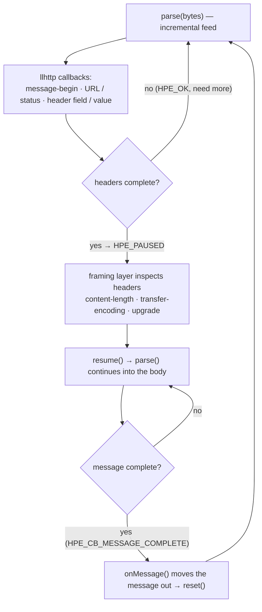

# HTTP message parsing and framing

> **Audience:** Contributor · **Status:** stable · **Verified-against:** qbm-http @ qb 3.0.0 (C++20 default, C++23 supported)

How raw bytes off a qb-io socket become a `qb::http::Request` or `qb::http::Response`: the llhttp-backed `qb::http::Parser`, the `qb::protocol::http` framing layer that drives it, and the security limits that gate every message.

**Prerequisites:** [Core concepts](./01-core-concepts.md) for `Request`/`Response`/`Headers`, and [the message body deep dive](./02-body-deep-dive.md) for `qb::http::Body` over `qb::allocator::pipe<char>`. **See also:** [Advanced topics](./16-advanced-topics.md) for pipelining, [WebSocket](./20-websocket.md) for the post-upgrade frame protocol, and the doc map [`README.md`](./README.md).

## What this page covers

This is the HTTP/1.1 parsing internals. You almost never call any of it directly — the server router, the async client functions, and `http1::Client` all sit on top of it. Read this when you are writing a custom transport, debugging a framing edge case, or need to understand exactly which messages the parser rejects and why.

Two types do the work, both in the `1.1/protocol/` headers:

- `qb::http::Parser<MessageType>` (`src/qbm/http/1.1/protocol/base.h`) — a thin C++ wrapper around the vendored **llhttp** C parser. It owns parser state and the in-progress message.
- `qb::protocol::http::base<IO_Handler, Trait>` (same file) — a `qb::io::async::AProtocol` that frames a byte stream into discrete messages, with `server<IO_Handler>` and `client<IO_Handler>` specializations (`src/qbm/http/1.1/protocol/server.h`, `src/qbm/http/1.1/protocol/client.h`).

HTTP/2 and HTTP/3 do **not** use this parser. HTTP/2 framing lives under `2/protocol/` (HPACK + RFC 9113 frames, see [HTTP/2 protocol specifics](./17-http2-protocol.md)); HTTP/3 framing is delegated to nghttp3 under `3/protocol/` (see [HTTP/3](./19-http3-protocol.md)). This page is HTTP/1.1 only.

This module is a **compiled library**, not header-only — the parser templates are header-defined, but the framework links the vendored llhttp static library (`qbm/http/not-qb/llhttp`) into `qbm::http`. See [Core concepts](./01-core-concepts.md) for the integration recipe.

## The llhttp dependency

`Parser` wraps **llhttp**, the parser that powers Node.js. Its C sources are vendored under `qbm/http/not-qb/llhttp` and built as a `STATIC` library target named `llhttp`; that target has **no public include directory**. Its single public header lives with the module's own headers, at `qbm/http/src/qbm/http/vendor/llhttp.h`.

<!-- src: qbm/http/CMakeLists.txt:64; qbm/http/not-qb/llhttp/CMakeLists.txt:3,29 -->

```cmake
# qbm/http/CMakeLists.txt — llhttp is a build dependency of qbm-http,
# not a header you pull in yourself.
add_subdirectory(not-qb/llhttp)
```

This is a **fork**, not a swappable dependency, so `qbm::http` owns the name rather than publishing it: the vendored copy renames llhttp's public symbols from the upstream `llhttp_*` prefix to a `http_*` prefix — the parser handle is `http_t`, the settings struct is `http_settings_s`, error codes are `http_errno_t`, and the entry points are `http_init` / `http_execute` / `http_resume`. A system llhttp cannot substitute for it, and conversely an installed `qbm-http` must not drop a file called `llhttp.h` on a consumer's include path. Hence the `vendor/` location and the spelling `<qbm/http/vendor/llhttp.h>` (`types.h`), which resolves through the same `qbm/` include root as every other qbm header, in the build tree and in an installed tree alike. It is pulled in transitively via `<qbm/http/http.h>` and used directly by `src/qbm/http/1.1/protocol/base.h`. The `http_method` and `http_status` enums that back `qb::http::Method` and `qb::http::Status` are the same llhttp enums (see [Core concepts](./01-core-concepts.md)).

llhttp is event-driven: you feed it bytes with `http_execute`, and it invokes callbacks as it crosses each boundary of the message (message-begin, URL, status, header field, header value, headers-complete, body, message-complete). `Parser` registers a fixed `static const http_settings_s` table and translates those callbacks into mutations on the message it is building.

## `qb::http::Parser<MessageType>`

`Parser` is templated on the message type and lives in `namespace qb::http`:

<!-- src: src/qbm/http/1.1/protocol/base.h:103,125-126,505-506,524-525,562-563,579-580,598-599 -->

```cpp
#include <qbm/http/http.h>

template <typename MessageType>      // qb::http::Request or qb::http::Response
struct qb::http::Parser : public http_t {
    http_errno_t parse(const char *buffer, std::size_t size);  // feed bytes
    void         reset() noexcept;                             // clear state for a new message
    void         resume() noexcept;                            // continue after the headers pause
    [[nodiscard]] MessageType &get_parsed_message() noexcept;  // the in-progress message
    [[nodiscard]] bool         headers_completed() const noexcept;
};
```

`MessageType` selects the parsing mode through `MessageType::type` (`HTTP_REQUEST` or `HTTP_RESPONSE`), so the same code parses requests on the server and responses on the client. `Parser` derives from `http_t` itself, so the llhttp fields it sets — `content_length`, `error_pos`, `status_code`, `http_major`/`http_minor` — are members you read directly off the parser after `parse()` returns.

### The parsing contract

- **`parse()` is incremental.** Call it repeatedly with successive byte ranges; the parser keeps state across calls. A return of `HPE_OK` means "consumed everything, need more data."
- **The parser pauses at end-of-headers.** The `on_headers_complete` callback returns `HPE_PAUSED` *by design*, so `parse()` returns `HPE_PAUSED` and `headers_completed()` flips to `true` the moment the header block is complete. This lets the framing layer inspect the headers (content length, transfer encoding, upgrade) before committing to read the body.
- **`resume()` clears the pause** so the next `parse()` continues into the body. Call it only after `headers_completed()` is true.
- **`reset()` returns to a clean state** for the next message. It re-initializes llhttp, placement-constructs a fresh `MessageType` (it deliberately avoids assigning into a moved-from message — `onMessage()` moves the message out before resetting), and clears the body buffer and all bookkeeping.
- **`on_message_complete` returns `1`,** which surfaces as `HPE_CB_MESSAGE_COMPLETE`. The framing layer keys off that specific code on the body/resume path (see below).



Here is the contract exercised directly, taken from the test suite:

<!-- src: tests/unit/http1/http1-parse-limits.cpp:122-130 -->

```cpp
#include <qbm/http/http.h>
using namespace qb::http;

Parser<Request> parser;
std::string raw = "GET / HTTP/1.1\r\nHost: example.com\r\n\r\n";

// Header-only request: the parser pauses at end-of-headers.
assert(parser.parse(raw.data(), raw.size()) == HPE_PAUSED);
assert(parser.headers_completed());
assert(parser.content_length == 0u);   // normalized — see "Body framing" below
```

And fragmented input — the case the framing layer is built around — reassembles correctly:

<!-- src: tests/unit/http1/http1-parse-limits.cpp:185-202 -->

```cpp
Parser<Request> parser;
// A single header split across five parse() calls.
parser.parse("GET / HTTP/1.1\r\nX-Cus", 21);   // HPE_OK
parser.parse("tom-Hea",                   7);   // HPE_OK
parser.parse("der: value-",              11);   // HPE_OK
parser.parse("part-1",                    6);   // HPE_OK
parser.parse("part-2\r\n\r\n",           10);   // HPE_PAUSED

assert(parser.get_parsed_message().header("X-Custom-Header") == "value-part-1part-2");
```

### Callbacks and message construction

`Parser` registers a fixed callback table (`static const http_settings_s inline settings`); the callbacks that carry meaning are these. You do not call them — they are the bridge between llhttp's event stream and the `Request`/`Response` you get back.

| llhttp callback | What `Parser` does |
| --- | --- |
| `on_url` | (requests only) Sets `msg.method()` from the parser's method, appends URL bytes into an owning buffer, and assigns `msg.uri()`. Tolerates a URL split across calls. |
| `on_status` | (responses only) Sets `msg.status()` from `parser->status_code`. |
| `on_header_field` / `on_header_value` | Accumulate the current name/value pair into owning `std::string`s; on the next field, push the completed pair into `msg.headers()`. Multiple values for one name are stored as a vector. |
| `on_headers_complete` | Flushes the last header pair, sets `msg.major_version`/`minor_version`, validates transfer encoding (see below), normalizes the body length, sets `msg.upgrade` and `msg.keep_alive`, then **returns `HPE_PAUSED`**. |
| `on_body` | Appends body bytes into an internal `qb::allocator::pipe<char>` (`_chunked`), enforcing the chunk and total-body limits. |
| `on_message_complete` | Sets the content type from the `Content-Type` header, moves the accumulated body into `msg.body().raw()`, and returns `1`. |

`msg.keep_alive` is computed here from llhttp's `http_should_keep_alive`; it is the HTTP/1.x persistence decision and is ignored by HTTP/2 and HTTP/3 (those set `stream_id` instead — see `message_base.h`).

> **Header callbacks APPEND across `http_execute` calls — the header block really is fed incrementally.** `on_header_field` / `on_header_value` append into `_last_header_key` / `_last_header_value` and clear only on a field↔value transition, committing each completed pair into `msg.headers()` exactly once; `on_url` accumulates through `_url_buffer` the same way. A name or value split across any number of `parse()` calls therefore reassembles correctly, which is what lets the framing layer feed only the newly-arrived bytes (next section). Do not re-feed the whole buffer to "protect" a split header: that is the O(n²) shape this design replaced. <!-- src: qbm/http/src/qbm/http/1.1/protocol/base.h:692-701 -->

## The framing layer: `qb::protocol::http::base`

`qb::protocol::http::base<IO_Handler, Trait>` is a `qb::io::async::AProtocol`. A protocol's job in qb-io is to answer one question — *does the input buffer hold a complete message yet, and if so how big is it?* — via `getMessageSize()`, and then to hand that message to the I/O component via `onMessage()`. See the [protocol interface](https://github.com/isndev/qb/blob/main/src/qb/io/async/protocol.h) for the full contract.

The two specializations are:

<!-- src: src/qbm/http/1.1/protocol/server.h:45-46; src/qbm/http/1.1/protocol/client.h:43-44 -->

```cpp
namespace qb::protocol::http {
    template <typename IO_Handler>
    class server : public base<IO_Handler, qb::http::Request>  { /* parses requests  */ };

    template <typename IO_Handler>
    class client : public base<IO_Handler, qb::http::Response> { /* parses responses */ };
}
```

Both are wired in by the server/client session types as `using protocol = qb::protocol::http::server<IO_Handler>;` (and `::client`). You normally reach them through `qb::http::make_server` or `http1::make_client`, never by hand.

### `getMessageSize()` — framing in three phases

`getMessageSize()` is called on the hot path every time bytes arrive. It runs the parser against the *unconsumed* portion of the I/O input pipe (`_io.in()`) and returns the size of one complete message, or `0` (`IProtocol::kNoMessage`) when more data is needed.

<!-- src: src/qbm/http/1.1/protocol/base.h:679-681,717-740,744-752,754-768,792-800 -->

**Phase 1 — headers.** While `headers_completed()` is false, it feeds **only the bytes that arrived since the last call** — `parse(buf + header_parsed, total - header_parsed)` — and returns 0 immediately when nothing is new (`total <= header_parsed`). If that returns `HPE_OK` (headers still incomplete), it records `header_parsed = total` and returns 0, keeping llhttp's incremental state rather than resetting it; the header callbacks append across calls, so a split name or value still reassembles. Cost is therefore **linear** in header bytes. (It formerly reset the parser and re-fed the whole buffer on every arrival: O(n²) in the header size with the *peer* controlling the segmentation — a 793 KB header block delivered in 64-byte segments cost ~1.5 s of parsing on a single-threaded `VirtualCore`, i.e. a remote CPU denial of service from one legal request. Do not reintroduce it.) If the parse ends without the headers completing and without `HPE_OK`, the protocol is marked `not_ok()`. Once the parser pauses (`HPE_PAUSED`), `body_offset` is computed from `error_pos` (llhttp's absolute "where I stopped" pointer) relative to `begin()`, and `header_parsed` is cleared.

**Phase 2 — HEAD / bodyless responses.** On the client side, if the I/O handler exposes `http1_response_body_forbidden()` and it returns true (a response to a HEAD request, where the server sends headers describing a body that is not actually transmitted), framing stops at the end of the headers and returns the header size. This is detected with a `requires`-expression, so handlers that do not opt in are unaffected.

**Phase 3 — body.** With headers in hand:

- **Chunked** (`Transfer-Encoding` present): `resume()` the parser and feed the post-header bytes. `HPE_CB_MESSAGE_COMPLETE` means the final chunk arrived — return the full message size. `HPE_OK` means more chunks are pending — advance `body_offset` and return 0. Anything else marks the protocol `not_ok()`.
- **Content-Length** (the common case): the message is complete once `_io.in().size() >= body_offset + content_length`. When complete, the body is set as a `string_view` over the input buffer and the total size is returned; otherwise return 0 and keep accumulating.

When `getMessageSize()` returns a non-zero size, qb-io consumes exactly that many bytes and calls `onMessage()`. If the parser ever marks itself `not_ok()`, the framework disconnects the connection.

### `onMessage()` — dispatch

`server::onMessage` and `client::onMessage` are the dispatch step. Both are `noexcept` (they sit on a noexcept `AProtocol` boundary), so each wraps cookie parsing in a `try/catch` — a malformed `Cookie` / `Set-Cookie` header is logged and ignored rather than escaping to `std::terminate`. They then **move** the parsed message into the I/O handler and reset the parser:

<!-- src: src/qbm/http/1.1/protocol/server.h:76-93 -->

```cpp
void onMessage(std::size_t) noexcept final {
    auto &request_obj = this->_http_obj.get_parsed_message();
    try {
        request_obj.parse_cookie_header();          // may throw — contained here
    } catch (const std::exception &e) {
        LOG_HTTP_WARN("Failed to parse Cookie header: " << e.what());
    } catch (...) {
        LOG_HTTP_WARN("Failed to parse Cookie header: unknown exception");
    }
    this->_io.on(std::move(request_obj));            // hand off to the session/router
    this->_http_obj.reset();                          // ready for the next message
}
```

Because the message is *owned* (`std::string`-backed, not a `string_view` into the socket buffer), the handler may move it into a long-lived structure — the shared `Context`, a middleware chain, or a coroutine frame — and it stays valid after the socket read that produced it. The retired `server_view` / `client_view` variants used view semantics and could not satisfy that requirement; the qb-io input pipe may `memmove` or reallocate between reads. See [the request context](./10-request-context.md) for how ownership flows through the async pipeline.

After `_io.on(...)`, server sessions apply pipelining and keep-alive: while a response is in flight, further requests queue up to `max_pipelined_requests` (default 128); exceeding the cap disconnects with `DisconnectedReason::ByProtocolError`. When the parser-computed `keep_alive` is false (or the session overrides it), the server closes after `ResponseTransmitted`. See [Advanced topics](./16-advanced-topics.md).

## Body framing and the normalization rules

`on_headers_complete` normalizes the body length so downstream framing never waits for an impossible body:

<!-- src: src/qbm/http/1.1/protocol/base.h:331-351 -->

- **Header-only requests.** llhttp reports `ULLONG_MAX` ("unknown length") when neither `Content-Length` nor `Transfer-Encoding` is present. For requests this is normalized to `content_length = 0` (RFC 9112 framing — a request with no framing headers has an empty body).
- **Bodyless responses.** Responses with a `1xx`, `204`, or `304` status force `content_length = 0` regardless of any declared `Content-Length` header (RFC 9112 §6.3). The test suite asserts this for both `304 Not Modified` and `204 No Content`.
- **Reservation.** When the body length is known and within `MAX_BODY_SIZE`, the body buffer is `reserve`d up front for that many bytes — one allocation instead of repeated growth.

## Security limits and rejected messages

The parser is hardened against framing attacks. The limits live in `namespace qb::http::protocol_limits` (`src/qbm/http/1.1/protocol/base.h`) as compile-time constants, and each is enforced *during* parsing — a message that exceeds any limit fails with `HPE_USER` (via `http_set_error_reason`), which propagates as a parse error and a disconnect.

<!-- src: src/qbm/http/1.1/protocol/base.h:43-61 -->

| Constant | Value | Enforced on |
| --- | --- | --- |
| `MAX_URL_LENGTH` | 8 KB (8192) | request URL/target |
| `MAX_HEADER_NAME_LENGTH` | 1 KB (1024) | each header name |
| `MAX_HEADER_VALUE_LENGTH` | 8 KB (8192) | each header value |
| `MAX_HEADERS_COUNT` | 100 | header count per message |
| `MAX_CHUNK_SIZE` | 16 MB | a single chunk |
| `MAX_BODY_SIZE` | 100 MB | declared `Content-Length` and accumulated body |

`MAX_BODY_SIZE` is checked twice: once against the declared `Content-Length` *before* any body buffer is reserved (so an oversized declaration is rejected before allocation), and again against the running total as body bytes arrive.

Two framing defenses go beyond size limits, both in `on_headers_complete`:

<!-- src: src/qbm/http/1.1/protocol/base.h:121-139,323-330 -->

- **Request smuggling.** A message carrying both `Transfer-Encoding` and `Content-Length` is rejected (`"HTTP Transfer-Encoding with Content-Length is forbidden"`). This is the classic TE.CL / CL.TE smuggling vector.
- **Transfer-Encoding allowlist.** Only a single `chunked` token is accepted. Any other value — `gzip, chunked`, a second encoding, anything non-`chunked` — is rejected (`"Unsupported HTTP Transfer-Encoding"`).

These are exercised directly against `Parser`:

<!-- src: tests/unit/http1/http1-parse-limits.cpp:59-160 -->

```cpp
Parser<Request> parser;

// Oversized URL → rejected (not HPE_OK).
std::string big_url = "GET /" + std::string(protocol_limits::MAX_URL_LENGTH + 1, 'x') + " HTTP/1.1\r\n\r\n";
assert(parser.parse(big_url.data(), big_url.size()) != HPE_OK);

// TE + CL → smuggling defense.
parser.reset();
std::string smuggle = "POST /u HTTP/1.1\r\nTransfer-Encoding: chunked\r\nContent-Length: 3\r\n\r\n";
assert(parser.parse(smuggle.data(), smuggle.size()) != HPE_PAUSED);

// "gzip, chunked" → not on the allowlist.
parser.reset();
std::string bad_te = "POST /u HTTP/1.1\r\nTransfer-Encoding: gzip, chunked\r\n\r\n";
auto err = parser.parse(bad_te.data(), bad_te.size());
assert(err != HPE_OK && err != HPE_PAUSED);
```

## Serialization (the reverse direction)

Parsing turns bytes into objects; serialization is the inverse, and it is **not** part of `Parser`. It is a `qb::allocator::pipe<char>::put<>` specialization for each message type, declared in `request.h` / `response.h` and defined in `request.cpp` / `response.cpp`:

<!-- src: qbm/http/src/qbm/http/request.h:384; qbm/http/src/qbm/http/response.h:357; qbm/http/src/qbm/http/request.cpp:161-163; qbm/http/src/qbm/http/response.cpp:228-230 -->

```cpp
template <>
qb::allocator::pipe<char> &
qb::allocator::pipe<char>::put<qb::http::Request>(const qb::http::Request &r);

template <>
qb::allocator::pipe<char> &
qb::allocator::pipe<char>::put<qb::http::Response>(const qb::http::Response &r);
```

These write the request line / status line, the headers, and the body to the output pipe — `out() << response_obj;` is how a session emits a response. They add a `Content-Length` header when one is absent and the body is non-empty, and they enforce the same `protocol_limits`: serializing a message whose body, headers, or estimated wire size exceeds the limit throws `std::length_error`. See [the message body deep dive](./02-body-deep-dive.md) for how the body is laid out in the pipe.

## After the upgrade: WebSocket

The HTTP/1.1 parser handles only the *opening* handshake of a WebSocket connection — the HTTP `GET` upgrade request and the `101 Switching Protocols` response. Once the connection calls `switch_protocol` with `qb::http::ws::protocol<IO_>` and it succeeds, the same socket is parsed as RFC 6455 frames by an entirely different protocol (`qb::protocol::ws_internal::base`), not by `qb::protocol::http::base`. The framing rules, limits, and state machine for that phase are covered in [WebSocket](./20-websocket.md).

## Pitfalls

- **Do not assume header callbacks accumulate across `http_execute` calls.** They overwrite. The framing layer's re-feed-the-whole-buffer strategy exists precisely so each header is parsed in one shot; if you build your own driver over `Parser`, you must preserve that property or split-header values will be truncated.
- **`reset()` before reuse, always.** A `Parser` carries the previous message's state until reset. The framing layer resets after every `onMessage()`; a hand-rolled loop must too. `reset()` is also what makes the parser usable after an error.
- **`content_length == 0` does not mean "no `Content-Length` header."** For requests with no framing headers, and for `1xx`/`204`/`304` responses, the parser normalizes the length to 0 even when a (misleading) `Content-Length` header was present. Read the body, not the raw header, to know what arrived.
- **The body is a view until `onMessage`.** Inside `getMessageSize()` the Content-Length body is set as a `string_view` into the I/O input pipe; it only becomes owned when `onMessage` moves the message out. Never hold a reference to `get_parsed_message()` across a `parse()` or buffer mutation.
- **These limits are compile-time.** `MAX_BODY_SIZE` is 100 MB by default; there is no per-connection runtime knob in this layer. If you need a different ceiling you change the constant and rebuild the module. The HTTP/2 and HTTP/3 layers have their own, separate `protocol_limits`.
- **This is HTTP/1.1 only.** None of `Parser`, `protocol_limits`, or `qb::protocol::http::base` is involved in HTTP/2 (`2/protocol/`) or HTTP/3 (`3/protocol/`) framing. Do not reason about h2/h3 message limits from this page.

## See also

- [Core concepts](./01-core-concepts.md) — `Request`, `Response`, `Headers`, `Method`/`Status`, and the build/integration recipe.
- [HTTP message body deep dive](./02-body-deep-dive.md) — `qb::http::Body` over `qb::allocator::pipe<char>`, chunks, and compression.
- [Advanced topics and best practices](./16-advanced-topics.md) — pipelining, keep-alive, and performance.
- [HTTP/2 protocol specifics](./17-http2-protocol.md) and [HTTP/3](./19-http3-protocol.md) — the other framing layers.
- [WebSocket](./20-websocket.md) — the RFC 6455 frame protocol the connection switches to after the upgrade.
- The doc map: [`README.md`](./README.md).
