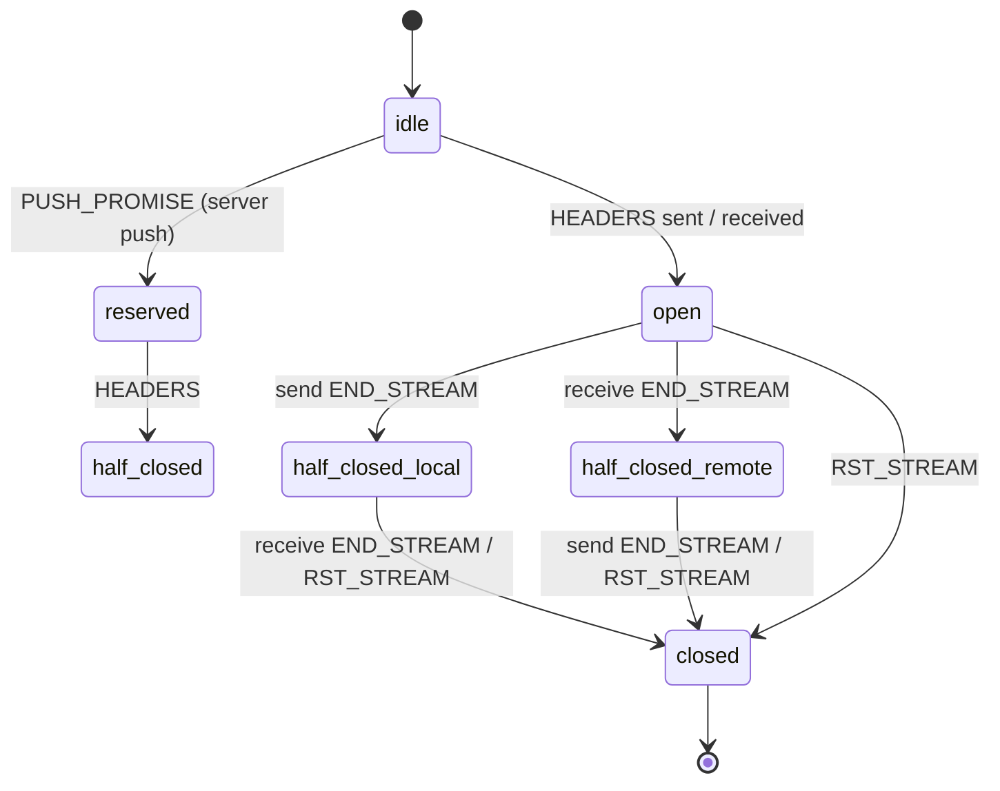
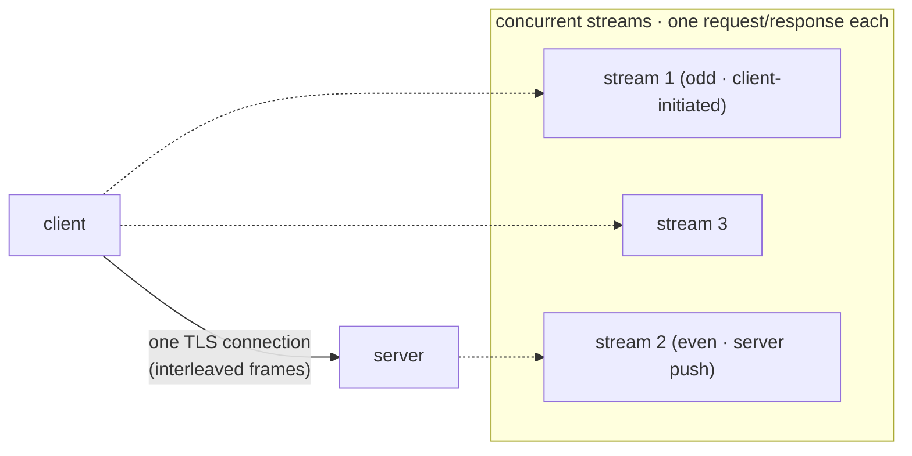

# HTTP/2 protocol specifics

> **Audience:** Adopter · **Status:** stable · **Verified-against:** qbm-http @ qb 3.0.0 (C++20 default, C++23 supported)

Run multiplexed HTTP/2 over TLS — `qb::http2::Server` and `qb::http2::Client` reuse the HTTP/1.1 router and message types while the protocol layer handles HPACK, streams, flow control, and per-stream cleanup.

**Prerequisites:** [Core concepts](./01-core-concepts.md), [Routing overview](./03-routing-overview.md), [Asynchronous HTTP client](./14-async-http-client.md) — **See also:** [Enabling HTTPS (SSL/TLS)](./18-https-ssl-tls.md), [HTTP/3 protocol](./19-http3-protocol.md), [Advanced topics](./16-advanced-topics.md)

HTTP/2 is a binary, multiplexed protocol: many concurrent request/response exchanges share one TCP connection, headers are compressed with HPACK, and per-stream flow control keeps a fast peer from overrunning a slow one. In qbm-http you get all of this without dropping down to frames — you write routes and handlers exactly as you do for HTTP/1.1, and the `qb::protocol::http2` layer does the framing. This page explains what that layer guarantees, how streams are created and torn down, and which knobs (concurrency limits, session timeout, cleanup interval) you can tune.

> **SSL is mandatory.** HTTP/2 in qbm-http is TLS-only. `<qbm/http/http.h>` includes `src/qbm/http/2/http2.h` only under `#ifdef QB_HAS_SSL`, and the build compiles `src/qbm/http/2/http2.cpp` and `src/qbm/http/2/client.cpp` into the library only when `QB_HAS_SSL` is set. There is no plaintext h2c path. If your build lacks OpenSSL, `qb::http2::*` does not exist. See [Enabling HTTPS (SSL/TLS)](./18-https-ssl-tls.md) for how `QB_HAS_SSL` is derived.
<!-- src: qbm/http/src/qbm/http/http.h:45-48; qbm/http/CMakeLists.txt:74-82 -->

## Concepts

### ALPN selects the protocol

There is no separate HTTP/2 port. The server listens for HTTPS and uses ALPN (Application-Layer Protocol Negotiation) during the TLS handshake to decide which protocol to speak. The server advertises `{"h2", "http/1.1"}`; when ALPN selects `h2`, the session switches to the HTTP/2 protocol handler, otherwise it falls back to HTTP/1.1 on the same connection. The persistent client advertises only `{"h2"}` and fails the connection if the peer does not negotiate `h2`.
<!-- src: qbm/http/src/qbm/http/2/http2.h:224-234,498; qbm/http/src/qbm/http/2/client.cpp:333,346,724-743 -->

### Streams and multiplexing

A stream is an independent, bidirectional sequence of frames identified by a stream ID. Each request/response exchange owns one stream, so many exchanges run concurrently over one connection with no head-of-line blocking at the HTTP layer. The lifecycle is the RFC 9113 §5.1 state machine, modeled by `qb::protocol::http2::Http2StreamConcreteState`:


<!-- src: qbm/http/src/qbm/http/2/protocol/stream.h:47-55 -->

Many such streams are interleaved over one TLS connection — that is the multiplexing that removes HTTP/1.1 head-of-line blocking:



Stream IDs are not arbitrary:

- **Stream 0** is reserved. In this module `constants::HTTP11_STREAM_ID == 0` doubles as the sentinel for an HTTP/1.1 message; a valid HTTP/2 stream ID is `>= 1`. A response written with `stream_id == 0` (or larger than `uint32_t` max) is rejected by `session::operator<<`.
- **Client-initiated streams use odd IDs**; **server-pushed streams use even IDs** (the server's next pushed ID starts at 2). The server rejects a client `HEADERS` frame on an even stream ID with `GOAWAY(PROTOCOL_ERROR)`.
<!-- src: qbm/http/src/qbm/http/2/http2.h:61,63,125,185-193; qbm/http/src/qbm/http/2/protocol/server.h:85,397-399 -->

Each request and response carries its stream ID on `MessageBase::stream_id` (0 for HTTP/1.1). Your handler reads it through `ctx->request().stream_id`; the session sets the matching ID on the outgoing response automatically when you call `ctx->complete()`.
<!-- src: qbm/http/src/qbm/http/message_base.h:55-72; qbm/http/src/qbm/http/2/http2.h:259-262 -->

### HPACK header compression

HTTP/2 compresses header blocks with HPACK (RFC 7541), implemented in `qb::protocol::hpack`. The encoder and decoder are owned by value inside each protocol handler (the former abstract interfaces were removed — annotated F35), so there is nothing for you to wire up. What you should know about its behavior:

- A **61-entry static table** holds common fields (`:method: GET`, `accept-encoding: gzip`, …); lookup uses a compile-time open-addressing index (F33).
- A per-connection **dynamic table**, a ring buffer (F34), stores recently sent fields. Its size is bounded by `SETTINGS_HEADER_TABLE_SIZE`, which each peer advertises for its own decoder. Per RFC 7541 §4.4, an entry larger than the whole table budget clears the table and is *not* inserted.
- The encoder **never indexes sensitive headers** (`authorization`, `cookie`, `proxy-authorization`, `set-cookie`) or pseudo-headers; they are emitted as *Literal Never Indexed* so intermediaries cannot cache them. Only non-sensitive, non-pseudo fields that fit the table are added with incremental indexing.
- String literals may be Huffman-coded for further size reduction.
<!-- src: qbm/http/src/qbm/http/2/protocol/hpack.h:100-170,302-426,481-485; FACTBOOK F33/F34/F35 -->

### Flow control

HTTP/2 has two flow-control windows, both replenished by `WINDOW_UPDATE` frames:

- **Stream-level** — each stream tracks how much DATA it may still send/receive. The initial size is `SETTINGS_INITIAL_WINDOW_SIZE` (default 65,535 octets).
- **Connection-level** — a single global window for the whole connection (stream ID 0).

A sender must not emit DATA that would exceed *either* window. The protocol layer (`FlowControlManager`, `Http2StreamBase`) segments large bodies into DATA frames respecting the current windows, sends `WINDOW_UPDATE` once consumed bytes cross a threshold (half the initial window by default), and treats any window growing past `MAX_WINDOW_SIZE_LIMIT` (2³¹−1) as a `FLOW_CONTROL_ERROR`. None of this needs application code.
<!-- src: qbm/http/src/qbm/http/2/protocol/stream.h:65-103,156-163,229-256; qbm/http/src/qbm/http/2/protocol/frames.h:105,110 -->

### Connection shutdown: GOAWAY and RST_STREAM

- **`RST_STREAM`** abruptly terminates a single stream with an error code, moving it straight to `CLOSED`. The server sends it for refused, malformed, oversized, or idle streams; your handler can trigger one through `session::reset_stream(...)`.
- **`GOAWAY`** announces connection shutdown and the last peer-initiated stream the sender will process, enabling a graceful drain. On a `NO_ERROR` GOAWAY the server keeps the connection until all in-range client-initiated streams close; a non-`NO_ERROR` GOAWAY deactivates immediately. The client fails any streams beyond `last_stream_id` and finishes its drain once active requests complete.
<!-- src: qbm/http/src/qbm/http/2/protocol/server.h:733-828; qbm/http/src/qbm/http/2/client.cpp:503-513,756-757 -->

## Running an HTTP/2 server

The server is the same shape as the HTTP/1.1 server (acceptor + sessions + router); the only differences are the class you instantiate and the ALPN/TLS setup, which `listen` handles for you.

### Quick start with `make_server`

`qb::http2::make_server()` returns a `std::unique_ptr<qb::http2::Server<>>` using the built-in `DefaultSession`. Define routes on its `router()`, call `compile()`, then `listen` with your certificate and key, `start()`, and drive the qb-io reactor.

```cpp
// src: qbm/http/src/qbm/http/2/http2.h:548-590 (Server/make_server), :499-508 (listen)
#include <qbm/http/http.h>          // umbrella; pulls <qbm/http/2/http2.h> under QB_HAS_SSL
#include <qb/io/async.h>
#include <filesystem>
#include <iostream>

int main(int argc, char *argv[]) {
    if (argc < 3) {
        std::cerr << "usage: " << argv[0] << " <cert.pem> <key.pem>\n";
        return 1;
    }
    std::filesystem::path cert_file = argv[1];
    std::filesystem::path key_file  = argv[2];

    qb::io::async::init();                       // one reactor per thread

    auto server = qb::http2::make_server();      // std::unique_ptr<Server<DefaultSession>>

    server->router().get("/hello", [](auto ctx) {
        ctx->response().status() = qb::http::status::OK;
        ctx->response().body()   = "Hello over HTTP/2";
        ctx->complete();
    });
    server->router().compile();                  // build the route trie once

    // listen() initializes the server TLS context and sets ALPN to {"h2","http/1.1"}.
    if (!server->listen({"https://0.0.0.0:8443"}, cert_file, key_file)) {
        std::cerr << "failed to listen on https://0.0.0.0:8443\n";
        return 1;
    }
    server->start();
    qb::io::async::run();                         // run the event loop
    return 0;
}
```

`listen` does three things for you: it creates the server SSL context from your cert/key, sets the ALPN list to `{"h2", "http/1.1"}`, and binds the listening socket. Routing is identical to HTTP/1.1 — groups, controllers, middleware, path parameters, and validation all work unchanged because the HTTP/2 session feeds the same `qb::http::Router`.
<!-- src: qbm/http/src/qbm/http/2/http2.h:499-508,400-402 -->

### Custom sessions with the CRTP `use<>` template

When you need per-connection state or custom event handling, define your own session and server through the `qb::http2::use<Derived>` template. The session derives from the internal HTTP/2 session machinery; the server derives from the internal acceptor and owns the router.

```cpp
// src: qbm/http/tests/system/http2/http2-client.cpp:61-72 (server pattern)
#include <qbm/http/http.h>

class MyServer;   // forward declaration

class MySession
    : public qb::http2::use<MySession>::session<MyServer> {
public:
    using Base = qb::http2::use<MySession>::session<MyServer>;
    explicit MySession(MyServer &server) : Base(server) {}
    // ... per-connection state ...
};

class MyServer
    : public qb::http2::use<MyServer>::server<MySession> {
public:
    MyServer() {
        router().get("/api/users/:id", [](auto ctx) {
            ctx->response().status() = qb::http::status::OK;
            ctx->response().body()   = "User " + ctx->path_param("id");
            ctx->complete();
        });
        router().compile();
    }
};
```

`qb::http2::use<Derived>` exposes three CRTP aliases — `session<ServerHandler>`, `io_handler<SessionType>`, and `server<SessionType>` — and `make_server<MySession>()` constructs the matching server. The `DefaultSession` / `Server<>` pair used by `make_server()` is exactly this template instantiated for you.
<!-- src: qbm/http/src/qbm/http/2/http2.h:500-510,525-536,548-590 -->

### Sending responses and resetting streams

Inside a handler you set the response and call `ctx->complete()` as usual; the session writes it on the request's stream. To abort a single stream — for example to enforce an application policy — call `reset_stream` on the session, which sends `RST_STREAM` with the error code you choose:

```cpp
// src: qbm/http/tests/system/http2/http2-client.cpp:146-154 (reset pattern)
router().get("/api/cancel", [](auto ctx) {
    auto session = ctx->session();
    if (session) {
        session->reset_stream(
            static_cast<uint32_t>(ctx->request().stream_id),
            qb::protocol::http2::ErrorCode::CANCEL,
            "application requested cancellation");
    }
});
```

`session::operator<<(qb::http::Response&)` validates the response before framing it: it rejects `stream_id == 0`, an out-of-range stream ID, or a status code outside `[100, 600)`, and it sets `content-length` automatically when the body is non-empty and no length was provided.
<!-- src: qbm/http/src/qbm/http/2/http2.h:166-215 -->

## Server stream management

The server session and protocol handler enforce limits that protect against resource exhaustion. The defaults are conservative; tune them only with a clear reason.

### Concurrency limit

The server advertises `SETTINGS_MAX_CONCURRENT_STREAMS = 50` to clients (reduced from 100 for DDoS resistance) and refuses new client streams with `RST_STREAM(REFUSED_STREAM)` once active client streams reach that cap. The persistent client caps its own outbound concurrency at 100 by default; configure it with `set_max_concurrent_streams`.
<!-- src: qbm/http/src/qbm/http/2/protocol/server.h:408-412,1403; qbm/http/src/qbm/http/2/http2.h:64; qbm/http/src/qbm/http/2/client.h:190,366 -->

### Session timeout and stream cleanup

Connection and stream lifetimes are governed by four `qb::duration` constants in `qb::http2::constants`:

| Constant | Default | Role |
| --- | --- | --- |
| `DEFAULT_SESSION_TIMEOUT` | 60 s | Connection inactivity deadline; the session disconnects with `ByTimeout` when it elapses. |
| `STREAM_IDLE_TIMEOUT` | 30 s | Per-stream idle deadline used by the cleanup sweep. |
| `STREAM_INCOMPLETE_TIMEOUT` | 10 s | Tighter deadline for streams that opened but never dispatched a request. |
| `CLEANUP_INTERVAL` | 5 s | Minimum gap between cleanup sweeps. |

<!-- src: qbm/http/src/qbm/http/2/http2.h:60-70 -->

These are real `qb::duration` values (`std::chrono::seconds`) — the protocol layer takes `qb::duration` throughout (`cleanup_idle_streams`, `StreamManager::CleanupCriteria`).
<!-- src: qbm/http/src/qbm/http/2/protocol/server.h:1285-1286; qbm/http/src/qbm/http/2/protocol/stream.h:502-508 -->

The cleanup mechanism has two parts, both run from the session's `pending_write` handler:

1. **Closed-context reaping** — on every write tick, contexts whose stream the protocol reports as closed (`is_stream_closed`) fire their `POST_RESPONSE_SEND` hook and are erased.
2. **Idle-stream sweep** — no more often than `CLEANUP_INTERVAL`, the session calls `protocol.cleanup_idle_streams(STREAM_IDLE_TIMEOUT, STREAM_INCOMPLETE_TIMEOUT)`, which sends `RST_STREAM(CANCEL)` to streams past their idle or incomplete deadline and removes them.

```cpp
// src: qbm/http/src/qbm/http/2/http2.h:292-312 (session pending_write handler, condensed)
void on(qb::io::async::event::pending_write &&) {
    this->updateTimeout();
    if (_http2_protocol) {
        // 1. reap contexts for streams the protocol already closed
        for (auto it = _contexts.begin(); it != _contexts.end();) {
            if (it->second && _http2_protocol->is_stream_closed(it->first)) {
                it->second->execute_hook(qb::http::HookPoint::POST_RESPONSE_SEND);
                it = _contexts.erase(it);
            } else {
                ++it;
            }
        }
        // 2. rate-limited idle-stream sweep
        auto now = std::chrono::steady_clock::now();
        if (now - _last_stream_cleanup >= qb::http2::constants::CLEANUP_INTERVAL) {
            _http2_protocol->cleanup_idle_streams(
                qb::http2::constants::STREAM_IDLE_TIMEOUT,
                qb::http2::constants::STREAM_INCOMPLETE_TIMEOUT);
            _last_stream_cleanup = now;
        }
    }
}
```

The sweep is **opportunistic**: it runs only when there is write activity. A purely idle connection with no writes never triggers the stream-level sweep — it is reclaimed instead by the 60 s `DEFAULT_SESSION_TIMEOUT`. Per-stream timestamps (`created_at`, `last_activity`) and `_last_stream_cleanup` use `std::chrono::steady_clock::time_point` directly, even though the durations they are compared against are `qb::duration`; this is a deliberate mixed time model in this slice.
<!-- src: qbm/http/src/qbm/http/2/http2.h:118,154,292-312; qbm/http/src/qbm/http/2/protocol/stream.h:143-144 -->

## Using the HTTP/2 client

The persistent client is `qb::http2::Client`, created through `qb::http2::make_client(base_uri)`, which returns a `std::shared_ptr<Client>`. The client is **non-copyable and non-movable** and uses `enable_shared_from_this` internally, so always own it through the shared pointer the factory hands you. It multiplexes many requests over one connection, manages stream IDs, and offers both callback and coroutine APIs. For the full client narrative — one-shot vs. persistent, batching, reconnection — see [Asynchronous HTTP client](./14-async-http-client.md); this section covers the HTTP/2-specific surface.
<!-- src: qbm/http/src/qbm/http/2/client.h:153-154,214-217,496 -->

### Callback API

```cpp
// src: qbm/http/tests/system/http2/http2-client.cpp:227-260 (client pattern)
#include <qbm/http/http.h>
#include <qb/io/async.h>

qb::io::async::init();

auto client = qb::http2::make_client("https://api.example.com");
client->set_verify_peer(true);              // default; verifies chain + hostname

qb::http::Request req;
req.uri() = qb::io::uri("/v1/items");        // resolved against the base URI
client->push_request(std::move(req), [](qb::http::Response res) {
    // delivered once, on this thread, when the stream completes
    handle(res.status(), res.body().as<std::string_view>());
});
```

`push_request` triggers an implicit connect when needed, so you do not have to call `connect()` first; queued requests flush once the handshake completes. To run several requests as one batch with a single callback that fires when all responses are in (order preserved), use `push_requests(std::vector<Request>, BatchResponseCallback)` — each request travels on its own stream concurrently.
<!-- src: qbm/http/src/qbm/http/2/client.h:290,313; qbm/http/tests/system/http2/http2-client-coro.cpp:264-285 -->

### Bounding outstanding work

Beyond the stream-concurrency cap, the client bounds the **total outstanding request set** (queued + in-flight). The limit is `set_max_pending_requests(size_t)` (default `_max_pending_requests = 1024`); once the combined count of pending and active requests reaches it, `push_request()` and `push_requests()` **reject immediately with `503 Service Unavailable`** rather than growing the queue without bound. This is a DoS guard that matches the HTTP/1.1 and HTTP/3 clients — a disconnected or saturated client cannot accumulate work indefinitely. The callback (or the per-element responses for a batch) receives the synthesized 503; the coroutine overloads surface the same 503 as their resolved `Response`.

```cpp
// src: qbm/http/src/qbm/http/2/client.h:372-379; qbm/http/src/qbm/http/2/client.cpp:189-194,245-250
client->set_max_pending_requests(256);       // tighten the outstanding-work bound
if (!client->push_request(std::move(req), cb)) {
    // false return == rejected; cb already fired with a 503 response
}
```
<!-- src: qbm/http/src/qbm/http/2/client.h:290,313,372-379 -->

### Flood protection against a hostile server

Control frames (`PING`, `SETTINGS`) and `CONTINUATION` frames are exempt from HTTP/2 flow control, so a malicious server could otherwise stream them without bound and either grow the client's output pipe (each `PING`/`SETTINGS` demands an ACK reply) or hold a header block open forever with zero-length `CONTINUATION` frames. The client bounds all three the same way the server does: past `qb::http2::protocol_limits::MAX_QUEUED_CONTROL_REPLIES` (1000) queued PONG + SETTINGS-ACK replies in one drain window, or past `MAX_CONTINUATION_FRAMES` (512) `CONTINUATION` frames in a single header block, it closes the connection with `GOAWAY(ENHANCE_YOUR_CALM)`. Real response progress (accepted `DATA`, a completed response) resets the control-reply budget, so a busy but well-behaved server never trips it. These caps cover the PING/SETTINGS-flood (CVE-2019-9512 / CVE-2019-9515) and CONTINUATION-flood (CVE-2024-27316) classes.
<!-- src: qbm/http/src/qbm/http/2/protocol/client.h:492-493,654-655,2450-2451; qbm/http/src/qbm/http/2/protocol/base.h:105-114 -->

### Coroutine API

Each entry point has a `co_await`-able overload. `connect()` yields a `ConnectResult` (boolean-convertible), `push_request(Request)` yields a `Response`, and `push_requests(...)` yields a `std::vector<Response>`.

```cpp
// src: qbm/http/tests/system/http2/http2-client-coro.cpp:235-258,216
#include <qbm/http/http.h>

qb::io::async::task<void> fetch() {
    auto client = qb::http2::make_client("https://api.example.com");
    if (!co_await client->connect()) co_return;       // ConnectResult is bool-convertible
    auto res = co_await client->push_request(
        qb::http::Request{qb::io::uri("/v1/items")});
    use(res);
}

// Blocking bridge for tests/main:
auto res = qb::http::run_sync(client->push_request(std::move(req)));
```

The coroutine `connect()` overload has **no default-argument callback overload**: a fire-and-forget caller must write `connect(nullptr)` so the call stays unambiguous. Call `set_verify_peer(false)` (before connecting) only for trusted self-signed endpoints; certificate verification is on by default because h2 is TLS-only.
<!-- src: qbm/http/src/qbm/http/2/client.h:227-232,254,294-295,317-318,327-331 -->

### Server push

The client advertises `SETTINGS_ENABLE_PUSH = 0` by default, so per RFC 9113 §8.4 it treats any received `PUSH_PROMISE` as a **connection error** and answers with `GOAWAY(PROTOCOL_ERROR)` — it does not RST the pushed stream and keep the connection alive. On the server, push is **disabled by default** (`SETTINGS_ENABLE_PUSH = 0`) and there is no first-class router API for it; `ServerHttp2Protocol::send_push_promise` exists for low-level integration and additionally requires the peer to have enabled push and a valid even, non-zero promised stream ID, returning a `PushPromiseFailureReason` otherwise. Treat server push as advanced/optional rather than a primary feature.
<!-- src: qbm/http/src/qbm/http/2/protocol/client.h:725-735; qbm/http/src/qbm/http/2/protocol/server.h:1151-1184,1401; qbm/http/src/qbm/http/2/protocol/frames.h:317-330 -->

## Protocol-layer reference

You rarely touch these directly, but they are the public types behind the convenience API.

| Component | Header | Role |
| --- | --- | --- |
| `qb::protocol::http2::ServerHttp2Protocol` / `ClientHttp2Protocol` | `src/qbm/http/2/protocol/server.h`, `src/qbm/http/2/protocol/client.h` | Frame dispatch, HPACK, flow control, stream lifecycle. |
| `qb::protocol::http2::Http2StreamConcreteState` | `src/qbm/http/2/protocol/stream.h` | RFC 9113 §5.1 stream state machine. |
| `qb::protocol::http2::Http2StreamBase` / `Http2ServerStream` / `Http2ClientStream` | `src/qbm/http/2/protocol/stream.h` | Per-stream window, timing, and assembly state. |
| `qb::protocol::http2::FlowControlManager` / `StreamManager` | `src/qbm/http/2/protocol/stream.h` | Window math and bulk stream cleanup/statistics. |
| `qb::protocol::hpack::Encoder` / `Decoder` / `DynamicTable` | `src/qbm/http/2/protocol/hpack.h` | RFC 7541 header compression, owned by value. |
| `qb::protocol::http2::ErrorCode` | `src/qbm/http/2/protocol/frames.h` | RFC error codes (`NO_ERROR`, `PROTOCOL_ERROR`, `REFUSED_STREAM`, `CANCEL`, `ENHANCE_YOUR_CALM`, …). |
| Events: `Http2StreamErrorEvent`, `Http2GoAwayEvent`, `Http2ConnectionErrorEvent`, `Http2PushPromiseEvent` | `src/qbm/http/2/protocol/stream.h` | Surfaced to the session/client via `on(...)` handlers. |

<!-- src: qbm/http/src/qbm/http/2/protocol/stream.h:47-55,114,329,369,419-486; qbm/http/src/qbm/http/2/protocol/frames.h:66-83 -->

The protocol enforces RFC 9113 validation you get for free: header names must be lowercase tokens with no NUL/CR/LF; requests require non-empty `:method`/`:scheme`/`:path` and `:authority` pseudo-headers ahead of regular headers; trailers may not carry pseudo-headers or hop-by-hop headers. A request body over `qb::http::protocol_limits::MAX_BODY_SIZE` is reset with `RST_STREAM(ENHANCE_YOUR_CALM)`, and an assembled header block over `qb::http2::protocol_limits::MAX_HEADER_BLOCK_SIZE` (1 MB) closes the connection with `GOAWAY(ENHANCE_YOUR_CALM)`.
<!-- src: qbm/http/src/qbm/http/2/protocol/server.h:134-136,302-309,435-438,1426-1509; qbm/http/src/qbm/http/2/protocol/base.h:85,88 -->

## Pitfalls

- **HTTP/2 needs `QB_HAS_SSL`.** Without it, none of `qb::http2::*` is compiled in and `<qbm/http/http.h>` does not declare it. There is no plaintext h2c. Build with OpenSSL and listen over `https://`.
  <!-- src: qbm/http/src/qbm/http/http.h:45-48; qbm/http/src/qbm/http/2/http2.h:499-508 -->
- **The module is a compiled library, not header-only.** `src/qbm/http/2/http2.cpp` and `src/qbm/http/2/client.cpp` are real translation units in the qbm-http build. Integrate by `add_subdirectory(qb)` → `qb_load_modules("<path>/qbm")` → `target_link_libraries(app PRIVATE qbm::http)` and include `<qbm/http/http.h>`; do not `find_package` the headers alone.
  <!-- src: qbm/http/CMakeLists.txt:74-82,109-160 -->
- **Never write a response with `stream_id == 0`.** Stream 0 is the HTTP/1.1 sentinel; `session::operator<<` discards such a response. Always carry `ctx->request().stream_id` through to the response (the framework does this for you when you use `ctx->complete()`).
  <!-- src: qbm/http/src/qbm/http/2/http2.h:185-193 -->
- **The idle-stream sweep is opportunistic.** It runs only on write activity and no more than once per `CLEANUP_INTERVAL` (5 s). A fully idle connection relies on the 60 s session timeout instead — do not assume `STREAM_IDLE_TIMEOUT` fires on a silent connection.
  <!-- src: qbm/http/src/qbm/http/2/http2.h:292-312 -->
- **Server concurrency defaults to 50, client to 100.** They are independent: the server's `SETTINGS_MAX_CONCURRENT_STREAMS = 50` bounds inbound client streams (excess gets `REFUSED_STREAM`); `client->set_max_concurrent_streams(...)` bounds the client's outbound *in-flight* streams (default 100). Raise the server limit only if you have measured headroom.
  <!-- src: qbm/http/src/qbm/http/2/protocol/server.h:1403; qbm/http/src/qbm/http/2/client.h:190,366 -->
- **The client also caps total outstanding requests.** Separate from stream concurrency, `set_max_pending_requests(...)` (default 1024) bounds queued + active requests; past it `push_request()`/`push_requests()` reject with `503 Service Unavailable` instead of queuing without limit. Tune it down for tighter backpressure, not up without a reason.
  <!-- src: qbm/http/src/qbm/http/2/client.h:192,372-379; qbm/http/src/qbm/http/2/client.cpp:189-194 -->
- **The client is non-movable; keep the `shared_ptr`.** Constructing one on the stack or trying to move it will not compile. Use `make_client(...)` and store the returned `std::shared_ptr`.
  <!-- src: qbm/http/src/qbm/http/2/client.h:214-217,496 -->
- **`set_verify_peer` must precede `connect`.** Changing it after the handshake has no effect. Leave it `true` in production; flip to `false` only for trusted self-signed test endpoints.
  <!-- src: qbm/http/src/qbm/http/2/client.h:343-350 -->
- **Coroutine `connect()` has no default callback.** For fire-and-forget, write `connect(nullptr)`; bare `connect()` is the coroutine awaiter overload.
  <!-- src: qbm/http/src/qbm/http/2/client.h:227-232 -->
- **Server push is off by default and not a router feature.** Do not design around server-initiated pushes; the client advertises `SETTINGS_ENABLE_PUSH = 0` and tears the connection down with `GOAWAY(PROTOCOL_ERROR)` on any `PUSH_PROMISE` (RFC 9113 §8.4), and the server disables `SETTINGS_ENABLE_PUSH`.
  <!-- src: qbm/http/src/qbm/http/2/protocol/client.h:725-735; qbm/http/src/qbm/http/2/protocol/server.h:1401 -->

## See also

- [Enabling HTTPS (SSL/TLS)](./18-https-ssl-tls.md) — certificates, server context, and ALPN setup that HTTP/2 depends on.
- [Asynchronous HTTP client](./14-async-http-client.md) — full client model (one-shot, coroutine, persistent), batching, and reconnection.
- [HTTP/3 protocol](./19-http3-protocol.md) — the QUIC successor and the dual-stack server that runs h2 and h3 on one route table.
- [Routing overview](./03-routing-overview.md), [Controllers](./06-controllers.md), [Middleware](./07-middleware.md) — the router surface shared with HTTP/1.1 and reused unchanged here.
- [Advanced topics](./16-advanced-topics.md) — performance guidance and `string_view`/body handling that apply across protocols.

---
Previous: [Advanced topics and best practices](./16-advanced-topics.md) · Next: [Enabling HTTPS (SSL/TLS)](./18-https-ssl-tls.md) · Return to [Index](./README.md)
