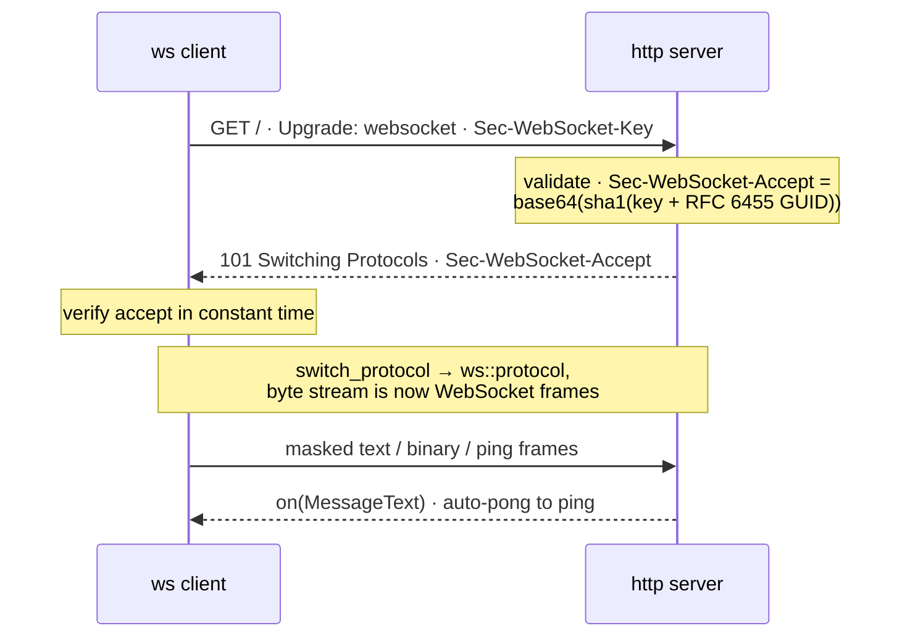

# WebSocket (RFC 6455)

> **Audience:** Adopter · **Status:** stable · **Verified-against:** qbm-http @ qb 3.0.0 (C++20 default, C++23 supported)

Upgrade an HTTP/1.1 connection to a full-duplex RFC 6455 WebSocket — server-side handshake validation, the CRTP/callback client, automatic ping keepalive, strict framing, and WSS over TLS.

**Prerequisites:** [Core concepts](./01-core-concepts.md), [Enabling HTTPS (SSL/TLS)](./18-https-ssl-tls.md) — **See also:** [WebSocket coroutines](./21-websocket-coroutines.md), [Asynchronous HTTP client](./14-async-http-client.md)

WebSocket lives under `qb::http::ws`. It is not a separate module: an application that already links `qbm::http` gets it for free through the umbrella header. A connection begins life as an ordinary HTTP/1.1 `GET` carrying `Upgrade: websocket`; once the handshake succeeds the byte stream stops being parsed as HTTP and is handed to `qb::http::ws::protocol`, which turns frames into `on(...)` events.

> **Feature gate.** The entire WebSocket subsystem requires `QB_HAS_SSL`, not only secure WS. `<qbm/http/http.h>` includes `src/qbm/http/ws/ws.h` only under `#ifdef QB_HAS_SSL`, and `src/qbm/http/ws/ws.h` itself opens with `#error "websocket protocol requires OpenSSL crypto library"` — even plaintext `ws://` cannot compile without OpenSSL, because the handshake hash (SHA-1 + base64) and the masking-key CSPRNG come from `qb::crypto`. In an SSL-less build, `qb::http::ws::*` simply does not exist. <!-- src: qbm/http/src/qbm/http/http.h:45-48, src/qbm/http/ws/ws.h:22-25 -->

```cpp
#include <qbm/http/http.h>   // umbrella: pulls in <src/qbm/http/ws/ws.h> under QB_HAS_SSL
// or, equivalently, the WebSocket header directly:
// #include <src/qbm/http/ws/ws.h>
```

This page covers the HTTP/1.1 upgrade path only. WebSocket over HTTP/2 extended `CONNECT` and WebTransport over HTTP/3 are not part of this integration. For a coroutine-shaped API over the same wire protocol, see [WebSocket coroutines](./21-websocket-coroutines.md).

## Concepts

The WebSocket subsystem is split across a few namespaces. You normally only touch `qb::http::ws`; the protocol templates re-export the rest. <!-- src: docs-overhaul/qbm-http/FACTBOOK.md:447 -->

| Symbol | Namespace | Role |
| --- | --- | --- |
| `protocol<IO_>` | `qb::http::ws` | The per-connection framer. Resolves to a server or client variant from `IO_::has_server`. Installed by `switch_protocol`. |
| `MessageText`, `MessageBinary`, `MessagePing`, `MessagePong`, `MessageClose` | `qb::http::ws` | Outbound frame value types. Stream payload in with `operator<<`, then send the value with `session << msg`. |
| `CloseStatus` | `qb::http::ws` | RFC 6455 §7.4 close codes (`Normal`, `GoingAway`, `ProtocolError`, …). |
| `WebSocket<T, Transport>` | `qb::http::ws` | CRTP client. `T` receives `connected` / `message` / `ping` / `pong` / `closed` events. |
| `WebSocketSecure<T>` | `qb::http::ws` | `WebSocket<T, qb::io::transport::stcp>` — the TLS-backed client. |
| `client`, `client_secure` (`Client<Transport>`) | `qb::http::ws` | Callback client: register lambdas instead of subclassing. |
| `WebSocketRequest` | `qb::http` | A `Request` preloaded with the four upgrade headers. |
| `generateKey()` | `qb::http::ws` | A fresh base64 `Sec-WebSocket-Key` (16 random bytes). |

A few mechanics worth knowing before you wire anything up:

- **The handshake is an HTTP exchange.** The client sends `GET` with `Sec-WebSocket-Key`; the server replies `101 Switching Protocols` with `Sec-WebSocket-Accept = base64(sha1(key + "258EAFA5-E914-47DA-95CA-C5AB0DC85B11"))`. The client verifies that accept value in constant time. <!-- src: src/qbm/http/ws/ws.h:794-803, src/qbm/http/ws/ws.h:1000-1016, src/qbm/http/ws/ws.h:871-880 -->


- **Masking is directional and mandatory.** Every client-to-server frame (control frames included) must be masked; every server-to-client frame must not be. The framer enforces both directions: a server that receives an unmasked frame, or a client that receives a masked one, fails the connection with `ProtocolError`. On the send side `WebSocket::operator<<` forces `masked = true` on outbound frames regardless of what you set. <!-- src: src/qbm/http/ws/ws.h:654-666, src/qbm/http/ws/ws.h:1480-1483 -->
- **Reassembly is bounded by default.** A message reassembled from continuation fragments is capped at `qb::http::protocol_limits::MAX_BODY_SIZE`; a peer streaming unbounded fragments is cut off with `CloseStatus::MessageTooBig`. Call `set_max_payload_size(0)` only deliberately to lift the cap. <!-- src: src/qbm/http/ws/ws.h:437, src/qbm/http/ws/ws.h:555-559, src/qbm/http/ws/ws.h:610-613 -->
- **Ping keepalive is a `qb::duration`.** `set_ping_interval(qb::duration)` arms a timer on the client; on each tick it sends a `MessagePing`, and the framer auto-replies to inbound pings with a same-payload `MessagePong`. A zero interval disables it. <!-- src: src/qbm/http/ws/ws.h:1198-1200, src/qbm/http/ws/ws.h:522-528, src/qbm/http/ws/ws.h:1460-1465 -->

## Server: upgrade an existing HTTP session

A WebSocket server session is an ordinary `qb-io` TCP session that starts by parsing HTTP. When the upgrade `GET` arrives, you call `switch_protocol<ws_protocol>(...)`, which validates the request, emits the `101` response, and swaps in the WebSocket framer. After that, frames arrive as `on(ws_protocol::message&&)` (plus `ping` / `pong` / `close`).

For a bare WebSocket endpoint, subclass `qb::io::use<Self>::tcp::client<Server>` — an HTTP-parsing TCP session bound to its listener.

<!-- src: qbm/http/tests/system/ws/ws-lifecycle.cpp:100-139 -->
```cpp
#include <qbm/http/http.h>
#include <qb/io/async.h>

class WsServer;

// One connected WebSocket peer.
class WsSession : public qb::io::use<WsSession>::tcp::client<WsServer> {
public:
    using Protocol    = qb::http::protocol<WsSession>;     // HTTP/1.1 parser
    using ws_protocol = qb::http::ws::protocol<WsSession>; // WebSocket framer

    explicit WsSession(WsServer &server) : client(server) {}

    // Initial HTTP request: try the upgrade.
    void on(Protocol::request &&request) {
        // The request-only overload validates the handshake, queues the 101
        // response, and installs the framer. It returns a ws_protocol* — and
        // yields nullptr (leaving the protocol not_ok) when the request is not
        // a valid upgrade.
        if (!this->switch_protocol<ws_protocol>(*this, request))
            disconnect();
    }

    // A complete text or binary message arrived.
    void on(ws_protocol::message &&event) {
        // event.ws is the qb::http::ws::Message; event.data / event.size are a
        // read-only view of the unmasked payload. Echo it back here.
        *this << event.ws;
    }

    void on(ws_protocol::ping &&) {}  // auto-pong already sent by the framer
    void on(ws_protocol::pong &&) {}
    void on(ws_protocol::close &&) {} // peer Close: defining this handler
                                      // suppresses the framer's auto-echo —
                                      // re-send the Close or disconnect() here
};

// The listener: accepts sockets and spawns WsSession instances.
class WsServer : public qb::io::use<WsServer>::tcp::server<WsSession> {
public:
    void on(IOSession &) {}  // optional: called per new connection
};
```

`switch_protocol` has two server overloads:

- **`switch_protocol<ws_protocol>(*this, request)`** — validates the handshake, builds the `101` response, **and queues it on the session** before installing the framer. This is the one-call form shown above. <!-- src: src/qbm/http/ws/ws.h:957-964 -->
- **`switch_protocol<ws_protocol>(*this, request, response)`** — fills a `response` you own but does **not** send it, so you can add headers (or transfer the socket to another actor) before flushing it yourself with `session << response`. Use this when an HTTP router handled the request and you want to hand the upgrade off. <!-- src: src/qbm/http/ws/ws.h:969-978, examples/qbm/ws/01_chat_server.cpp:537-555 -->

`switch_protocol<_Protocol>(...)` returns a `_Protocol*` (here a `ws_protocol*`), not a `bool`: it yields the installed protocol pointer on success and `nullptr` — marking the protocol `not_ok` — when the request is not a valid RFC 6455 upgrade. Test it as a pointer (`if (!this->switch_protocol<ws_protocol>(...))`). On failure, either `disconnect()` or queue a `400` HTTP response and `close_after_deliver()` so the client sees the error before the socket closes. <!-- src: qb/src/qb/io/async/io.h:862-873 -->

### What the handshake validator enforces

`populate_handshake_response` rejects anything that is not a strict RFC 6455 §4.2.1 upgrade. The request must be: HTTP `GET`; `Upgrade: websocket` (case-insensitive); `Connection` containing the `Upgrade` token; `Sec-WebSocket-Version: 13`; and a `Sec-WebSocket-Key` that is exactly 24 base64 characters decoding to 16 bytes with a clean base64 round-trip. Otherwise the response is `400 Bad Request` and the protocol goes `not_ok`. <!-- src: src/qbm/http/ws/ws.h:900-930 -->

### Broadcasting from a server

A server (or `io_handler`) owns its sessions, so `stream(...)` fans a frame out to every connected session and `stream_if(predicate, ...)` to a filtered subset. Build the frame once and pass it by value: <!-- src: qb/src/qb/io/async/io_handler.h:284-329, examples/qbm/ws/01_chat_server.cpp:587-593 -->

```cpp
qb::http::ws::MessageText msg;
msg << R"({"type":"system","text":"server restarting"})";

server().stream(msg);                                  // every peer
server().stream_if([this](const WsSession &s) {        // a subset
    return &s != this;                                 // all but the sender
}, msg);
```

### Handing the upgrade off to another actor

A common pattern (see `examples/qbm/ws/01_chat_server.cpp`) keeps the HTTP listener separate from the WebSocket actor: the HTTP route extracts the transport with `extractSession(...)`, ships it to the WebSocket actor in a `qb::Event`, and calls `ctx->suppress_response()` so the routing context destructor does not send a stale, moved-from HTTP response over the now-transferred socket. The receiving actor calls `registerSession(...)`, then the three-argument `switch_protocol` overload, then flushes the `101`: <!-- src: examples/qbm/ws/01_chat_server.cpp:494-555, qbm/http/src/qbm/http/routing/context.h:1250-1255 -->

```cpp
void on(TransferToWebSocketEvent &event) {
    // registerSession returns nullptr (and closes the transport) when the
    // io_handler session limit is reached — null-check before use.
    auto *session = registerSession(std::move(event.data->transport));
    if (!session)
        return;
    if (session->switch_protocol<WsSession::ws_protocol>(
            *session, event.data->request, event.data->response)) {
        *session << event.data->response;  // finalize with the 101
    } else {
        session->disconnect();             // not a valid upgrade
    }
}
```

## Sending frames

Each outbound frame is a value type derived from `qb::http::ws::Message`. Stream the payload in with `operator<<`, then send the whole value with `session << frame`. The framer attaches the correct opcode, length encoding, and (on the client) masking. <!-- src: src/qbm/http/ws/ws.h:159-213 -->

```cpp
qb::http::ws::MessageText text;
text << R"({"event":"hello"})";
*this << text;

qb::http::ws::MessageBinary bin;
bin << some_bytes;          // any type the qb::allocator::pipe<char> accepts
*this << bin;

qb::http::ws::MessagePing  ping;   // empty keepalive ping
*this << ping;
```

### Closing

`MessageClose` carries a 2-byte status code plus an optional UTF-8 reason, capped at 125 bytes total (2 status + 123 reason). Construction is fail-fast: a reserved code (`1004` / `1005` / `1006` / `1015`) or one outside `[1000, 4999]` throws `std::invalid_argument`, and an over-long reason is truncated on a UTF-8 boundary. <!-- src: src/qbm/http/ws/ws.cpp:210-234, src/qbm/http/ws/ws.h:283-298 -->

```cpp
qb::http::ws::MessageClose bye(qb::http::ws::CloseStatus::Normal, "done");
*this << bye;
```

RFC 6455 §5.5.1 is a two-way handshake: after you send a Close you should wait for the peer's Close echo before tearing the TCP stream down. The framer's behavior on an inbound Close depends on whether your session defines an `on(close)` handler. If it does **not**, the framer auto-echoes the peer's Close before going `not_ok`. If it **does** (as the server example above does, with an empty `void on(ws_protocol::close &&) {}`), the framer hands the Close to your handler and goes `not_ok` **without** echoing — re-sending the Close (or calling `disconnect()`) is then your handler's responsibility. Call `disconnect()` only when you want an immediate teardown. <!-- src: src/qbm/http/ws/ws.h:491-521 -->

## Client: the CRTP form

Subclass `WebSocket<Self>` (or `WebSocketSecure<Self>` for WSS) when the client holds state. You receive lifecycle and frame events as `on(...)` overloads; only the handlers you actually define are wired up. <!-- src: src/qbm/http/ws/ws.h:1165-1572 -->

<!-- src: src/qbm/http/ws/ws.h:1152-1164 (illustrative of the public WebSocket<T> event API) -->
```cpp
#include <qbm/http/http.h>
#include <qb/io/async.h>
#include <chrono>

class Client : public qb::http::ws::WebSocket<Client> {
public:
    void on(connected &&) {                    // 101 verified, framer installed
        set_ping_interval(std::chrono::seconds(30)); // qb::duration keepalive
        qb::http::ws::MessageText hello;
        hello << R"({"event":"hello"})";
        *this << hello;
    }

    void on(message &&event) {                 // a complete message
        qb::io::cout() << std::string_view(event.data, event.size) << '\n';
    }

    void on(closed &&) {}                        // peer Close frame
    void on(error  &&) {}                         // handshake / protocol failure
    void on(disconnected &&) {}                   // TCP stream gone
};

// Drive it from an actor or a standalone qb-io listener:
Client ws;
ws.connect(qb::io::uri("ws://localhost:9000/chat"));  // takes a uri, not a string; "wss://" for TLS
```

The `connect(...)` signature is `connect(const qb::io::uri &remote, qb::duration timeout = qb::duration::zero(), bool verify_peer = true)`. It establishes the TCP (or TLS) connection, sends the upgrade `GET`, and verifies the `101` before firing `connected`. A nonzero `timeout` bounds the connect; `verify_peer` controls TLS certificate verification on the secure transport. <!-- src: src/qbm/http/ws/ws.h:1277 -->

## Client: the callback form

For compact, stateless clients, use `qb::http::ws::client` (or `client_secure` for WSS) and register lambdas. Each `on_*` returns `*this` so the calls chain. <!-- src: src/qbm/http/ws/ws.h:1709-1710 -->

<!-- src: qbm/http/tests/system/ws/ws-client-echo.cpp:222-258 -->
```cpp
#include <qbm/http/http.h>

qb::http::ws::client ws;

ws.on_connected([&](auto &) {
      qb::io::cout() << "connected\n";
  })
  .on_message([](auto &event) {
      qb::io::cout() << std::string_view(event.data, event.size) << '\n';
  })
  .on_error([](auto &) {
      qb::io::cout() << "handshake failed\n";
  });

ws.connect(qb::io::uri("ws://localhost:9000/"));
```

Both client forms expose the same connection controls: `set_ping_interval(qb::duration)`, `close(CloseStatus, reason)`, and the subprotocol API below.

## Subprotocol negotiation

Advertise an ordered list of subprotocols before `connect()`. The client serializes them into `Sec-WebSocket-Protocol`; the server must echo exactly one (case-sensitive) of them or omit the header. After `connected` fires, `negotiated_subprotocol()` returns the chosen token, or empty if the server picked none. <!-- src: src/qbm/http/ws/ws.h:1226-1234, src/qbm/http/ws/ws.h:1240-1245, src/qbm/http/ws/ws.h:1330-1356 -->

```cpp
qb::http::ws::client ws;
ws.set_subprotocols({"chat.v2", "chat.v1"});   // or add_subprotocol("chat.v1")
ws.on_connected([&](auto &) {
    auto chosen = ws.negotiated_subprotocol();  // "chat.v2", "chat.v1", or ""
});
ws.connect(qb::io::uri("ws://localhost:9000/"));
```

Offers must be valid RFC 7230 tokens — `set_subprotocols` / `add_subprotocol` throw `std::invalid_argument` otherwise — and the negotiation check is strict: a server that returns multiple tokens, an unoffered token, or any token when the client offered none triggers `on(error)` and a disconnect. <!-- src: src/qbm/http/ws/ws.h:1226-1234, src/qbm/http/ws/ws.h:1240-1245, src/qbm/http/ws/ws.h:1330-1356 -->

## Secure WebSocket (WSS)

WSS reuses the same TLS transport as HTTPS — the only change is the transport template argument and the `wss://` scheme. On the client, use `WebSocketSecure<Self>` (CRTP) or `client_secure` (callback):

```cpp
qb::http::ws::client_secure ws;            // = Client<qb::io::transport::stcp>
ws.connect("wss://localhost:9443/ws");      // verify_peer defaults to true
```

Server-side WSS follows the HTTPS server pattern: build the session on a secure transport (`qb::io::use<Self>::tcp::ssl::client<Server>` / `...ssl::server<Session>`), initialize it with a certificate/key pair as in [Enabling HTTPS (SSL/TLS)](./18-https-ssl-tls.md), then run the identical HTTP/1.1 upgrade flow — `switch_protocol<ws_protocol>` is transport-agnostic. <!-- src: qbm/http/tests/system/ws/ws-client-echo.cpp:275-378, src/qbm/http/ws/ws.h:1071-1072 -->

## Pitfalls

- **The subsystem is SSL-gated, not just WSS.** Plaintext `ws://` still needs `QB_HAS_SSL`; `src/qbm/http/ws/ws.h` `#error`s without OpenSSL because the handshake hash and masking CSPRNG come from `qb::crypto`. Build with `QB_WITH_SSL=ON`. <!-- src: src/qbm/http/ws/ws.h:22-25 -->
- **Do not pre-mask or pre-unmask by hand.** `WebSocket::operator<<` forces `masked = true` on every outbound frame; setting `masked` yourself has no effect on the client send path. The receive path validates masking per direction and fails the connection on a violation. <!-- src: src/qbm/http/ws/ws.h:1480-1483, src/qbm/http/ws/ws.h:654-666 -->
- **`MessageClose` throws on reserved/out-of-range codes.** `is_sendable_close_code` forbids the full reserved set — `1004` (reserved), `1005` ("no status received"), `1006` ("abnormal closure"), and `1015` ("TLS handshake failure") — none of which may appear on the wire, plus anything outside `[1000, 4999]`. Passing any of those to `MessageClose` throws `std::invalid_argument`. Receiving a 1-byte Close payload, or a reserved code on the wire, is itself a `ProtocolError`. <!-- src: src/qbm/http/ws/ws.h:253-266 (is_sendable_close_code), src/qbm/http/ws/ws.cpp:210-234, src/qbm/http/ws/ws.h:492-502 -->
- **`set_max_payload_size(0)` removes the memory guard.** The default cap (`MAX_BODY_SIZE`) is what stops a peer from exhausting memory with unbounded continuation fragments. Lift it only when you have an independent bound. <!-- src: src/qbm/http/ws/ws.h:437, src/qbm/http/ws/ws.h:555-559 -->
- **Transfer ownership cleanly.** When you move a session's transport to another actor for the upgrade, call `ctx->suppress_response()` so the routing context destructor does not send a moved-from HTTP response over the transferred socket. <!-- src: qbm/http/src/qbm/http/routing/context.h:1250-1255 -->
- **Frame events are views, not owners.** `event.data` / `event.size` point into the framer's reassembly buffer and are valid only during the `on(...)` call; copy out anything you need to keep. The owning `event.ws` (`qb::http::ws::Message`) is what you forward when echoing. <!-- src: src/qbm/http/ws/ws.h:392-396 -->

## See also

- [WebSocket coroutines](./21-websocket-coroutines.md) — `coro_client`, `coro_session`, the `co_await` awaiters, and the server-side handshake hook.
- [Enabling HTTPS (SSL/TLS)](./18-https-ssl-tls.md) — certificate setup for the WSS transport.
- [Asynchronous HTTP client](./14-async-http-client.md) — the HTTP/1.1 client the upgrade builds on.
- [Core concepts](./01-core-concepts.md) — sessions, protocols, and the `switch_protocol` mechanism.

Previous: [HTTP/3 protocol](./19-http3-protocol.md)
Next: [WebSocket coroutines](./21-websocket-coroutines.md)

---
Return to [Index](./README.md)
